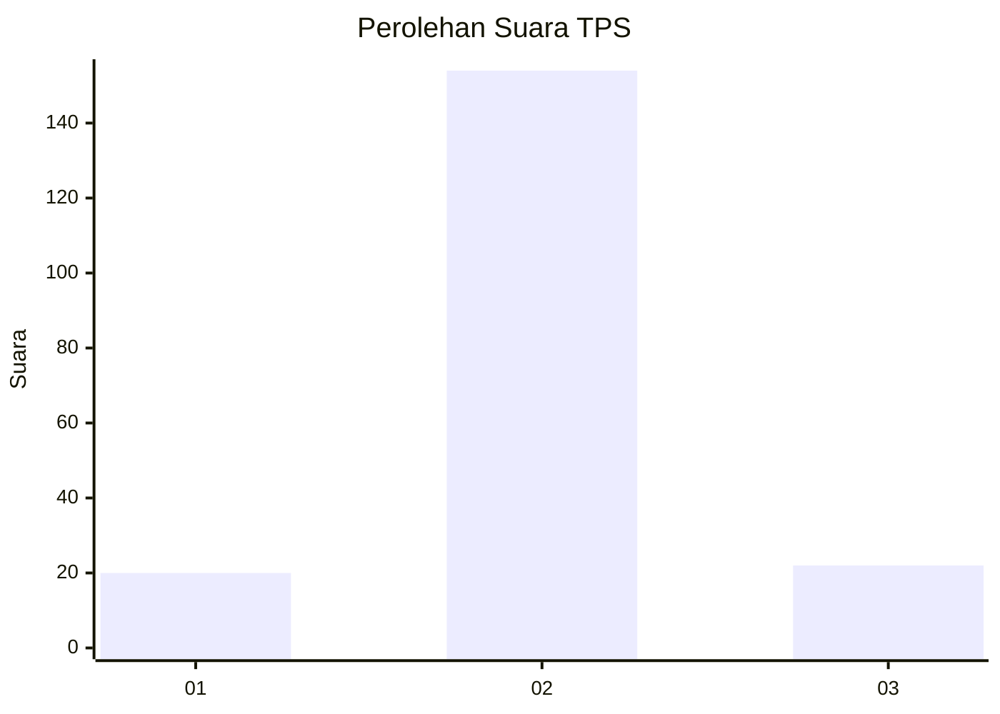
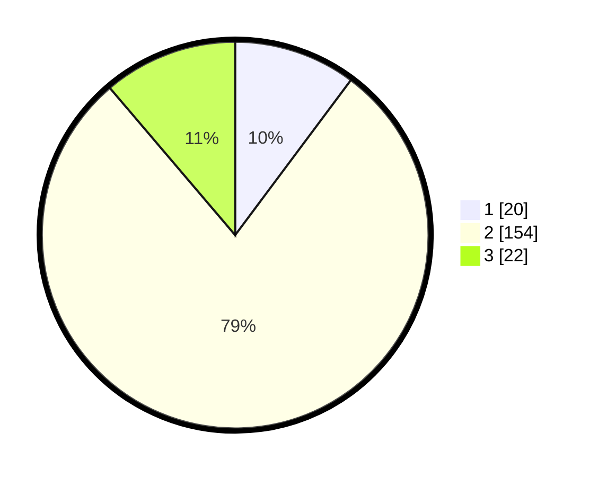

# Hasil

## Grafik

## Tabel

| No. | Nama Paslon    | Suara | Suara (raw) | Persentase |
|:--- |:-------------- | -----:| -----------:| ----------:|
| 1   | ANIES MUHAIMIN | 20    | [20][p-1]   | 10,20      |
| 2   | PRABOWO GIBRAN | 154   | [154][p-2]  | 78,57      |
| 3   | GANJAR MAHFUD  | 22    | [22][p-3]   | 11,22      |

[p-1]: https://github.com/gigit-pemilu/pemilu-2024-18-lampung/blob/main/pilpres/hitung-suara/sub/18-lampung/sub/03-lampung-utara/sub/22-abung-kunang/sub/2001-aji-kagungan/sub/004-tps/sub/paslon-1.txt
[p-2]: https://github.com/gigit-pemilu/pemilu-2024-18-lampung/blob/main/pilpres/hitung-suara/sub/18-lampung/sub/03-lampung-utara/sub/22-abung-kunang/sub/2001-aji-kagungan/sub/004-tps/sub/paslon-2.txt
[p-3]: https://github.com/gigit-pemilu/pemilu-2024-18-lampung/blob/main/pilpres/hitung-suara/sub/18-lampung/sub/03-lampung-utara/sub/22-abung-kunang/sub/2001-aji-kagungan/sub/004-tps/sub/paslon-3.txt

## Foto C Plano

https://sirekap-obj-formc.kpu.go.id/1d54/pemilu/ppwp/18/03/22/20/01/1803222001004-20240215-021633--9e3c3a24-c71e-4adf-ae7c-c00bc8a8bb33.jpg

https://sirekap-obj-formc.kpu.go.id/1d54/pemilu/ppwp/18/03/22/20/01/1803222001004-20240215-021901--4c207d81-6f70-45ce-ae4e-9cef1231a6e3.jpg

https://sirekap-obj-formc.kpu.go.id/1d54/pemilu/ppwp/18/03/22/20/01/1803222001004-20240215-150223--efba5517-0467-4129-a0ba-b89beb4a57cd.jpg

## Metadata

| Key        | Value               |
| ---------- | ------------------- |
| Time Stamp | 2024-02-16 16:25:10 |

