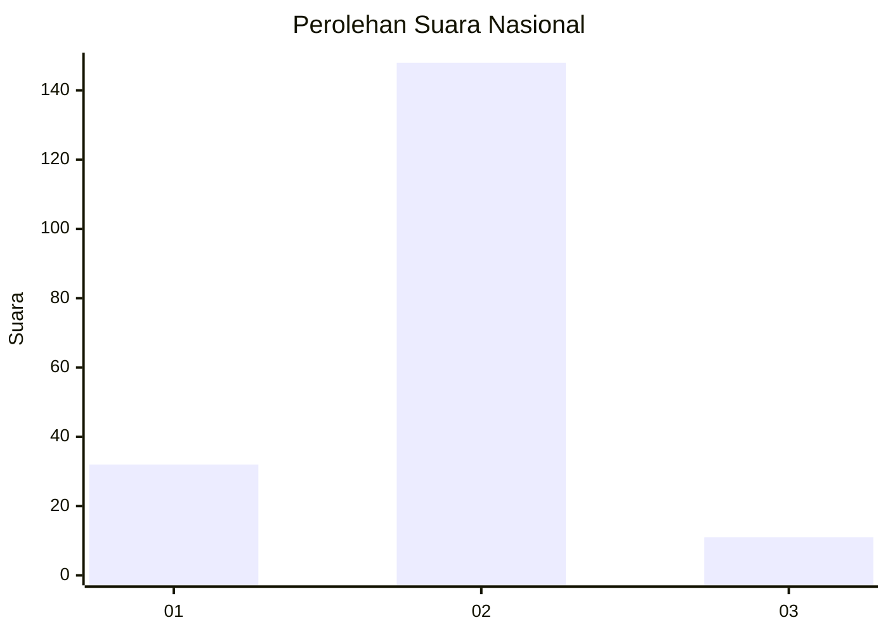
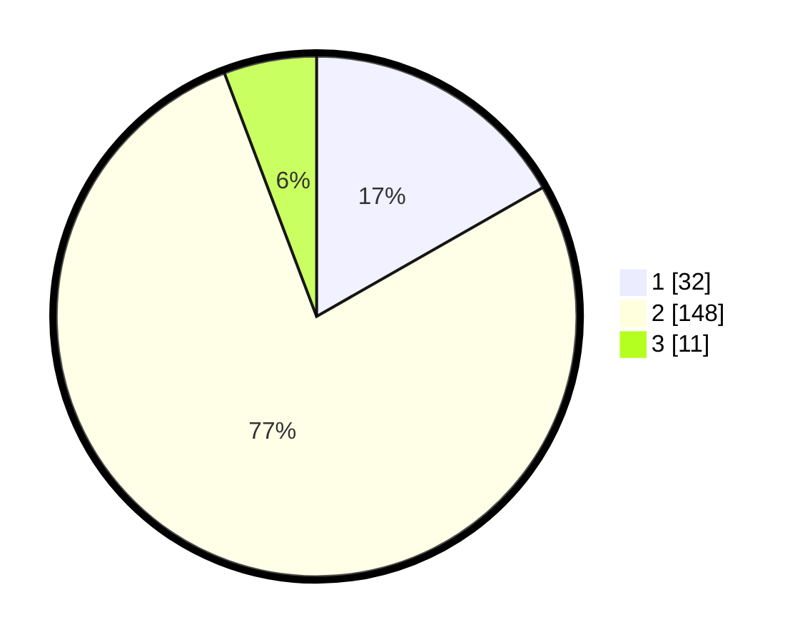

# Hasil

## Grafik

## Tabel

| No. | Nama Paslon    | Suara | Suara (raw) | Persentase |
|:--- |:-------------- | -----:| -----------:| ----------:|
| 1   | ANIES MUHAIMIN | 32    | [32][p-1]   | 16,75      |
| 2   | PRABOWO GIBRAN | 148   | [148][p-2]  | 77,49      |
| 3   | GANJAR MAHFUD  | 11    | [11][p-3]   | 5,76       |

[p-1]: https://github.com/gigit-pemilu/pemilu-2024/blob/main/pilpres/hitung-suara/sub/18-lampung/sub/03-lampung-utara/sub/22-abung-kunang/sub/2001-aji-kagungan/sub/005-tps/sub/paslon-1.txt
[p-2]: https://github.com/gigit-pemilu/pemilu-2024/blob/main/pilpres/hitung-suara/sub/18-lampung/sub/03-lampung-utara/sub/22-abung-kunang/sub/2001-aji-kagungan/sub/005-tps/sub/paslon-2.txt
[p-3]: https://github.com/gigit-pemilu/pemilu-2024/blob/main/pilpres/hitung-suara/sub/18-lampung/sub/03-lampung-utara/sub/22-abung-kunang/sub/2001-aji-kagungan/sub/005-tps/sub/paslon-3.txt

## Foto C Plano

https://sirekap-obj-formc.kpu.go.id/5264/pemilu/ppwp/18/03/22/20/01/1803222001005-20240215-184659--f0c0cc7f-612b-4a4d-ab5d-6f0069a9f4ed.jpg

https://sirekap-obj-formc.kpu.go.id/5264/pemilu/ppwp/18/03/22/20/01/1803222001005-20240215-170333--b4f4e85d-8435-4361-9022-01a93741c571.jpg

https://sirekap-obj-formc.kpu.go.id/5264/pemilu/ppwp/18/03/22/20/01/1803222001005-20240215-170550--f41bdc34-9480-408c-9625-bb4d6ac277cb.jpg

## Metadata

| Key        | Value               |
| ---------- | ------------------- |
| Time Stamp | 2024-02-15 19:00:26 |

