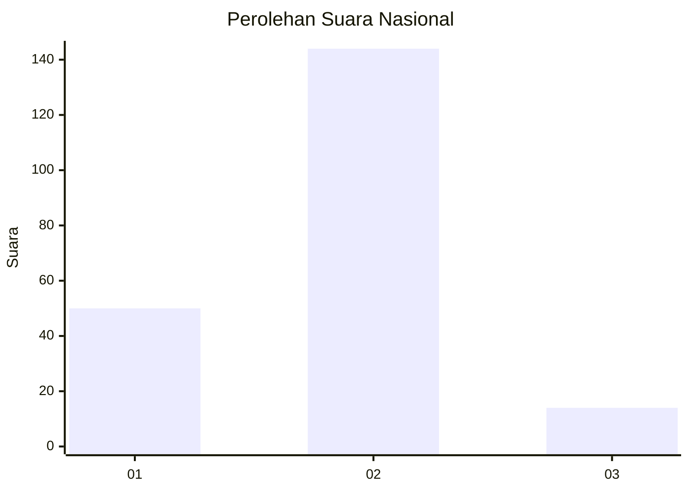
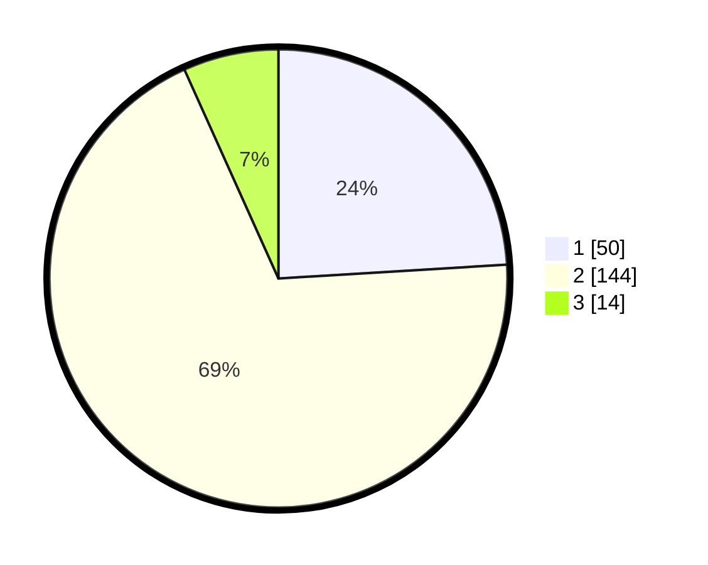

# Hasil

## Grafik

## Tabel

| No. | Nama Paslon    | Suara | Suara (raw) | Persentase |
|:--- |:-------------- | -----:| -----------:| ----------:|
| 1   | ANIES MUHAIMIN | 50    | [50][p-1]   | 24,04      |
| 2   | PRABOWO GIBRAN | 144   | [144][p-2]  | 69,23      |
| 3   | GANJAR MAHFUD  | 14    | [14][p-3]   | 6,73       |

[p-1]: https://github.com/gigit-pemilu/pemilu-2024/blob/main/pilpres/hitung-suara/sub/18-lampung/sub/04-lampung-barat/sub/04-balik-bukit/sub/1001-pasar-liwa/sub/002-tps/sub/paslon-1.txt
[p-2]: https://github.com/gigit-pemilu/pemilu-2024/blob/main/pilpres/hitung-suara/sub/18-lampung/sub/04-lampung-barat/sub/04-balik-bukit/sub/1001-pasar-liwa/sub/002-tps/sub/paslon-2.txt
[p-3]: https://github.com/gigit-pemilu/pemilu-2024/blob/main/pilpres/hitung-suara/sub/18-lampung/sub/04-lampung-barat/sub/04-balik-bukit/sub/1001-pasar-liwa/sub/002-tps/sub/paslon-3.txt

## Foto C Plano

https://sirekap-obj-formc.kpu.go.id/5c88/pemilu/ppwp/18/04/04/10/01/1804041001002-20240223-155759--ab9c68e1-3b30-4f8a-9072-4ee0382a75a1.jpg

https://sirekap-obj-formc.kpu.go.id/5c88/pemilu/ppwp/18/04/04/10/01/1804041001002-20240223-155850--13f82eb2-1765-401a-95c9-9117823e1a9d.jpg

https://sirekap-obj-formc.kpu.go.id/5c88/pemilu/ppwp/18/04/04/10/01/1804041001002-20240223-155928--4c68ca89-c918-4c48-b94d-62274caf7186.jpg

## Metadata

| Key        | Value               |
| ---------- | ------------------- |
| Time Stamp | 2024-02-24 22:31:28 |

