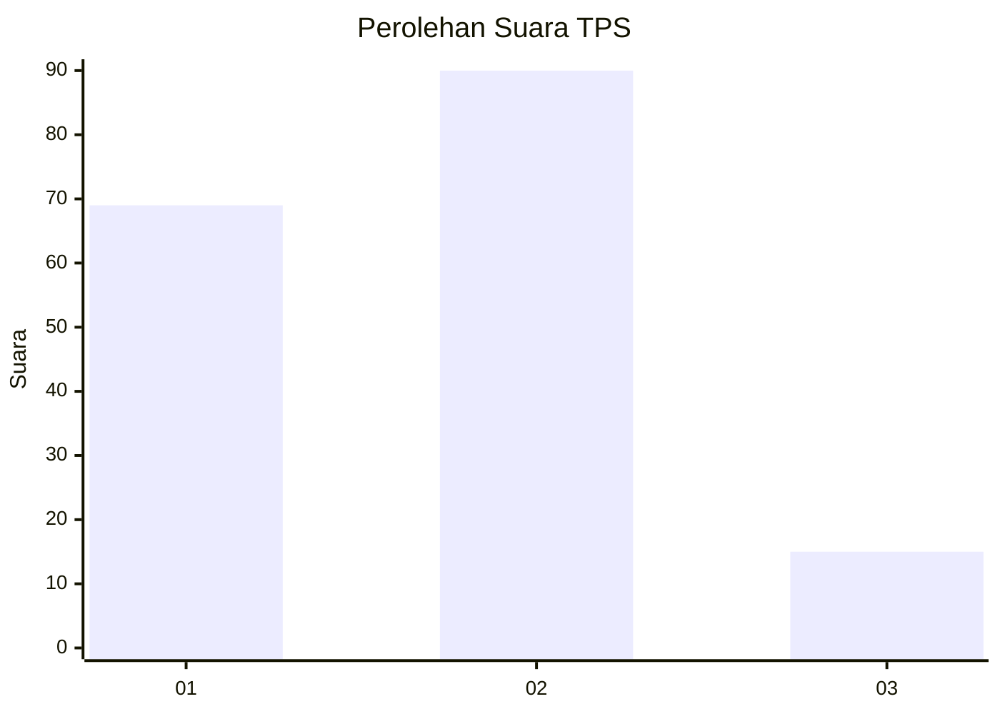

# Hasil

## Grafik

## Tabel

| No. | Nama Paslon    | Suara | Suara (raw) | Persentase |
|:--- |:-------------- | -----:| -----------:| ----------:|
| 1   | ANIES MUHAIMIN | 69    | [69][p-1]   | 39,66      |
| 2   | PRABOWO GIBRAN | 90    | [90][p-2]   | 51,72      |
| 3   | GANJAR MAHFUD  | 15    | [15][p-3]   | 8,62       |

[p-1]: https://github.com/gigit-pemilu/pemilu-2024-18-lampung/blob/main/pilpres/hitung-suara/sub/18-lampung/sub/04-lampung-barat/sub/04-balik-bukit/sub/1001-pasar-liwa/sub/004-tps/sub/paslon-1.txt
[p-2]: https://github.com/gigit-pemilu/pemilu-2024-18-lampung/blob/main/pilpres/hitung-suara/sub/18-lampung/sub/04-lampung-barat/sub/04-balik-bukit/sub/1001-pasar-liwa/sub/004-tps/sub/paslon-2.txt
[p-3]: https://github.com/gigit-pemilu/pemilu-2024-18-lampung/blob/main/pilpres/hitung-suara/sub/18-lampung/sub/04-lampung-barat/sub/04-balik-bukit/sub/1001-pasar-liwa/sub/004-tps/sub/paslon-3.txt

## Foto C Plano

https://sirekap-obj-formc.kpu.go.id/49d3/pemilu/ppwp/18/04/04/10/01/1804041001004-20240215-022450--64ee87d0-e9c2-4349-a90d-64d8c512f4e9.jpg

https://sirekap-obj-formc.kpu.go.id/49d3/pemilu/ppwp/18/04/04/10/01/1804041001004-20240215-022708--b29f32b8-3456-4cf8-b6fb-dfc24172c839.jpg

https://sirekap-obj-formc.kpu.go.id/49d3/pemilu/ppwp/18/04/04/10/01/1804041001004-20240223-180038--218fad3d-fb2a-4aa4-9648-c3e40b7bf7f3.jpg

## Metadata

| Key        | Value               |
| ---------- | ------------------- |
| Time Stamp | 2024-02-24 22:31:28 |

