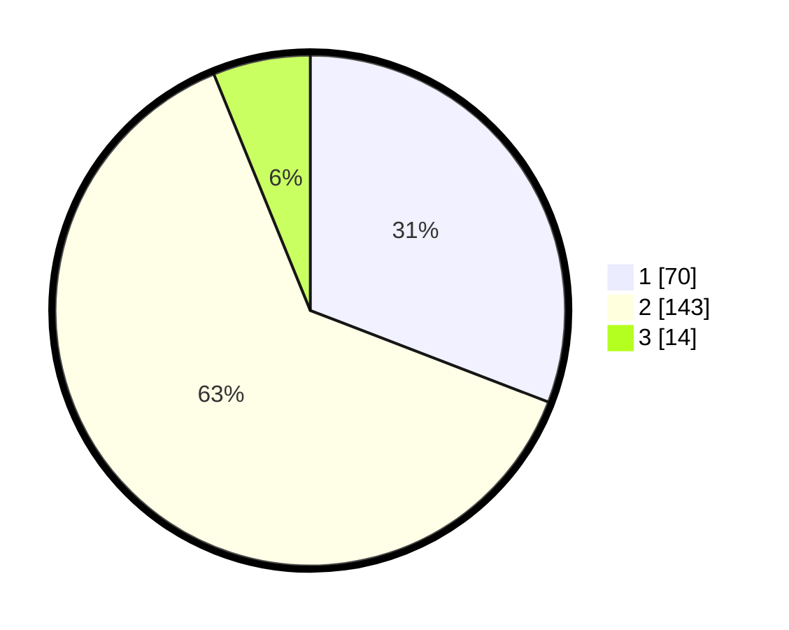

# Hasil

## Grafik

## Tabel

| No. | Nama Paslon    | Suara | Suara (raw) | Persentase |
|:--- |:-------------- | -----:| -----------:| ----------:|
| 1   | ANIES MUHAIMIN | 70    | [70][p-1]   | 30,84      |
| 2   | PRABOWO GIBRAN | 143   | [143][p-2]  | 63,00      |
| 3   | GANJAR MAHFUD  | 14    | [14][p-3]   | 6,17       |

[p-1]: https://github.com/gigit-pemilu/pemilu-2024-18-lampung/blob/main/pilpres/hitung-suara/sub/18-lampung/sub/04-lampung-barat/sub/04-balik-bukit/sub/1001-pasar-liwa/sub/005-tps/sub/paslon-1.txt
[p-2]: https://github.com/gigit-pemilu/pemilu-2024-18-lampung/blob/main/pilpres/hitung-suara/sub/18-lampung/sub/04-lampung-barat/sub/04-balik-bukit/sub/1001-pasar-liwa/sub/005-tps/sub/paslon-2.txt
[p-3]: https://github.com/gigit-pemilu/pemilu-2024-18-lampung/blob/main/pilpres/hitung-suara/sub/18-lampung/sub/04-lampung-barat/sub/04-balik-bukit/sub/1001-pasar-liwa/sub/005-tps/sub/paslon-3.txt

## Foto C Plano

https://sirekap-obj-formc.kpu.go.id/309f/pemilu/ppwp/18/04/04/10/01/1804041001005-20240223-210351--40c1dbd0-b623-4d1d-af62-131825a357a9.jpg

https://sirekap-obj-formc.kpu.go.id/309f/pemilu/ppwp/18/04/04/10/01/1804041001005-20240223-210423--19527785-815c-45c0-8141-3088e4b4cc2b.jpg

https://sirekap-obj-formc.kpu.go.id/309f/pemilu/ppwp/18/04/04/10/01/1804041001005-20240223-210542--5a7b34c2-c54f-40e7-9d17-9d048318ac73.jpg

## Metadata

| Key        | Value               |
| ---------- | ------------------- |
| Time Stamp | 2024-02-24 22:31:28 |

