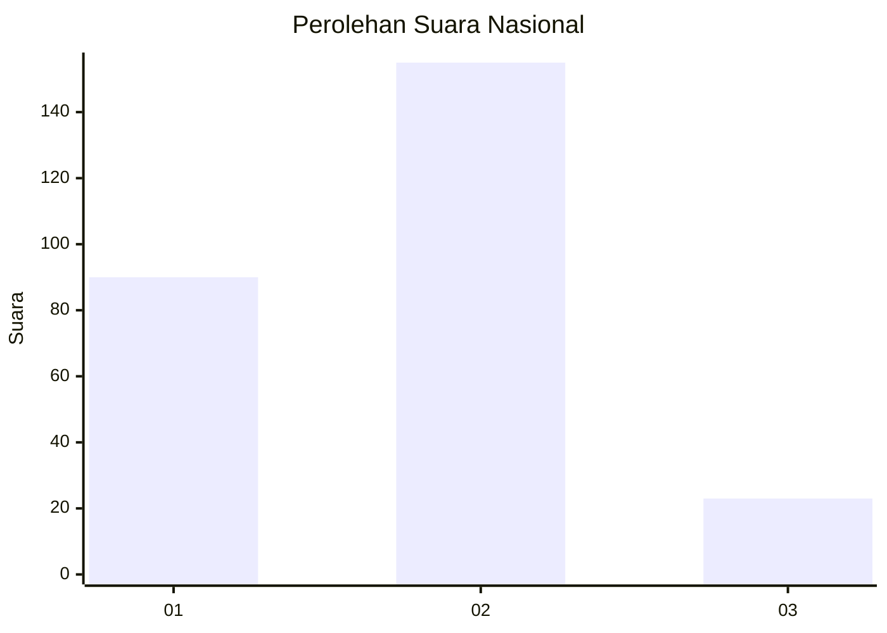
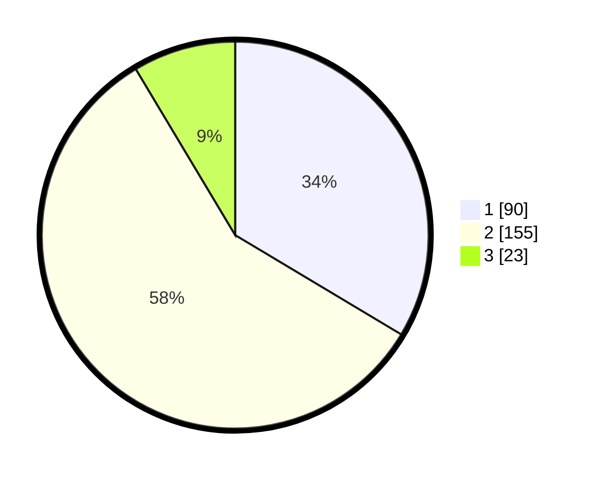

# Hasil

## Grafik

## Tabel

| No. | Nama Paslon    | Suara | Suara (raw) | Persentase |
|:--- |:-------------- | -----:| -----------:| ----------:|
| 1   | ANIES MUHAIMIN | 90    | [90][p-1]   | 33,58      |
| 2   | PRABOWO GIBRAN | 155   | [155][p-2]  | 57,84      |
| 3   | GANJAR MAHFUD  | 23    | [23][p-3]   | 8,58       |

[p-1]: https://github.com/gigit-pemilu/pemilu-2024/blob/main/pilpres/hitung-suara/sub/18-lampung/sub/04-lampung-barat/sub/04-balik-bukit/sub/2004-padang-cahya/sub/002-tps/sub/paslon-1.txt
[p-2]: https://github.com/gigit-pemilu/pemilu-2024/blob/main/pilpres/hitung-suara/sub/18-lampung/sub/04-lampung-barat/sub/04-balik-bukit/sub/2004-padang-cahya/sub/002-tps/sub/paslon-2.txt
[p-3]: https://github.com/gigit-pemilu/pemilu-2024/blob/main/pilpres/hitung-suara/sub/18-lampung/sub/04-lampung-barat/sub/04-balik-bukit/sub/2004-padang-cahya/sub/002-tps/sub/paslon-3.txt

## Foto C Plano

https://sirekap-obj-formc.kpu.go.id/c4b0/pemilu/ppwp/18/04/04/20/04/1804042004002-20240219-160035--f1ac6ebf-5b32-4709-be91-15d2e89d4afc.jpg

https://sirekap-obj-formc.kpu.go.id/c4b0/pemilu/ppwp/18/04/04/20/04/1804042004002-20240219-160148--28713fc0-db6d-4e28-ad1f-2e72652a38ef.jpg

https://sirekap-obj-formc.kpu.go.id/c4b0/pemilu/ppwp/18/04/04/20/04/1804042004002-20240219-160304--62cf333c-4db0-4917-ad7f-c122bc1901ed.jpg

## Metadata

| Key        | Value               |
| ---------- | ------------------- |
| Time Stamp | 2024-02-20 23:00:00 |

