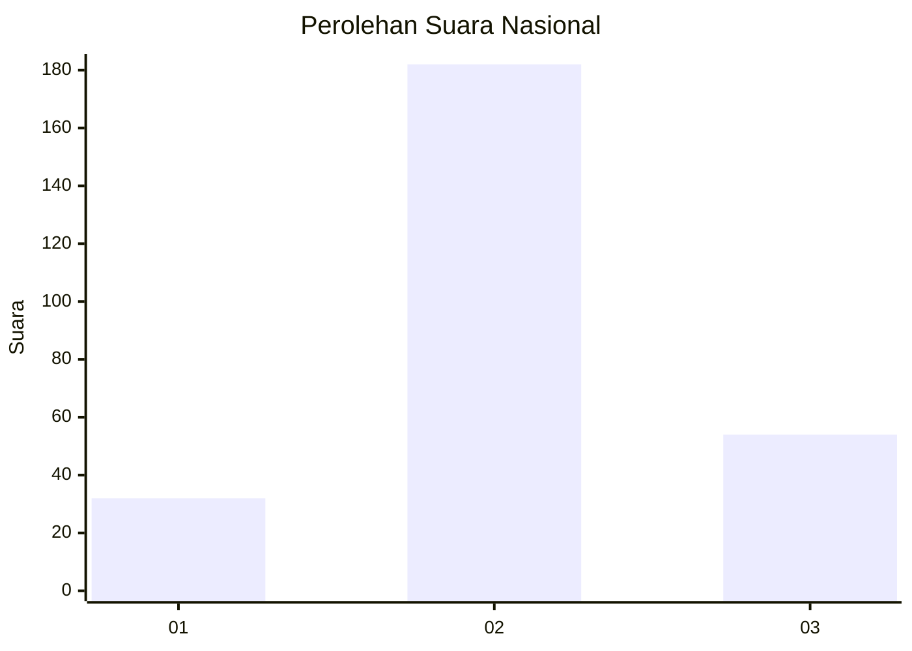
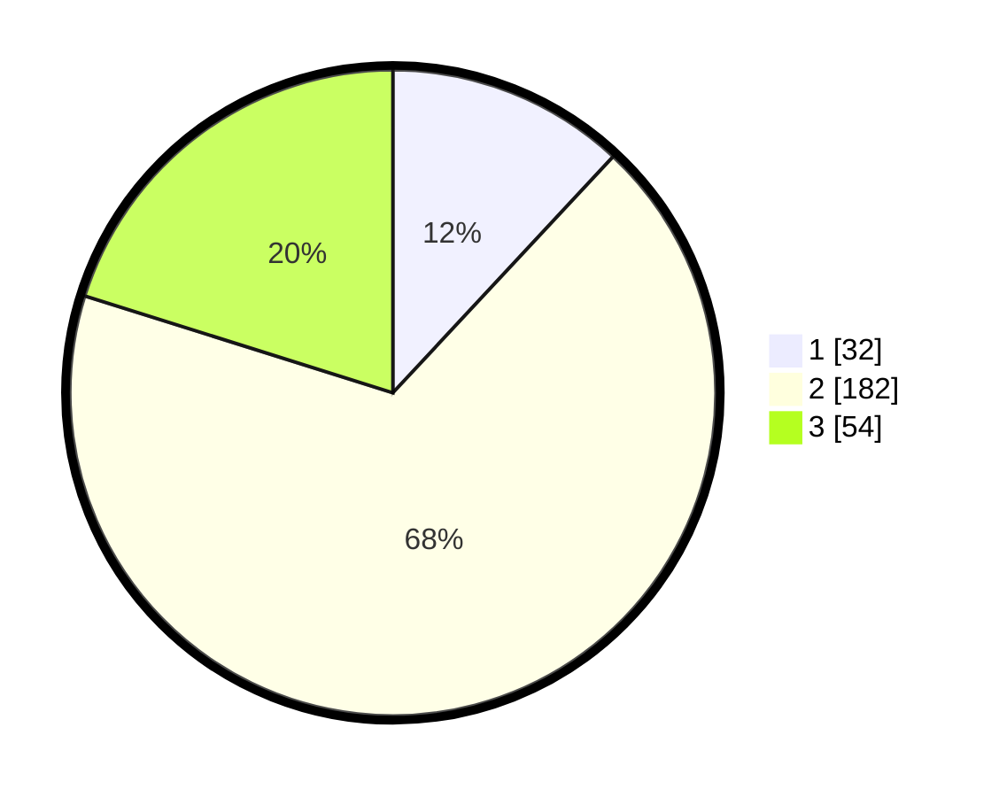

# Hasil

## Grafik

## Tabel

| No. | Nama Paslon    | Suara | Suara (raw) | Persentase |
|:--- |:-------------- | -----:| -----------:| ----------:|
| 1   | ANIES MUHAIMIN | 32    | [32][p-1]   | 11,94      |
| 2   | PRABOWO GIBRAN | 182   | [182][p-2]  | 67,91      |
| 3   | GANJAR MAHFUD  | 54    | [54][p-3]   | 20,15      |

[p-1]: https://github.com/gigit-pemilu/pemilu-2024/blob/main/pilpres/hitung-suara/sub/18-lampung/sub/04-lampung-barat/sub/04-balik-bukit/sub/2011-bahway/sub/006-tps/sub/paslon-1.txt
[p-2]: https://github.com/gigit-pemilu/pemilu-2024/blob/main/pilpres/hitung-suara/sub/18-lampung/sub/04-lampung-barat/sub/04-balik-bukit/sub/2011-bahway/sub/006-tps/sub/paslon-2.txt
[p-3]: https://github.com/gigit-pemilu/pemilu-2024/blob/main/pilpres/hitung-suara/sub/18-lampung/sub/04-lampung-barat/sub/04-balik-bukit/sub/2011-bahway/sub/006-tps/sub/paslon-3.txt

## Foto C Plano

https://sirekap-obj-formc.kpu.go.id/4499/pemilu/ppwp/18/04/04/20/11/1804042011006-20240214-195604--3fbc942f-8560-4f86-953e-2e3c04bc1b00.jpg

https://sirekap-obj-formc.kpu.go.id/4499/pemilu/ppwp/18/04/04/20/11/1804042011006-20240214-195618--51d3f0f7-c604-4c8f-a7d3-3c1d6e06385c.jpg

https://sirekap-obj-formc.kpu.go.id/4499/pemilu/ppwp/18/04/04/20/11/1804042011006-20240214-195628--4a445316-2540-4a54-b98d-89889bb6adac.jpg

## Metadata

| Key        | Value               |
| ---------- | ------------------- |
| Time Stamp | 2024-02-15 15:30:25 |

