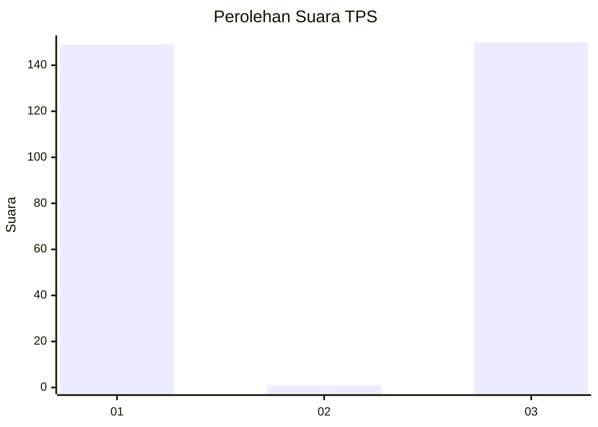
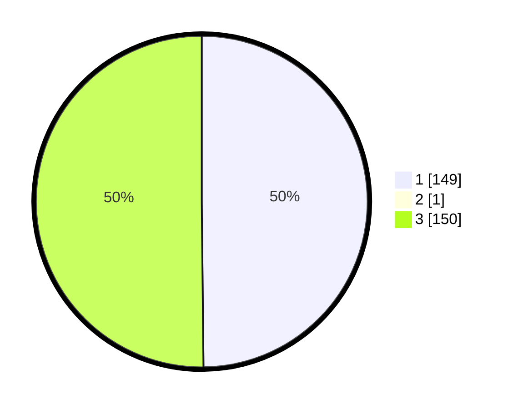

# Hasil

## Grafik

## Tabel

| No. | Nama Paslon    | Suara | Suara (raw) | Persentase |
|:--- |:-------------- | -----:| -----------:| ----------:|
| 1   | ANIES MUHAIMIN | 149   | [149][p-1]  | 49,67      |
| 2   | PRABOWO GIBRAN | 1     | [1][p-2]    | 0,33       |
| 3   | GANJAR MAHFUD  | 150   | [150][p-3]  | 50,00      |

[p-1]: https://github.com/gigit-pemilu/pemilu-2024-18-lampung/blob/main/pilpres/hitung-suara/sub/18-lampung/sub/04-lampung-barat/sub/05-sumber-jaya/sub/1016-tugu-sari/sub/023-tps/sub/paslon-1.txt
[p-2]: https://github.com/gigit-pemilu/pemilu-2024-18-lampung/blob/main/pilpres/hitung-suara/sub/18-lampung/sub/04-lampung-barat/sub/05-sumber-jaya/sub/1016-tugu-sari/sub/023-tps/sub/paslon-2.txt
[p-3]: https://github.com/gigit-pemilu/pemilu-2024-18-lampung/blob/main/pilpres/hitung-suara/sub/18-lampung/sub/04-lampung-barat/sub/05-sumber-jaya/sub/1016-tugu-sari/sub/023-tps/sub/paslon-3.txt

## Foto C Plano

https://sirekap-obj-formc.kpu.go.id/6b0f/pemilu/ppwp/18/04/05/10/16/1804051016023-20240214-195357--b10eef14-3503-47c9-8edc-5232ee31dcee.jpg

https://sirekap-obj-formc.kpu.go.id/6b0f/pemilu/ppwp/18/04/05/10/16/1804051016023-20240214-195417--31497be7-7a3a-4bb3-b898-2087157240b8.jpg

https://sirekap-obj-formc.kpu.go.id/6b0f/pemilu/ppwp/18/04/05/10/16/1804051016023-20240214-195433--dfa64c70-62d2-4e56-a207-c4bdb37c975c.jpg

## Metadata

| Key        | Value               |
| ---------- | ------------------- |
| Time Stamp | 2024-02-25 15:00:00 |

