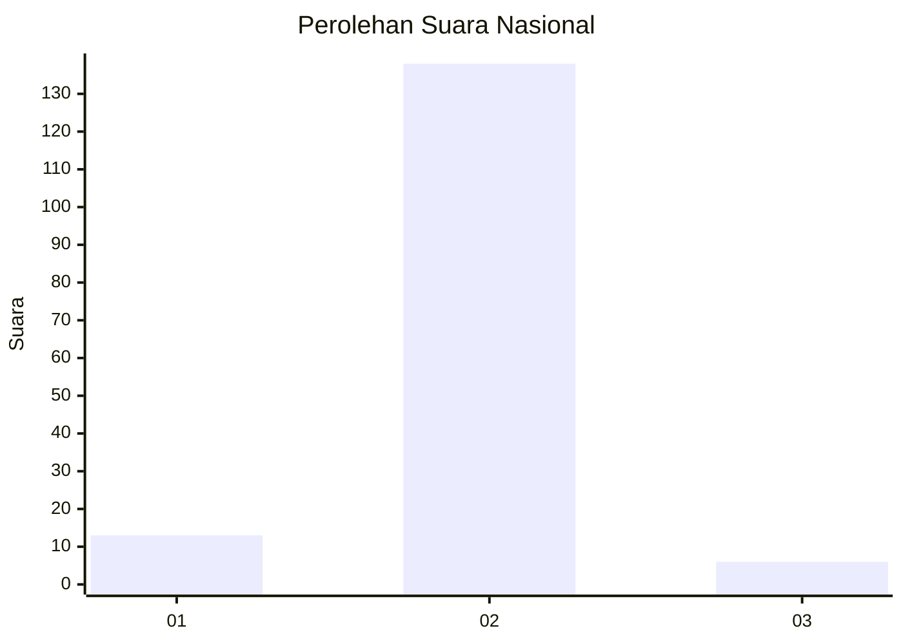
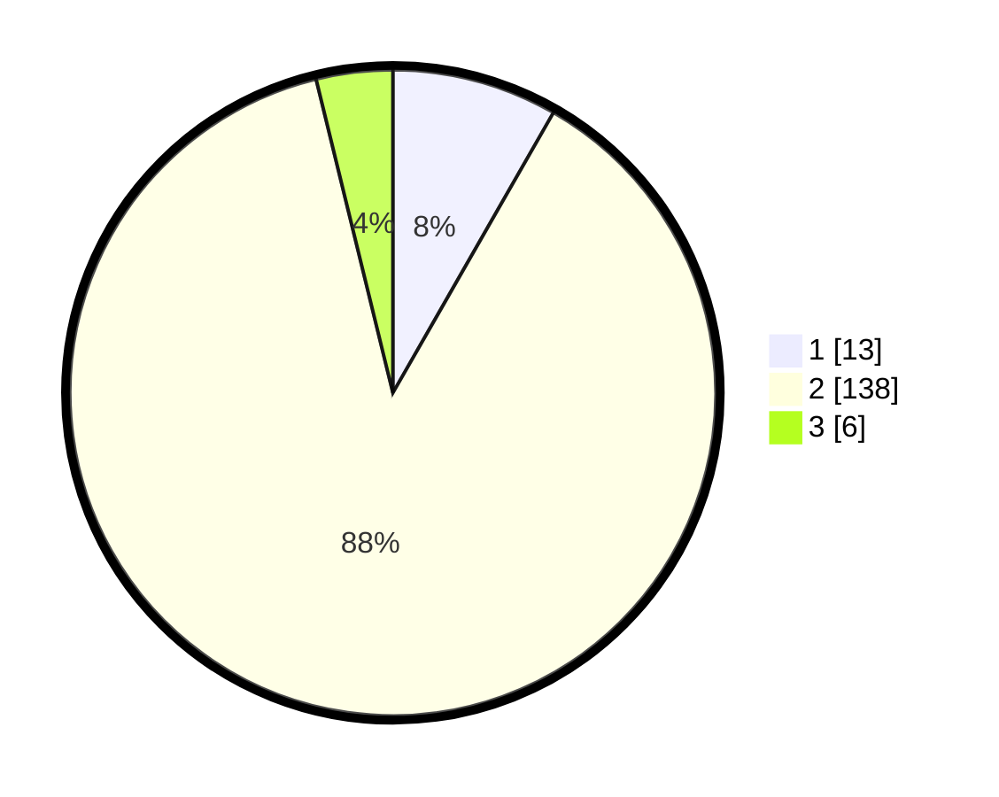

# Hasil

## Grafik

## Tabel

| No. | Nama Paslon    | Suara | Suara (raw) | Persentase |
|:--- |:-------------- | -----:| -----------:| ----------:|
| 1   | ANIES MUHAIMIN | 13    | [13][p-1]   | 8,28       |
| 2   | PRABOWO GIBRAN | 138   | [138][p-2]  | 87,90      |
| 3   | GANJAR MAHFUD  | 6     | [6][p-3]    | 3,82       |

[p-1]: https://github.com/gigit-pemilu/pemilu-2024/blob/main/pilpres/hitung-suara/sub/18-lampung/sub/04-lampung-barat/sub/06-belalau/sub/2001-kenali/sub/001-tps/sub/paslon-1.txt
[p-2]: https://github.com/gigit-pemilu/pemilu-2024/blob/main/pilpres/hitung-suara/sub/18-lampung/sub/04-lampung-barat/sub/06-belalau/sub/2001-kenali/sub/001-tps/sub/paslon-2.txt
[p-3]: https://github.com/gigit-pemilu/pemilu-2024/blob/main/pilpres/hitung-suara/sub/18-lampung/sub/04-lampung-barat/sub/06-belalau/sub/2001-kenali/sub/001-tps/sub/paslon-3.txt

## Foto C Plano

https://sirekap-obj-formc.kpu.go.id/feaf/pemilu/ppwp/18/04/06/20/01/1804062001001-20240215-015304--b03105cb-9246-438f-a5a2-50cdcf7a8ccb.jpg

https://sirekap-obj-formc.kpu.go.id/feaf/pemilu/ppwp/18/04/06/20/01/1804062001001-20240214-212944--09bba069-8776-49bb-b0e7-19c79b1c1521.jpg

https://sirekap-obj-formc.kpu.go.id/feaf/pemilu/ppwp/18/04/06/20/01/1804062001001-20240215-015409--16c6f1a8-480a-4047-a9ce-bb6a7b317946.jpg

## Metadata

| Key        | Value               |
| ---------- | ------------------- |
| Time Stamp | 2024-02-15 23:29:50 |

