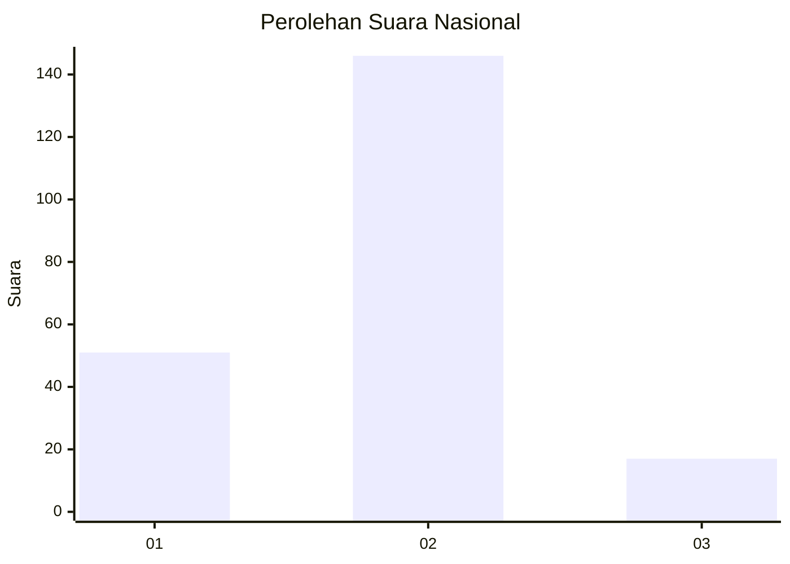
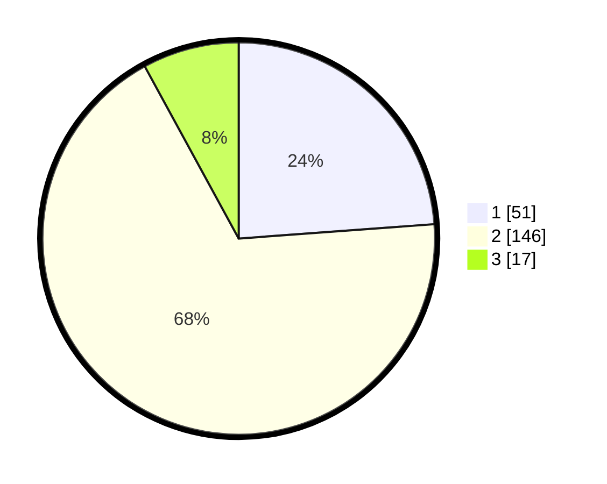

# Hasil

## Grafik

## Tabel

| No. | Nama Paslon    | Suara | Suara (raw) | Persentase |
|:--- |:-------------- | -----:| -----------:| ----------:|
| 1   | ANIES MUHAIMIN | 51    | [51][p-1]   | 23,83      |
| 2   | PRABOWO GIBRAN | 146   | [146][p-2]  | 68,22      |
| 3   | GANJAR MAHFUD  | 17    | [17][p-3]   | 7,94       |

[p-1]: https://github.com/gigit-pemilu/pemilu-2024/blob/main/pilpres/hitung-suara/sub/18-lampung/sub/04-lampung-barat/sub/06-belalau/sub/2001-kenali/sub/004-tps/sub/paslon-1.txt
[p-2]: https://github.com/gigit-pemilu/pemilu-2024/blob/main/pilpres/hitung-suara/sub/18-lampung/sub/04-lampung-barat/sub/06-belalau/sub/2001-kenali/sub/004-tps/sub/paslon-2.txt
[p-3]: https://github.com/gigit-pemilu/pemilu-2024/blob/main/pilpres/hitung-suara/sub/18-lampung/sub/04-lampung-barat/sub/06-belalau/sub/2001-kenali/sub/004-tps/sub/paslon-3.txt

## Foto C Plano

https://sirekap-obj-formc.kpu.go.id/da68/pemilu/ppwp/18/04/06/20/01/1804062001004-20240215-100151--add88b13-bf1f-447c-8f5f-54605b0094a7.jpg

https://sirekap-obj-formc.kpu.go.id/da68/pemilu/ppwp/18/04/06/20/01/1804062001004-20240215-100238--08ded2ed-d043-4388-8cbe-06052798534c.jpg

https://sirekap-obj-formc.kpu.go.id/da68/pemilu/ppwp/18/04/06/20/01/1804062001004-20240215-080935--d580f552-58c3-4a57-9fa9-4a4ef3eb5a48.jpg

## Metadata

| Key        | Value               |
| ---------- | ------------------- |
| Time Stamp | 2024-02-16 00:00:26 |

