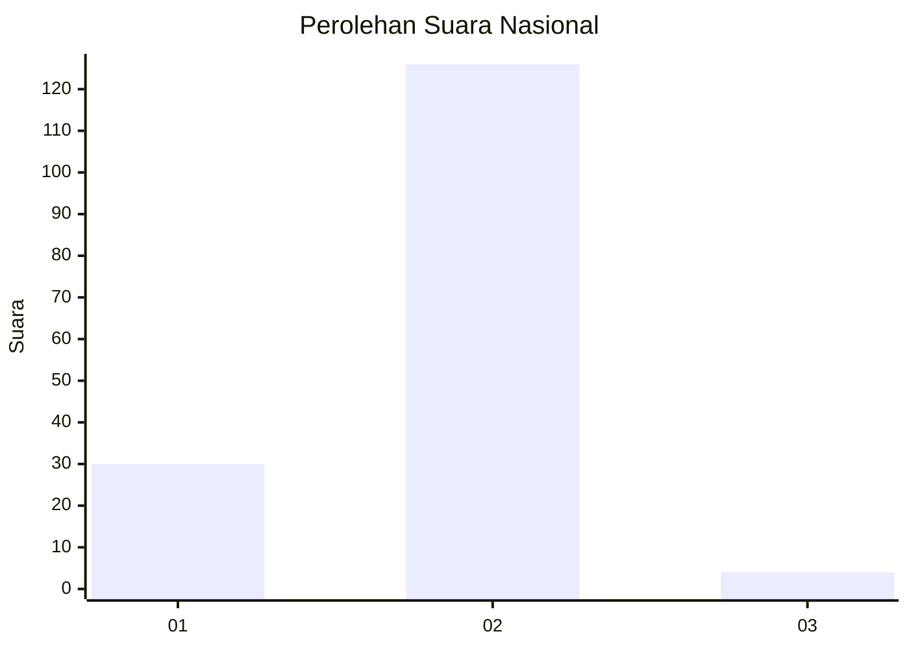
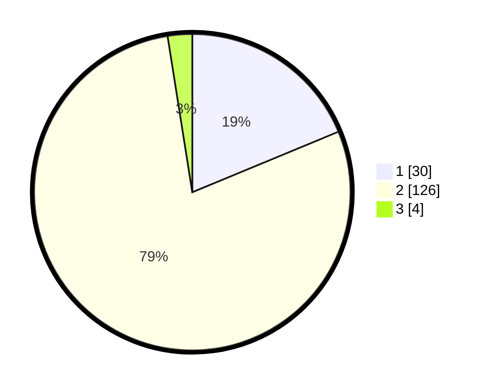

# Hasil

## Grafik

## Tabel

| No. | Nama Paslon    | Suara | Suara (raw) | Persentase |
|:--- |:-------------- | -----:| -----------:| ----------:|
| 1   | ANIES MUHAIMIN | 30    | [30][p-1]   | 18,75      |
| 2   | PRABOWO GIBRAN | 126   | [126][p-2]  | 78,75      |
| 3   | GANJAR MAHFUD  | 4     | [4][p-3]    | 2,50       |

[p-1]: https://github.com/gigit-pemilu/pemilu-2024/blob/main/pilpres/hitung-suara/sub/18-lampung/sub/04-lampung-barat/sub/10-batu-brak/sub/2001-kembahang/sub/002-tps/sub/paslon-1.txt
[p-2]: https://github.com/gigit-pemilu/pemilu-2024/blob/main/pilpres/hitung-suara/sub/18-lampung/sub/04-lampung-barat/sub/10-batu-brak/sub/2001-kembahang/sub/002-tps/sub/paslon-2.txt
[p-3]: https://github.com/gigit-pemilu/pemilu-2024/blob/main/pilpres/hitung-suara/sub/18-lampung/sub/04-lampung-barat/sub/10-batu-brak/sub/2001-kembahang/sub/002-tps/sub/paslon-3.txt

## Foto C Plano

https://sirekap-obj-formc.kpu.go.id/529d/pemilu/ppwp/18/04/10/20/01/1804102001002-20240215-003913--5a396f64-26cc-47b3-840b-00682145a389.jpg

https://sirekap-obj-formc.kpu.go.id/529d/pemilu/ppwp/18/04/10/20/01/1804102001002-20240215-004541--f5957d18-d0f6-4980-bf71-b449f42aa218.jpg

https://sirekap-obj-formc.kpu.go.id/529d/pemilu/ppwp/18/04/10/20/01/1804102001002-20240215-005026--934b541b-d648-41cb-9760-f1f4e4ae5940.jpg

## Metadata

| Key        | Value               |
| ---------- | ------------------- |
| Time Stamp | 2024-02-15 16:00:26 |

