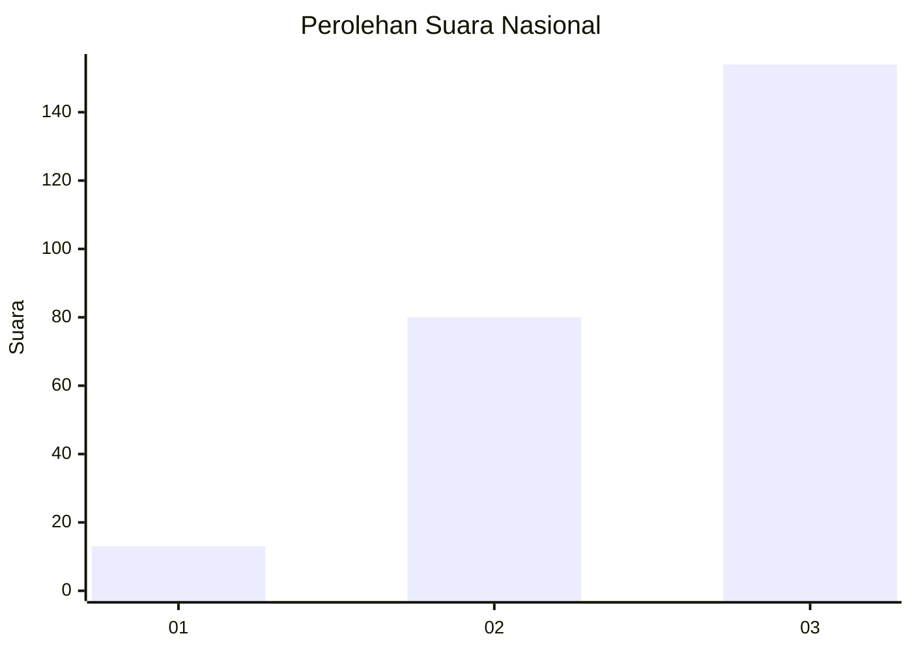
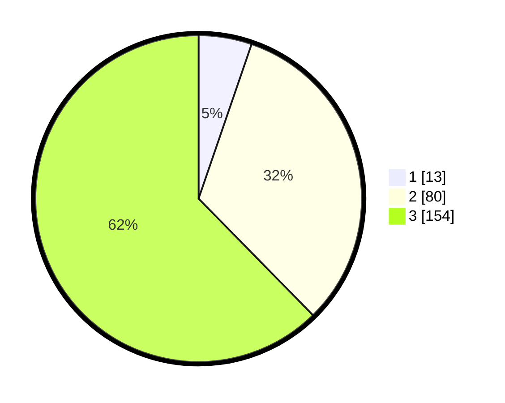

# Hasil

## Grafik

## Tabel

| No. | Nama Paslon    | Suara | Suara (raw) | Persentase |
|:--- |:-------------- | -----:| -----------:| ----------:|
| 1   | ANIES MUHAIMIN | 13    | [13][p-1]   | 5,26       |
| 2   | PRABOWO GIBRAN | 80    | [80][p-2]   | 32,39      |
| 3   | GANJAR MAHFUD  | 154   | [154][p-3]  | 62,35      |

[p-1]: https://github.com/gigit-pemilu/pemilu-2024/blob/main/pilpres/hitung-suara/sub/18-lampung/sub/04-lampung-barat/sub/10-batu-brak/sub/2005-pekon-balak/sub/002-tps/sub/paslon-1.txt
[p-2]: https://github.com/gigit-pemilu/pemilu-2024/blob/main/pilpres/hitung-suara/sub/18-lampung/sub/04-lampung-barat/sub/10-batu-brak/sub/2005-pekon-balak/sub/002-tps/sub/paslon-2.txt
[p-3]: https://github.com/gigit-pemilu/pemilu-2024/blob/main/pilpres/hitung-suara/sub/18-lampung/sub/04-lampung-barat/sub/10-batu-brak/sub/2005-pekon-balak/sub/002-tps/sub/paslon-3.txt

## Foto C Plano

https://sirekap-obj-formc.kpu.go.id/08db/pemilu/ppwp/18/04/10/20/05/1804102005002-20240214-210918--d5fdae8a-ceec-4941-8109-a672f0bd4002.jpg

https://sirekap-obj-formc.kpu.go.id/08db/pemilu/ppwp/18/04/10/20/05/1804102005002-20240215-020015--7bd10d83-2e08-4af3-95c8-1b9164eb8b15.jpg

https://sirekap-obj-formc.kpu.go.id/08db/pemilu/ppwp/18/04/10/20/05/1804102005002-20240214-211254--e8916462-8eb3-4bb5-9077-27ecda6d863e.jpg

## Metadata

| Key        | Value               |
| ---------- | ------------------- |
| Time Stamp | 2024-02-15 12:00:28 |

