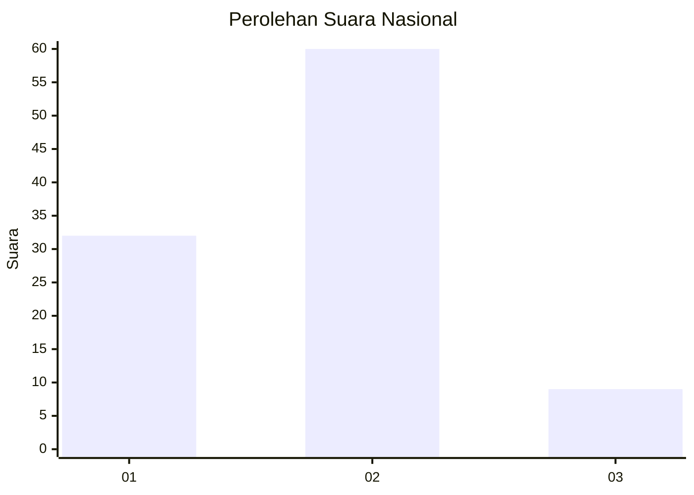
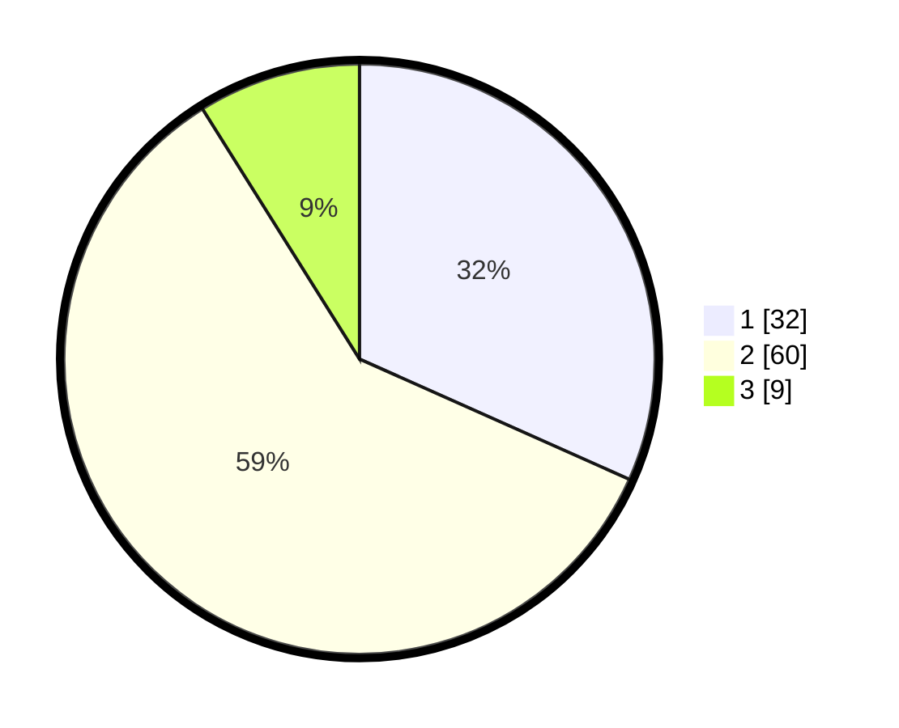

# Hasil

## Grafik

## Tabel

| No. | Nama Paslon    | Suara | Suara (raw) | Persentase |
|:--- |:-------------- | -----:| -----------:| ----------:|
| 1   | ANIES MUHAIMIN | 32    | [32][p-1]   | 31,68      |
| 2   | PRABOWO GIBRAN | 60    | [60][p-2]   | 59,41      |
| 3   | GANJAR MAHFUD  | 9     | [9][p-3]    | 8,91       |

[p-1]: https://github.com/gigit-pemilu/pemilu-2024/blob/main/pilpres/hitung-suara/sub/18-lampung/sub/04-lampung-barat/sub/10-batu-brak/sub/2008-kotabesi/sub/006-tps/sub/paslon-1.txt
[p-2]: https://github.com/gigit-pemilu/pemilu-2024/blob/main/pilpres/hitung-suara/sub/18-lampung/sub/04-lampung-barat/sub/10-batu-brak/sub/2008-kotabesi/sub/006-tps/sub/paslon-2.txt
[p-3]: https://github.com/gigit-pemilu/pemilu-2024/blob/main/pilpres/hitung-suara/sub/18-lampung/sub/04-lampung-barat/sub/10-batu-brak/sub/2008-kotabesi/sub/006-tps/sub/paslon-3.txt

## Foto C Plano

https://sirekap-obj-formc.kpu.go.id/8f5e/pemilu/ppwp/18/04/10/20/08/1804102008006-20240219-102154--db73ac09-bf53-48e9-804a-b85ae7834a70.jpg

https://sirekap-obj-formc.kpu.go.id/8f5e/pemilu/ppwp/18/04/10/20/08/1804102008006-20240215-032714--4fc85dce-be46-4c3b-a216-57c614628515.jpg

https://sirekap-obj-formc.kpu.go.id/8f5e/pemilu/ppwp/18/04/10/20/08/1804102008006-20240215-033042--81b2d649-7417-41c7-a851-cc33c7f5413a.jpg

## Metadata

| Key        | Value               |
| ---------- | ------------------- |
| Time Stamp | 2024-02-19 11:00:00 |

