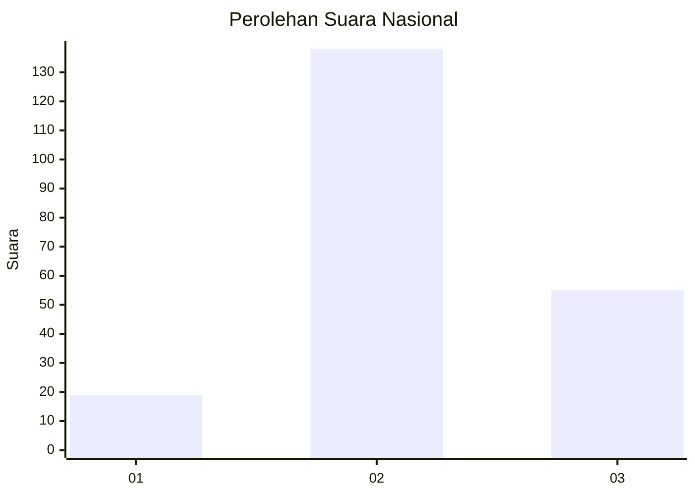
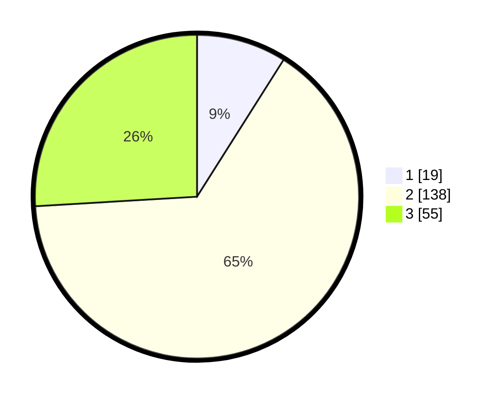

# Hasil

## Grafik

## Tabel

| No. | Nama Paslon    | Suara | Suara (raw) | Persentase |
|:--- |:-------------- | -----:| -----------:| ----------:|
| 1   | ANIES MUHAIMIN | 19    | [19][p-1]   | 8,96       |
| 2   | PRABOWO GIBRAN | 138   | [138][p-2]  | 65,09      |
| 3   | GANJAR MAHFUD  | 55    | [55][p-3]   | 25,94      |

[p-1]: https://github.com/gigit-pemilu/pemilu-2024/blob/main/pilpres/hitung-suara/sub/18-lampung/sub/04-lampung-barat/sub/15-gedung-surian/sub/2001-gedung-surian/sub/001-tps/sub/paslon-1.txt
[p-2]: https://github.com/gigit-pemilu/pemilu-2024/blob/main/pilpres/hitung-suara/sub/18-lampung/sub/04-lampung-barat/sub/15-gedung-surian/sub/2001-gedung-surian/sub/001-tps/sub/paslon-2.txt
[p-3]: https://github.com/gigit-pemilu/pemilu-2024/blob/main/pilpres/hitung-suara/sub/18-lampung/sub/04-lampung-barat/sub/15-gedung-surian/sub/2001-gedung-surian/sub/001-tps/sub/paslon-3.txt

## Foto C Plano

https://sirekap-obj-formc.kpu.go.id/08eb/pemilu/ppwp/18/04/15/20/01/1804152001001-20240215-053005--8dc9d4ea-5ef5-4cf0-963b-df62c7b7a26a.jpg

https://sirekap-obj-formc.kpu.go.id/08eb/pemilu/ppwp/18/04/15/20/01/1804152001001-20240215-054145--da1420f6-963d-41a4-80cc-b96d5f635161.jpg

https://sirekap-obj-formc.kpu.go.id/08eb/pemilu/ppwp/18/04/15/20/01/1804152001001-20240215-045602--a4ae2867-1ff1-4fd3-8367-e9a01116fb10.jpg

## Metadata

| Key        | Value               |
| ---------- | ------------------- |
| Time Stamp | 2024-02-16 01:00:27 |

