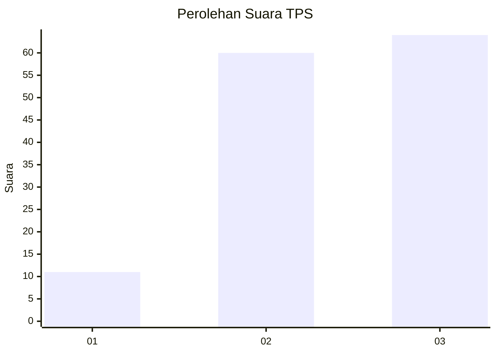
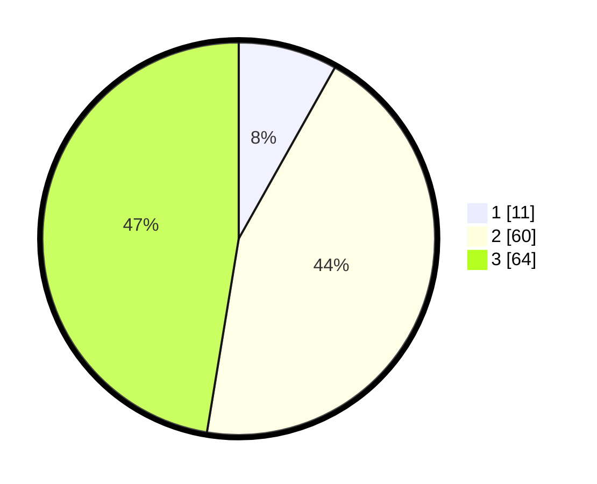

# Hasil

## Grafik

## Tabel

| No. | Nama Paslon    | Suara | Suara (raw) | Persentase |
|:--- |:-------------- | -----:| -----------:| ----------:|
| 1   | ANIES MUHAIMIN | 11    | [11][p-1]   | 8,15       |
| 2   | PRABOWO GIBRAN | 60    | [60][p-2]   | 44,44      |
| 3   | GANJAR MAHFUD  | 64    | [64][p-3]   | 47,41      |

[p-1]: https://github.com/gigit-pemilu/pemilu-2024-18-lampung/blob/main/pilpres/hitung-suara/sub/18-lampung/sub/04-lampung-barat/sub/19-air-hitam/sub/2001-sidodadi/sub/003-tps/sub/paslon-1.txt
[p-2]: https://github.com/gigit-pemilu/pemilu-2024-18-lampung/blob/main/pilpres/hitung-suara/sub/18-lampung/sub/04-lampung-barat/sub/19-air-hitam/sub/2001-sidodadi/sub/003-tps/sub/paslon-2.txt
[p-3]: https://github.com/gigit-pemilu/pemilu-2024-18-lampung/blob/main/pilpres/hitung-suara/sub/18-lampung/sub/04-lampung-barat/sub/19-air-hitam/sub/2001-sidodadi/sub/003-tps/sub/paslon-3.txt

## Foto C Plano

https://sirekap-obj-formc.kpu.go.id/d818/pemilu/ppwp/18/04/19/20/01/1804192001003-20240214-195057--fbf892be-295c-4522-aefc-a4f8a9839564.jpg

https://sirekap-obj-formc.kpu.go.id/d818/pemilu/ppwp/18/04/19/20/01/1804192001003-20240214-234110--0b37e770-fe37-47b1-868c-8968a2dcf545.jpg

https://sirekap-obj-formc.kpu.go.id/d818/pemilu/ppwp/18/04/19/20/01/1804192001003-20240214-234355--7a2c55ce-d2ea-4d8d-b12d-6c5e99f2448e.jpg

## Metadata

| Key        | Value               |
| ---------- | ------------------- |
| Time Stamp | 2024-02-15 17:00:25 |

