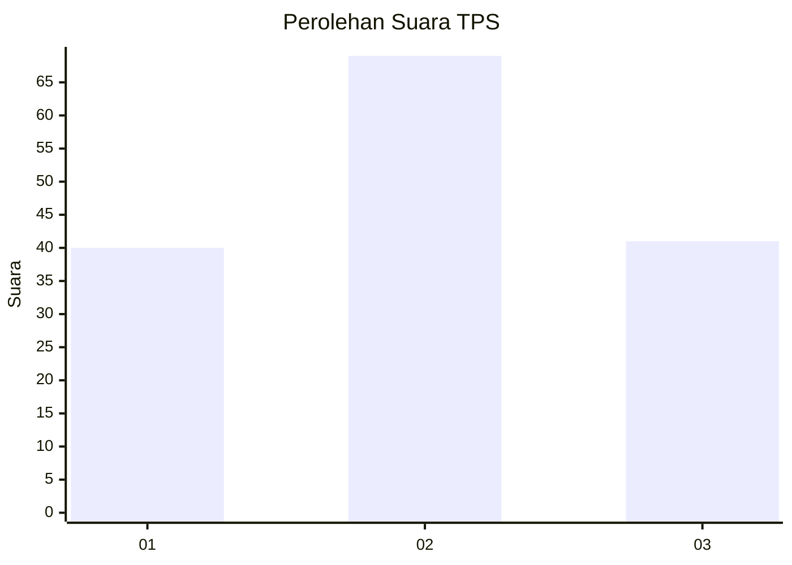
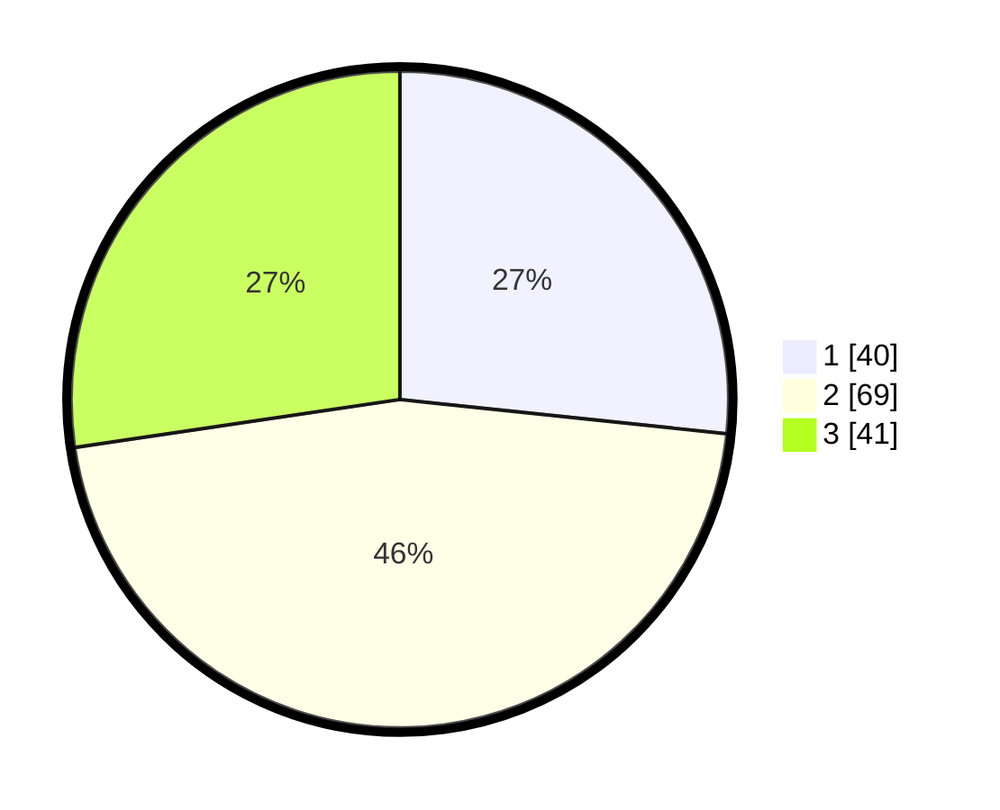

# Hasil

## Grafik

## Tabel

| No. | Nama Paslon    | Suara | Suara (raw) | Persentase |
|:--- |:-------------- | -----:| -----------:| ----------:|
| 1   | ANIES MUHAIMIN | 40    | [40][p-1]   | 26,67      |
| 2   | PRABOWO GIBRAN | 69    | [69][p-2]   | 46,00      |
| 3   | GANJAR MAHFUD  | 41    | [41][p-3]   | 27,33      |

[p-1]: https://github.com/gigit-pemilu/pemilu-2024-18-lampung/blob/main/pilpres/hitung-suara/sub/18-lampung/sub/04-lampung-barat/sub/20-pagar-dewa/sub/2001-pahayu-jaya/sub/004-tps/sub/paslon-1.txt
[p-2]: https://github.com/gigit-pemilu/pemilu-2024-18-lampung/blob/main/pilpres/hitung-suara/sub/18-lampung/sub/04-lampung-barat/sub/20-pagar-dewa/sub/2001-pahayu-jaya/sub/004-tps/sub/paslon-2.txt
[p-3]: https://github.com/gigit-pemilu/pemilu-2024-18-lampung/blob/main/pilpres/hitung-suara/sub/18-lampung/sub/04-lampung-barat/sub/20-pagar-dewa/sub/2001-pahayu-jaya/sub/004-tps/sub/paslon-3.txt

## Foto C Plano

https://sirekap-obj-formc.kpu.go.id/304f/pemilu/ppwp/18/04/20/20/01/1804202001004-20240214-231140--9dd5e764-242e-49f7-9cb4-82f6a3341ff2.jpg

https://sirekap-obj-formc.kpu.go.id/304f/pemilu/ppwp/18/04/20/20/01/1804202001004-20240214-231612--b02a1274-9236-424f-ab19-64c49bcf14e2.jpg

https://sirekap-obj-formc.kpu.go.id/304f/pemilu/ppwp/18/04/20/20/01/1804202001004-20240214-231806--86f5f4ef-7a10-460c-9f71-dfd146c3c41c.jpg

## Metadata

| Key        | Value               |
| ---------- | ------------------- |
| Time Stamp | 2024-02-16 00:30:27 |

