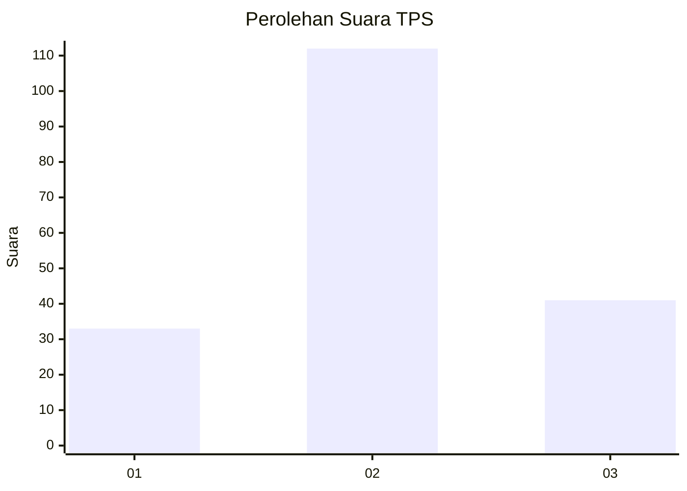
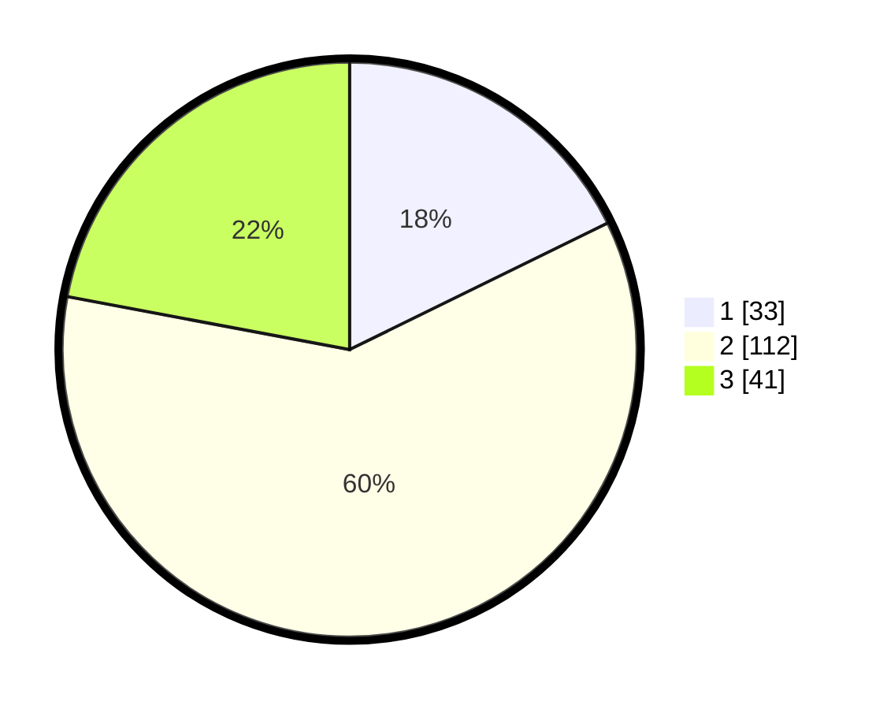

# Hasil

## Grafik

## Tabel

| No. | Nama Paslon    | Suara | Suara (raw) | Persentase |
|:--- |:-------------- | -----:| -----------:| ----------:|
| 1   | ANIES MUHAIMIN | 33    | [33][p-1]   | 17,74      |
| 2   | PRABOWO GIBRAN | 112   | [112][p-2]  | 60,22      |
| 3   | GANJAR MAHFUD  | 41    | [41][p-3]   | 22,04      |

[p-1]: https://github.com/gigit-pemilu/pemilu-2024-18-lampung/blob/main/pilpres/hitung-suara/sub/18-lampung/sub/04-lampung-barat/sub/20-pagar-dewa/sub/2001-pahayu-jaya/sub/007-tps/sub/paslon-1.txt
[p-2]: https://github.com/gigit-pemilu/pemilu-2024-18-lampung/blob/main/pilpres/hitung-suara/sub/18-lampung/sub/04-lampung-barat/sub/20-pagar-dewa/sub/2001-pahayu-jaya/sub/007-tps/sub/paslon-2.txt
[p-3]: https://github.com/gigit-pemilu/pemilu-2024-18-lampung/blob/main/pilpres/hitung-suara/sub/18-lampung/sub/04-lampung-barat/sub/20-pagar-dewa/sub/2001-pahayu-jaya/sub/007-tps/sub/paslon-3.txt

## Foto C Plano

https://sirekap-obj-formc.kpu.go.id/7506/pemilu/ppwp/18/04/20/20/01/1804202001007-20240215-041333--e4ade672-d8df-4040-af77-ea35ef1bfec0.jpg

https://sirekap-obj-formc.kpu.go.id/7506/pemilu/ppwp/18/04/20/20/01/1804202001007-20240215-041437--55e91f52-7503-470b-9581-ec7d5fe25f28.jpg

https://sirekap-obj-formc.kpu.go.id/7506/pemilu/ppwp/18/04/20/20/01/1804202001007-20240215-041507--fd85dc9d-0a64-4e87-b3bd-29544706c2fc.jpg

## Metadata

| Key        | Value               |
| ---------- | ------------------- |
| Time Stamp | 2024-02-16 02:00:27 |

