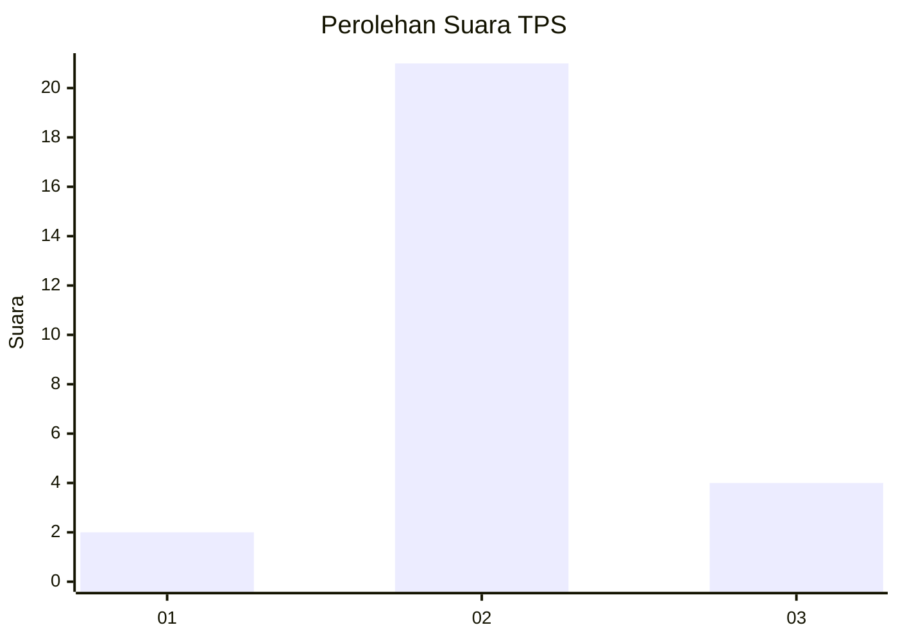

# Hasil

## Grafik

## Tabel

| No. | Nama Paslon    | Suara | Suara (raw) | Persentase |
|:--- |:-------------- | -----:| -----------:| ----------:|
| 1   | ANIES MUHAIMIN | 2     | [2][p-1]    | 7,41       |
| 2   | PRABOWO GIBRAN | 21    | [21][p-2]   | 77,78      |
| 3   | GANJAR MAHFUD  | 4     | [4][p-3]    | 14,81      |

[p-1]: https://github.com/gigit-pemilu/pemilu-2024-18-lampung/blob/main/pilpres/hitung-suara/sub/18-lampung/sub/04-lampung-barat/sub/21-batu-ketulis/sub/2005-luas/sub/007-tps/sub/paslon-1.txt
[p-2]: https://github.com/gigit-pemilu/pemilu-2024-18-lampung/blob/main/pilpres/hitung-suara/sub/18-lampung/sub/04-lampung-barat/sub/21-batu-ketulis/sub/2005-luas/sub/007-tps/sub/paslon-2.txt
[p-3]: https://github.com/gigit-pemilu/pemilu-2024-18-lampung/blob/main/pilpres/hitung-suara/sub/18-lampung/sub/04-lampung-barat/sub/21-batu-ketulis/sub/2005-luas/sub/007-tps/sub/paslon-3.txt

## Foto C Plano

https://sirekap-obj-formc.kpu.go.id/ecd1/pemilu/ppwp/18/04/21/20/05/1804212005007-20240215-122511--922c7d7b-afec-4e9f-a21b-96cddd290e4a.jpg

https://sirekap-obj-formc.kpu.go.id/ecd1/pemilu/ppwp/18/04/21/20/05/1804212005007-20240214-195616--3621323f-938e-4bde-89c1-c103fff6ac0c.jpg

https://sirekap-obj-formc.kpu.go.id/ecd1/pemilu/ppwp/18/04/21/20/05/1804212005007-20240215-122738--3e64437c-0e5b-447e-bed9-cb419a875de2.jpg

## Metadata

| Key        | Value               |
| ---------- | ------------------- |
| Time Stamp | 2024-02-15 15:00:29 |

