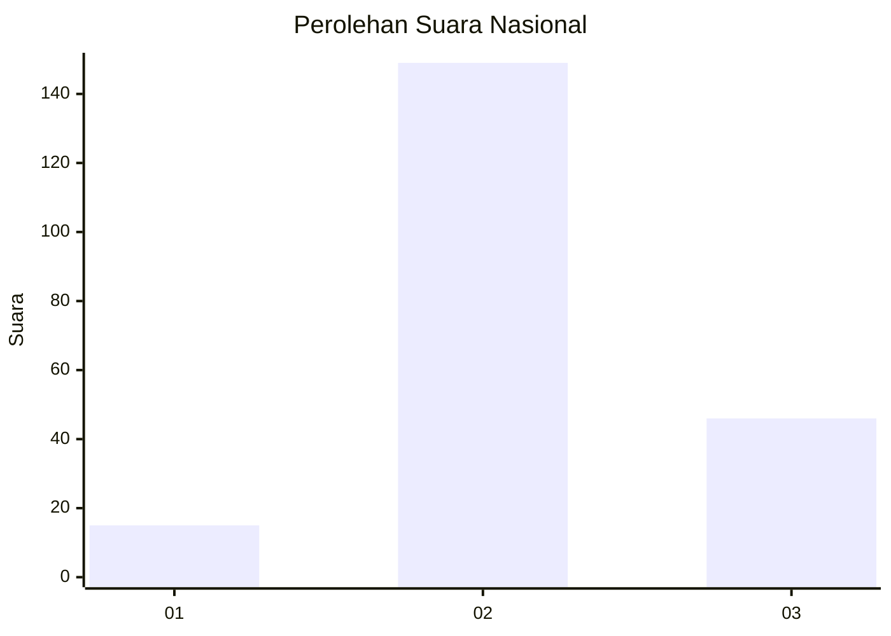

# Hasil

## Grafik

## Tabel

| No. | Nama Paslon    | Suara | Suara (raw) | Persentase |
|:--- |:-------------- | -----:| -----------:| ----------:|
| 1   | ANIES MUHAIMIN | 15    | [15][p-1]   | 7,14       |
| 2   | PRABOWO GIBRAN | 149   | [149][p-2]  | 70,95      |
| 3   | GANJAR MAHFUD  | 46    | [46][p-3]   | 21,90      |

[p-1]: https://github.com/gigit-pemilu/pemilu-2024/blob/main/pilpres/hitung-suara/sub/18-lampung/sub/04-lampung-barat/sub/23-bandar-negeri-suoh/sub/2001-suoh/sub/004-tps/sub/paslon-1.txt
[p-2]: https://github.com/gigit-pemilu/pemilu-2024/blob/main/pilpres/hitung-suara/sub/18-lampung/sub/04-lampung-barat/sub/23-bandar-negeri-suoh/sub/2001-suoh/sub/004-tps/sub/paslon-2.txt
[p-3]: https://github.com/gigit-pemilu/pemilu-2024/blob/main/pilpres/hitung-suara/sub/18-lampung/sub/04-lampung-barat/sub/23-bandar-negeri-suoh/sub/2001-suoh/sub/004-tps/sub/paslon-3.txt

## Foto C Plano

https://sirekap-obj-formc.kpu.go.id/29db/pemilu/ppwp/18/04/23/20/01/1804232001004-20240217-090816--3d56089b-c6a6-4d54-83de-3fc0195f85ea.jpg

https://sirekap-obj-formc.kpu.go.id/29db/pemilu/ppwp/18/04/23/20/01/1804232001004-20240217-082059--1e21bb2f-4274-49b1-96ab-136c99977a70.jpg

https://sirekap-obj-formc.kpu.go.id/29db/pemilu/ppwp/18/04/23/20/01/1804232001004-20240217-082230--73865e37-dbaf-4aff-b029-cf5ab30e0626.jpg

## Metadata

| Key        | Value               |
| ---------- | ------------------- |
| Time Stamp | 2024-02-17 09:30:03 |

