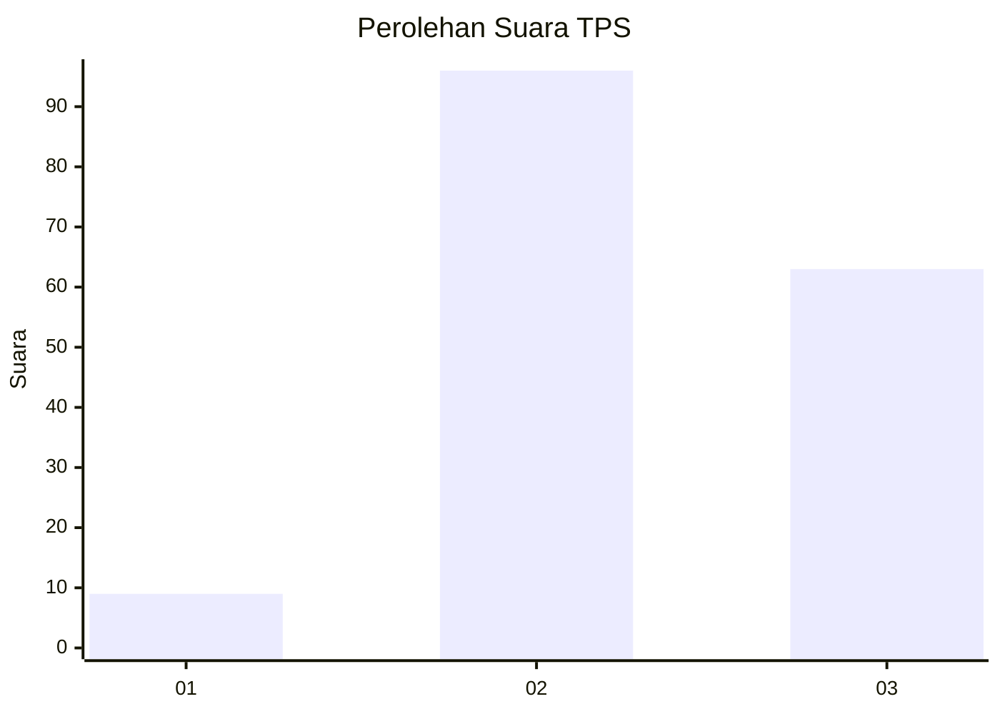
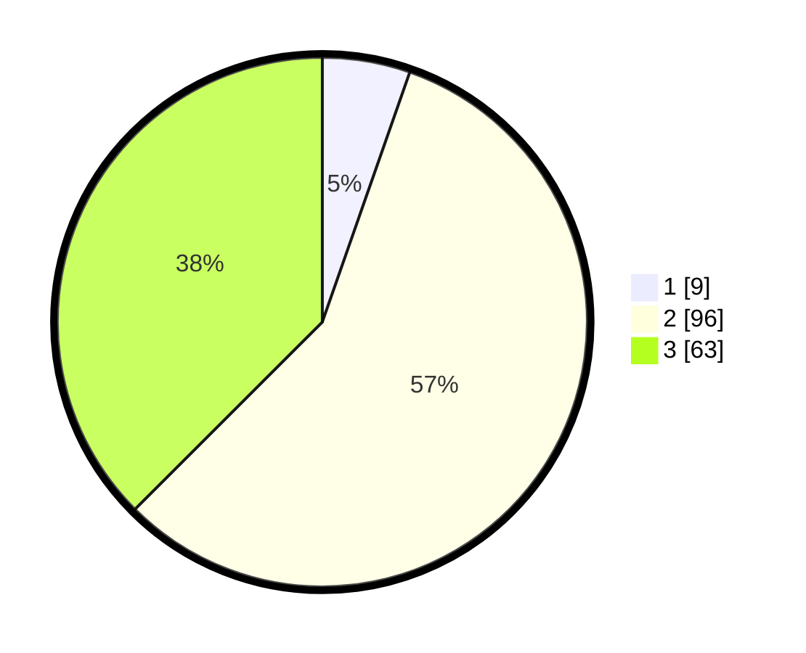

# Hasil

## Grafik

## Tabel

| No. | Nama Paslon    | Suara | Suara (raw) | Persentase |
|:--- |:-------------- | -----:| -----------:| ----------:|
| 1   | ANIES MUHAIMIN | 9     | [9][p-1]    | 5,36       |
| 2   | PRABOWO GIBRAN | 96    | [96][p-2]   | 57,14      |
| 3   | GANJAR MAHFUD  | 63    | [63][p-3]   | 37,50      |

[p-1]: https://github.com/gigit-pemilu/pemilu-2024-18-lampung/blob/main/pilpres/hitung-suara/sub/18-lampung/sub/05-tulang-bawang/sub/08-banjar-agung/sub/2001-banjar-agung/sub/003-tps/sub/paslon-1.txt
[p-2]: https://github.com/gigit-pemilu/pemilu-2024-18-lampung/blob/main/pilpres/hitung-suara/sub/18-lampung/sub/05-tulang-bawang/sub/08-banjar-agung/sub/2001-banjar-agung/sub/003-tps/sub/paslon-2.txt
[p-3]: https://github.com/gigit-pemilu/pemilu-2024-18-lampung/blob/main/pilpres/hitung-suara/sub/18-lampung/sub/05-tulang-bawang/sub/08-banjar-agung/sub/2001-banjar-agung/sub/003-tps/sub/paslon-3.txt

## Foto C Plano

https://sirekap-obj-formc.kpu.go.id/2e76/pemilu/ppwp/18/05/08/20/01/1805082001003-20240214-220901--06bea851-ac0a-4589-9792-1e3c2a1ee5fe.jpg

https://sirekap-obj-formc.kpu.go.id/2e76/pemilu/ppwp/18/05/08/20/01/1805082001003-20240214-220933--80d69c92-8101-4793-9681-8589f919965f.jpg

https://sirekap-obj-formc.kpu.go.id/2e76/pemilu/ppwp/18/05/08/20/01/1805082001003-20240214-221007--764e9bc5-44df-4d9a-8d98-d0087388e447.jpg

## Metadata

| Key        | Value               |
| ---------- | ------------------- |
| Time Stamp | 2024-02-15 23:29:50 |

