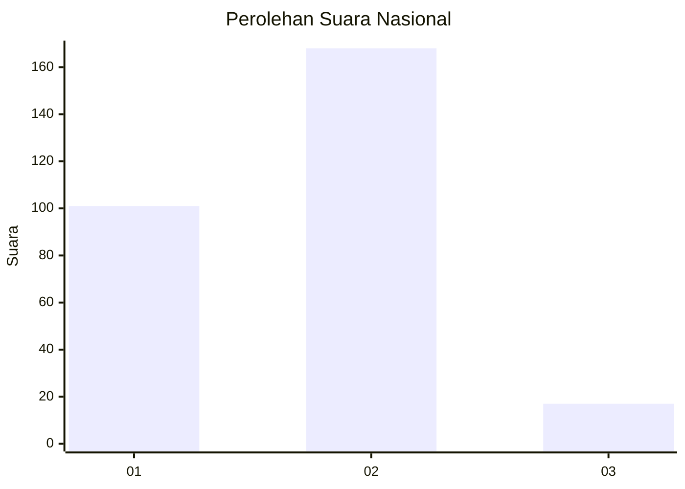
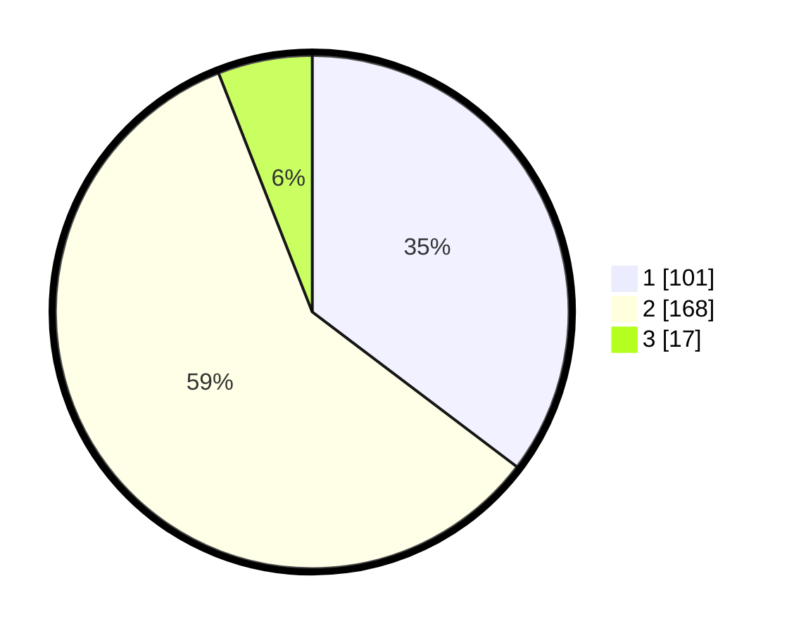

# Hasil

## Grafik

## Tabel

| No. | Nama Paslon    | Suara | Suara (raw) | Persentase |
|:--- |:-------------- | -----:| -----------:| ----------:|
| 1   | ANIES MUHAIMIN | 101   | [101][p-1]  | 35,31      |
| 2   | PRABOWO GIBRAN | 168   | [168][p-2]  | 58,74      |
| 3   | GANJAR MAHFUD  | 17    | [17][p-3]   | 5,94       |

[p-1]: https://github.com/gigit-pemilu/pemilu-2024/blob/main/pilpres/hitung-suara/sub/18-lampung/sub/05-tulang-bawang/sub/08-banjar-agung/sub/2021-tri-tunggal-jaya/sub/013-tps/sub/paslon-1.txt
[p-2]: https://github.com/gigit-pemilu/pemilu-2024/blob/main/pilpres/hitung-suara/sub/18-lampung/sub/05-tulang-bawang/sub/08-banjar-agung/sub/2021-tri-tunggal-jaya/sub/013-tps/sub/paslon-2.txt
[p-3]: https://github.com/gigit-pemilu/pemilu-2024/blob/main/pilpres/hitung-suara/sub/18-lampung/sub/05-tulang-bawang/sub/08-banjar-agung/sub/2021-tri-tunggal-jaya/sub/013-tps/sub/paslon-3.txt

## Foto C Plano

https://sirekap-obj-formc.kpu.go.id/5a12/pemilu/ppwp/18/05/08/20/21/1805082021013-20240214-225033--01067e43-b23f-4488-bc9f-e1075d3a0238.jpg

https://sirekap-obj-formc.kpu.go.id/5a12/pemilu/ppwp/18/05/08/20/21/1805082021013-20240214-225422--d4099127-0c9a-4a82-bf10-58ff9573d1f6.jpg

https://sirekap-obj-formc.kpu.go.id/5a12/pemilu/ppwp/18/05/08/20/21/1805082021013-20240214-230523--ff3982ec-1467-4c97-97d7-1d59e0f0860b.jpg

## Metadata

| Key        | Value               |
| ---------- | ------------------- |
| Time Stamp | 2024-02-26 14:00:00 |

