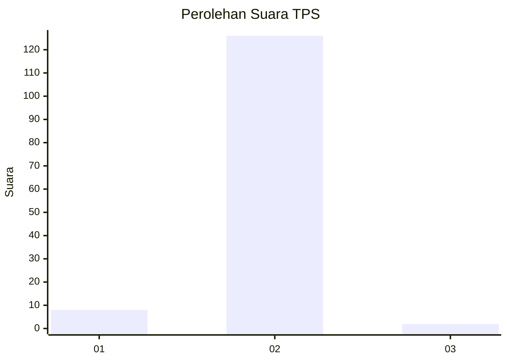
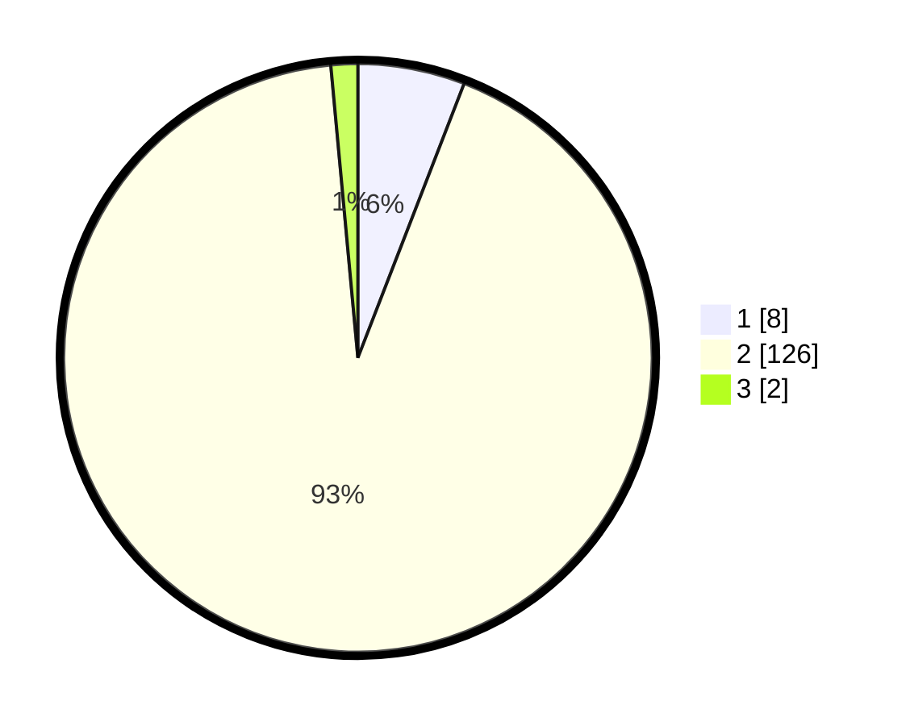

# Hasil

## Grafik

## Tabel

| No. | Nama Paslon    | Suara | Suara (raw) | Persentase |
|:--- |:-------------- | -----:| -----------:| ----------:|
| 1   | ANIES MUHAIMIN | 8     | [8][p-1]    | 5,88       |
| 2   | PRABOWO GIBRAN | 126   | [126][p-2]  | 92,65      |
| 3   | GANJAR MAHFUD  | 2     | [2][p-3]    | 1,47       |

[p-1]: https://github.com/gigit-pemilu/pemilu-2024-18-lampung/blob/main/pilpres/hitung-suara/sub/18-lampung/sub/05-tulang-bawang/sub/11-gedung-meneng/sub/2001-gunung-tapa/sub/001-tps/sub/paslon-1.txt
[p-2]: https://github.com/gigit-pemilu/pemilu-2024-18-lampung/blob/main/pilpres/hitung-suara/sub/18-lampung/sub/05-tulang-bawang/sub/11-gedung-meneng/sub/2001-gunung-tapa/sub/001-tps/sub/paslon-2.txt
[p-3]: https://github.com/gigit-pemilu/pemilu-2024-18-lampung/blob/main/pilpres/hitung-suara/sub/18-lampung/sub/05-tulang-bawang/sub/11-gedung-meneng/sub/2001-gunung-tapa/sub/001-tps/sub/paslon-3.txt

## Foto C Plano

https://sirekap-obj-formc.kpu.go.id/4030/pemilu/ppwp/18/05/11/20/01/1805112001001-20240214-190318--8528708c-48b7-4ed0-b679-e9426d49ae12.jpg

https://sirekap-obj-formc.kpu.go.id/4030/pemilu/ppwp/18/05/11/20/01/1805112001001-20240216-134106--0a94dd52-cc5d-4932-abc2-50bd25bd9fdb.jpg

https://sirekap-obj-formc.kpu.go.id/4030/pemilu/ppwp/18/05/11/20/01/1805112001001-20240216-134105--6b1dd0dc-75a1-4e70-9f30-f145ea352928.jpg

## Metadata

| Key        | Value               |
| ---------- | ------------------- |
| Time Stamp | 2024-02-19 06:16:00 |

