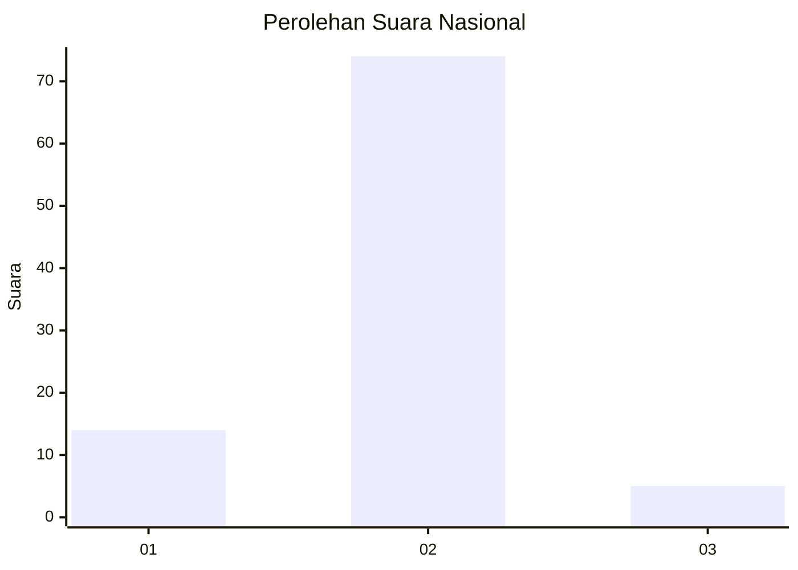
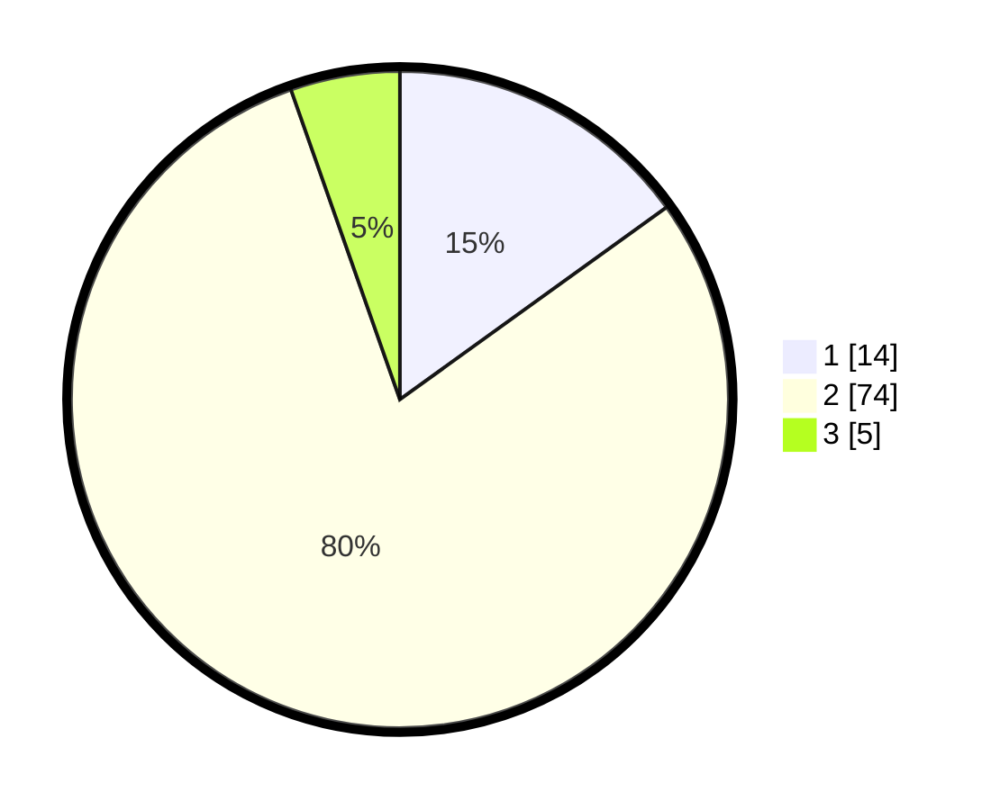

# Hasil

## Grafik

## Tabel

| No. | Nama Paslon    | Suara | Suara (raw) | Persentase |
|:--- |:-------------- | -----:| -----------:| ----------:|
| 1   | ANIES MUHAIMIN | 14    | [14][p-1]   | 15,05      |
| 2   | PRABOWO GIBRAN | 74    | [74][p-2]   | 79,57      |
| 3   | GANJAR MAHFUD  | 5     | [5][p-3]    | 5,38       |

[p-1]: https://github.com/gigit-pemilu/pemilu-2024/blob/main/pilpres/hitung-suara/sub/18-lampung/sub/05-tulang-bawang/sub/11-gedung-meneng/sub/2002-gedung-meneng/sub/049-tps/sub/paslon-1.txt
[p-2]: https://github.com/gigit-pemilu/pemilu-2024/blob/main/pilpres/hitung-suara/sub/18-lampung/sub/05-tulang-bawang/sub/11-gedung-meneng/sub/2002-gedung-meneng/sub/049-tps/sub/paslon-2.txt
[p-3]: https://github.com/gigit-pemilu/pemilu-2024/blob/main/pilpres/hitung-suara/sub/18-lampung/sub/05-tulang-bawang/sub/11-gedung-meneng/sub/2002-gedung-meneng/sub/049-tps/sub/paslon-3.txt

## Foto C Plano

https://sirekap-obj-formc.kpu.go.id/eb85/pemilu/ppwp/18/05/11/20/02/1805112002049-20240214-141813--4adaa920-040a-4871-8fe4-139e4a147676.jpg

https://sirekap-obj-formc.kpu.go.id/eb85/pemilu/ppwp/18/05/11/20/02/1805112002049-20240214-141901--68dd6e7c-afec-4a43-90ea-70b231154e35.jpg

https://sirekap-obj-formc.kpu.go.id/eb85/pemilu/ppwp/18/05/11/20/02/1805112002049-20240214-141928--5bbf86c2-76dd-4f37-b642-70bb4d63fe4c.jpg

## Metadata

| Key        | Value               |
| ---------- | ------------------- |
| Time Stamp | 2024-02-16 00:30:27 |

