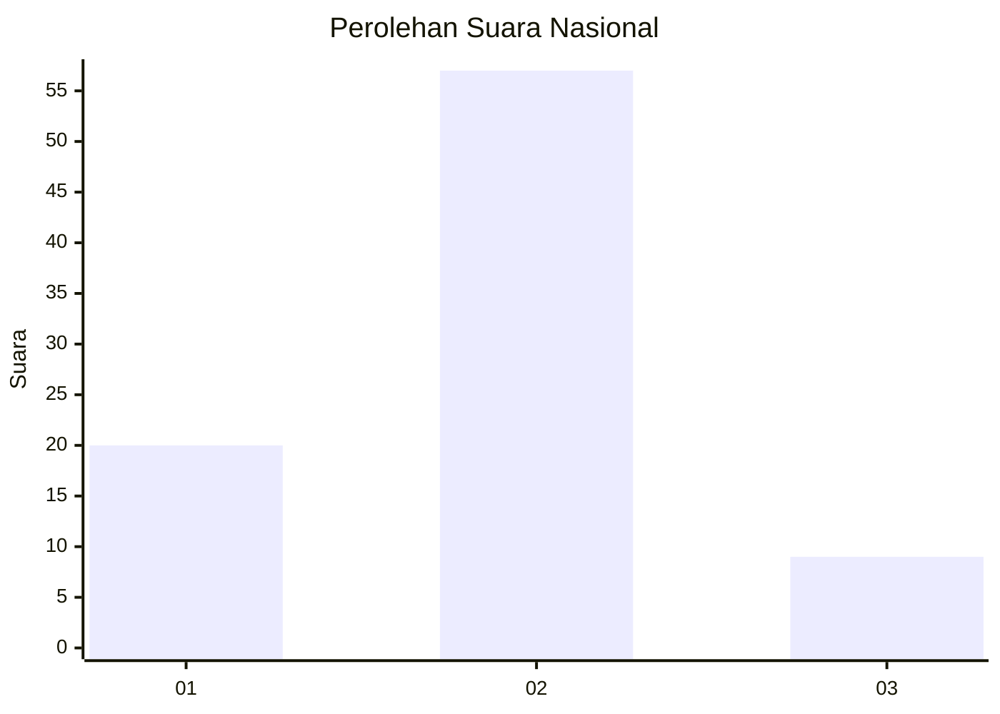

# Hasil

## Grafik

## Tabel

| No. | Nama Paslon    | Suara | Suara (raw) | Persentase |
|:--- |:-------------- | -----:| -----------:| ----------:|
| 1   | ANIES MUHAIMIN | 20    | [20][p-1]   | 23,26      |
| 2   | PRABOWO GIBRAN | 57    | [57][p-2]   | 66,28      |
| 3   | GANJAR MAHFUD  | 9     | [9][p-3]    | 10,47      |

[p-1]: https://github.com/gigit-pemilu/pemilu-2024/blob/main/pilpres/hitung-suara/sub/18-lampung/sub/05-tulang-bawang/sub/11-gedung-meneng/sub/2002-gedung-meneng/sub/050-tps/sub/paslon-1.txt
[p-2]: https://github.com/gigit-pemilu/pemilu-2024/blob/main/pilpres/hitung-suara/sub/18-lampung/sub/05-tulang-bawang/sub/11-gedung-meneng/sub/2002-gedung-meneng/sub/050-tps/sub/paslon-2.txt
[p-3]: https://github.com/gigit-pemilu/pemilu-2024/blob/main/pilpres/hitung-suara/sub/18-lampung/sub/05-tulang-bawang/sub/11-gedung-meneng/sub/2002-gedung-meneng/sub/050-tps/sub/paslon-3.txt

## Foto C Plano

https://sirekap-obj-formc.kpu.go.id/5209/pemilu/ppwp/18/05/11/20/02/1805112002050-20240215-023934--6ee76308-2529-4d4d-876b-46baedac9ce2.jpg

https://sirekap-obj-formc.kpu.go.id/5209/pemilu/ppwp/18/05/11/20/02/1805112002050-20240215-010132--93f429c0-6c4c-473b-ad97-927edf701272.jpg

https://sirekap-obj-formc.kpu.go.id/5209/pemilu/ppwp/18/05/11/20/02/1805112002050-20240215-010154--ddf415f8-d381-4744-99d1-a5a74cff7341.jpg

## Metadata

| Key        | Value               |
| ---------- | ------------------- |
| Time Stamp | 2024-02-16 00:30:27 |

