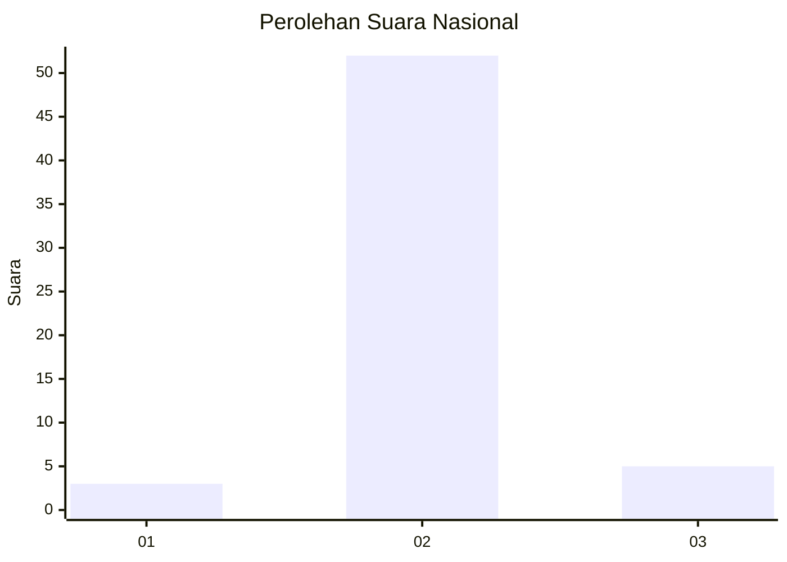
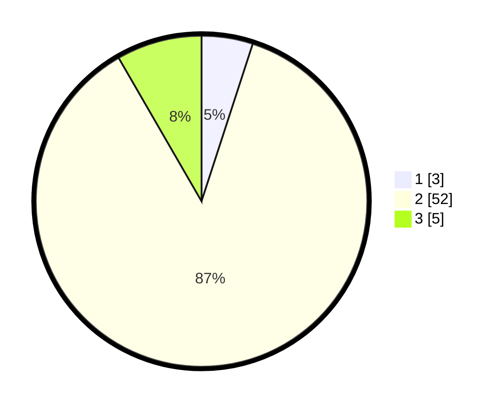

# Hasil

## Grafik

## Tabel

| No. | Nama Paslon    | Suara | Suara (raw) | Persentase |
|:--- |:-------------- | -----:| -----------:| ----------:|
| 1   | ANIES MUHAIMIN | 3     | [3][p-1]    | 5,00       |
| 2   | PRABOWO GIBRAN | 52    | [52][p-2]   | 86,67      |
| 3   | GANJAR MAHFUD  | 5     | [5][p-3]    | 8,33       |

[p-1]: https://github.com/gigit-pemilu/pemilu-2024/blob/main/pilpres/hitung-suara/sub/18-lampung/sub/05-tulang-bawang/sub/11-gedung-meneng/sub/2002-gedung-meneng/sub/058-tps/sub/paslon-1.txt
[p-2]: https://github.com/gigit-pemilu/pemilu-2024/blob/main/pilpres/hitung-suara/sub/18-lampung/sub/05-tulang-bawang/sub/11-gedung-meneng/sub/2002-gedung-meneng/sub/058-tps/sub/paslon-2.txt
[p-3]: https://github.com/gigit-pemilu/pemilu-2024/blob/main/pilpres/hitung-suara/sub/18-lampung/sub/05-tulang-bawang/sub/11-gedung-meneng/sub/2002-gedung-meneng/sub/058-tps/sub/paslon-3.txt

## Foto C Plano

https://sirekap-obj-formc.kpu.go.id/9fd9/pemilu/ppwp/18/05/11/20/02/1805112002058-20240216-144712--fe310f5b-1173-4b10-a279-acab8a797b0b.jpg

https://sirekap-obj-formc.kpu.go.id/9fd9/pemilu/ppwp/18/05/11/20/02/1805112002058-20240216-151153--40958670-ae21-4f59-a93e-5d9f08d72a17.jpg

https://sirekap-obj-formc.kpu.go.id/9fd9/pemilu/ppwp/18/05/11/20/02/1805112002058-20240216-152850--9f7b4f31-d003-493e-be19-3330cc9179e7.jpg

## Metadata

| Key        | Value               |
| ---------- | ------------------- |
| Time Stamp | 2024-02-16 22:01:00 |

