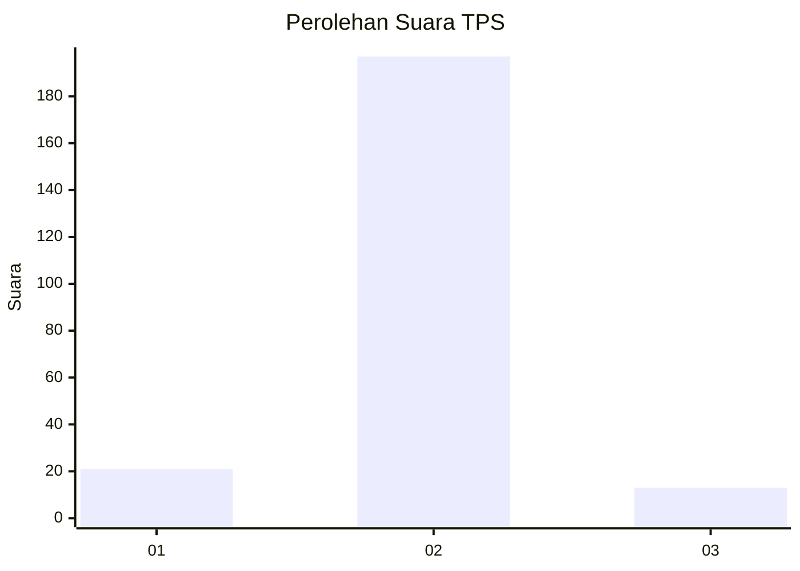
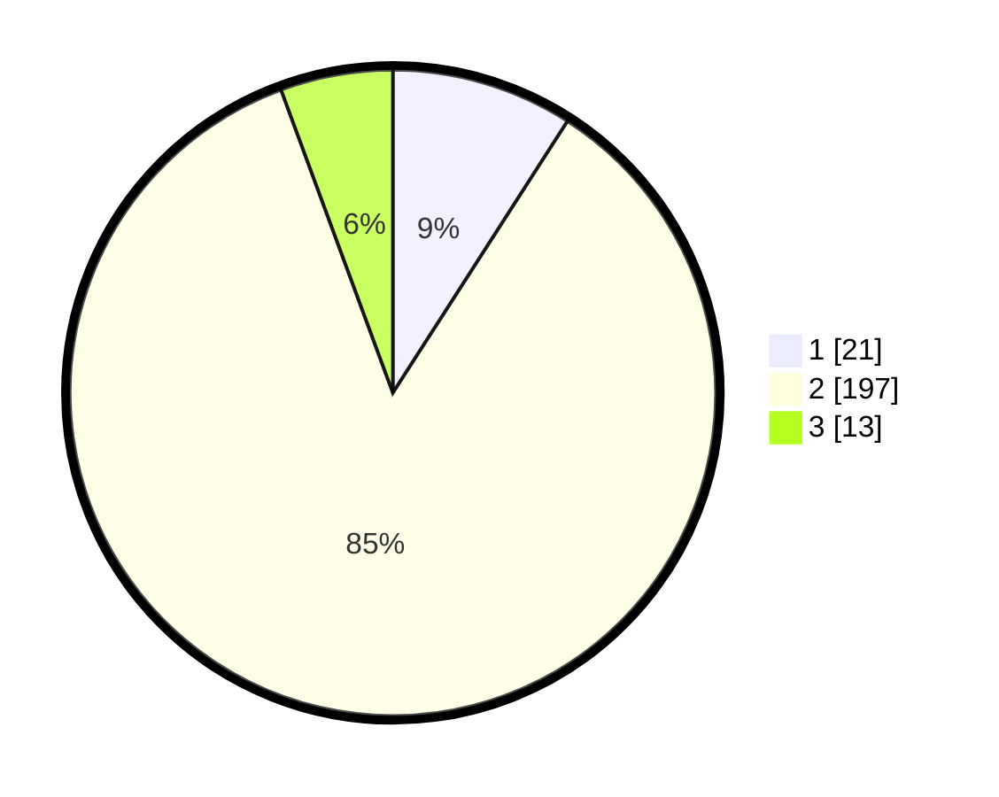

# Hasil

## Grafik

## Tabel

| No. | Nama Paslon    | Suara | Suara (raw) | Persentase |
|:--- |:-------------- | -----:| -----------:| ----------:|
| 1   | ANIES MUHAIMIN | 21    | [21][p-1]   | 9,09       |
| 2   | PRABOWO GIBRAN | 197   | [197][p-2]  | 85,28      |
| 3   | GANJAR MAHFUD  | 13    | [13][p-3]   | 5,63       |

[p-1]: https://github.com/gigit-pemilu/pemilu-2024-18-lampung/blob/main/pilpres/hitung-suara/sub/18-lampung/sub/05-tulang-bawang/sub/11-gedung-meneng/sub/2016-gunung-tapa-udik/sub/003-tps/sub/paslon-1.txt
[p-2]: https://github.com/gigit-pemilu/pemilu-2024-18-lampung/blob/main/pilpres/hitung-suara/sub/18-lampung/sub/05-tulang-bawang/sub/11-gedung-meneng/sub/2016-gunung-tapa-udik/sub/003-tps/sub/paslon-2.txt
[p-3]: https://github.com/gigit-pemilu/pemilu-2024-18-lampung/blob/main/pilpres/hitung-suara/sub/18-lampung/sub/05-tulang-bawang/sub/11-gedung-meneng/sub/2016-gunung-tapa-udik/sub/003-tps/sub/paslon-3.txt

## Foto C Plano

https://sirekap-obj-formc.kpu.go.id/8429/pemilu/ppwp/18/05/11/20/16/1805112016003-20240214-225526--72f3e873-0463-457a-abe4-90bb70cd40bd.jpg

https://sirekap-obj-formc.kpu.go.id/8429/pemilu/ppwp/18/05/11/20/16/1805112016003-20240214-225614--573a7542-16bf-4ede-954a-b33db7e55449.jpg

https://sirekap-obj-formc.kpu.go.id/8429/pemilu/ppwp/18/05/11/20/16/1805112016003-20240214-225621--b90f0a4f-ffa7-4ddd-87ba-5c61e4610ca7.jpg

## Metadata

| Key        | Value               |
| ---------- | ------------------- |
| Time Stamp | 2024-02-16 00:00:26 |

## DATA PEMILIH TETAP

Jumlah pemilih dalam DPT: **231**.
 * L: **155**.
 * P: **426**.

## DATA PENGGUNA HAK PILIH

Jumlah pengguna hak pilih dalam DPT: **221**.
 * L: **129**.
 * P: **101**.

Jumlah pengguna hak pilih dalam DPTb: **248**.
 * L: **88**.
 * P: **82**.

Jumlah pengguna hak pilih dalam DPK: **912**.
 * L: **88**.
 * P: **11**.

Jumlah pengguna hak pilih: **240**.
 * L: **828**.
 * P: **112**.

## JUMLAH SUARA SAH DAN TIDAK SAH

JUMLAH SELURUH SUARA SAH: **231**.

JUMLAH SUARA TIDAK SAH: **9**.

JUMLAH SELURUH SUARA SAH DAN SUARA TIDAK SAH: **240**.

