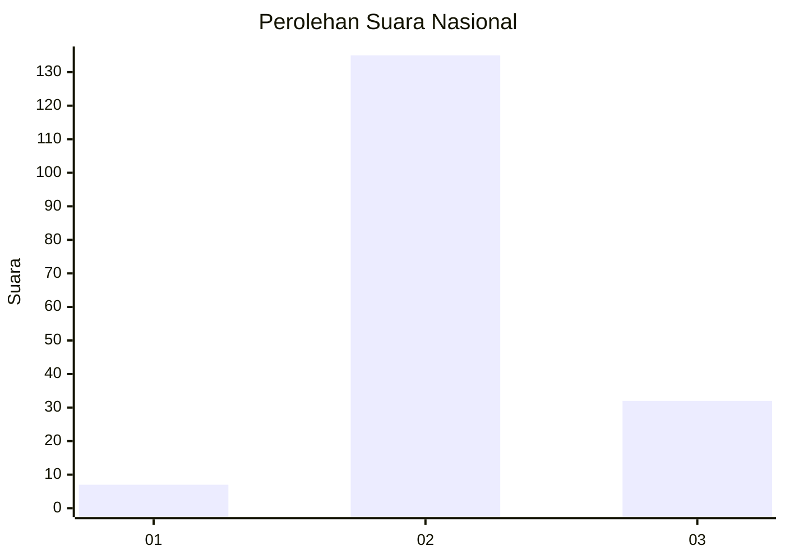

# Hasil

## Grafik

## Tabel

| No. | Nama Paslon    | Suara | Suara (raw) | Persentase |
|:--- |:-------------- | -----:| -----------:| ----------:|
| 1   | ANIES MUHAIMIN | 7     | [7][p-1]    | 4,02       |
| 2   | PRABOWO GIBRAN | 135   | [135][p-2]  | 77,59      |
| 3   | GANJAR MAHFUD  | 32    | [32][p-3]   | 18,39      |

[p-1]: https://github.com/gigit-pemilu/pemilu-2024/blob/main/pilpres/hitung-suara/sub/18-lampung/sub/05-tulang-bawang/sub/12-rawa-jitu-selatan/sub/2003-yudha-karya-jitu/sub/004-tps/sub/paslon-1.txt
[p-2]: https://github.com/gigit-pemilu/pemilu-2024/blob/main/pilpres/hitung-suara/sub/18-lampung/sub/05-tulang-bawang/sub/12-rawa-jitu-selatan/sub/2003-yudha-karya-jitu/sub/004-tps/sub/paslon-2.txt
[p-3]: https://github.com/gigit-pemilu/pemilu-2024/blob/main/pilpres/hitung-suara/sub/18-lampung/sub/05-tulang-bawang/sub/12-rawa-jitu-selatan/sub/2003-yudha-karya-jitu/sub/004-tps/sub/paslon-3.txt

## Foto C Plano

https://sirekap-obj-formc.kpu.go.id/f222/pemilu/ppwp/18/05/12/20/03/1805122003004-20240215-015328--d358f41a-376e-4e87-b598-69d1da44ce18.jpg

https://sirekap-obj-formc.kpu.go.id/f222/pemilu/ppwp/18/05/12/20/03/1805122003004-20240215-015602--456cabd9-511d-441f-9737-7032ef0ce0ac.jpg

https://sirekap-obj-formc.kpu.go.id/f222/pemilu/ppwp/18/05/12/20/03/1805122003004-20240215-015744--57b9dde2-6fad-4f7b-809d-cb8461c1433e.jpg

## Metadata

| Key        | Value               |
| ---------- | ------------------- |
| Time Stamp | 2024-02-15 23:29:50 |

