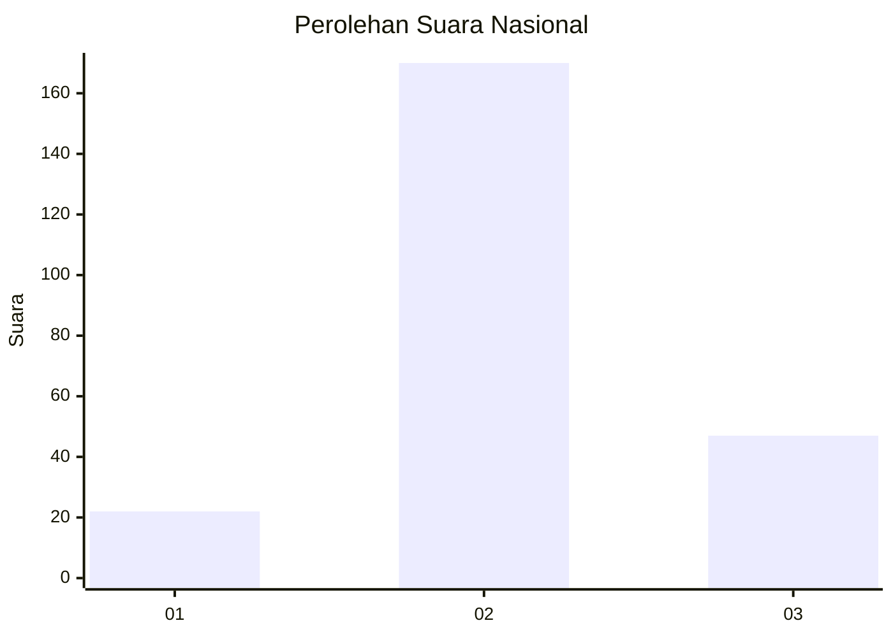
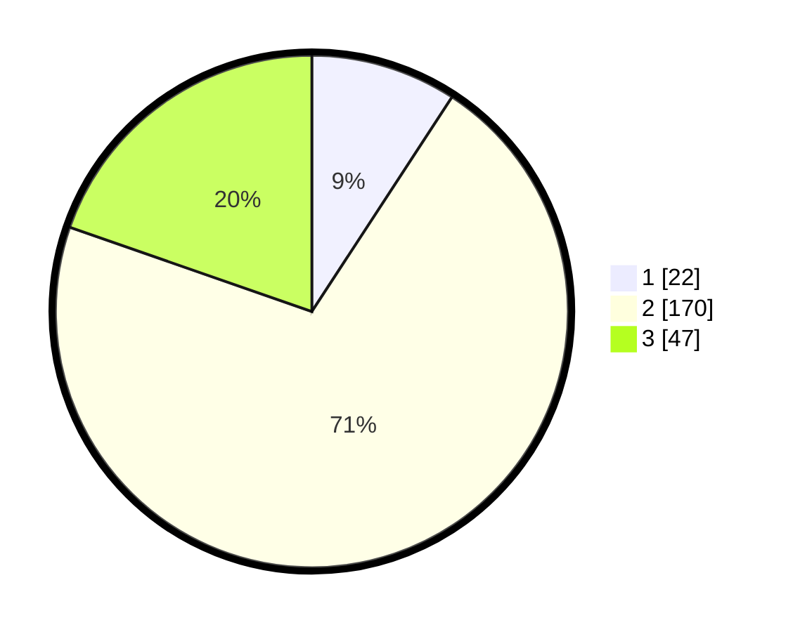

# Hasil

## Grafik

## Tabel

| No. | Nama Paslon    | Suara | Suara (raw) | Persentase |
|:--- |:-------------- | -----:| -----------:| ----------:|
| 1   | ANIES MUHAIMIN | 22    | [22][p-1]   | 9,21       |
| 2   | PRABOWO GIBRAN | 170   | [170][p-2]  | 71,13      |
| 3   | GANJAR MAHFUD  | 47    | [47][p-3]   | 19,67      |

[p-1]: https://github.com/gigit-pemilu/pemilu-2024/blob/main/pilpres/hitung-suara/sub/18-lampung/sub/05-tulang-bawang/sub/12-rawa-jitu-selatan/sub/2004-gedung-karya-jitu/sub/005-tps/sub/paslon-1.txt
[p-2]: https://github.com/gigit-pemilu/pemilu-2024/blob/main/pilpres/hitung-suara/sub/18-lampung/sub/05-tulang-bawang/sub/12-rawa-jitu-selatan/sub/2004-gedung-karya-jitu/sub/005-tps/sub/paslon-2.txt
[p-3]: https://github.com/gigit-pemilu/pemilu-2024/blob/main/pilpres/hitung-suara/sub/18-lampung/sub/05-tulang-bawang/sub/12-rawa-jitu-selatan/sub/2004-gedung-karya-jitu/sub/005-tps/sub/paslon-3.txt

## Foto C Plano

https://sirekap-obj-formc.kpu.go.id/4008/pemilu/ppwp/18/05/12/20/04/1805122004005-20240215-000512--76bf9ddc-f833-4ffb-91ae-89f0fbb7e26e.jpg

https://sirekap-obj-formc.kpu.go.id/4008/pemilu/ppwp/18/05/12/20/04/1805122004005-20240215-000643--bdca18e1-3d62-4fe2-930d-0d925e899047.jpg

https://sirekap-obj-formc.kpu.go.id/4008/pemilu/ppwp/18/05/12/20/04/1805122004005-20240215-000821--4a466e62-b5f0-46d6-8838-d9faf4df9420.jpg

## Metadata

| Key        | Value               |
| ---------- | ------------------- |
| Time Stamp | 2024-02-15 23:29:50 |

