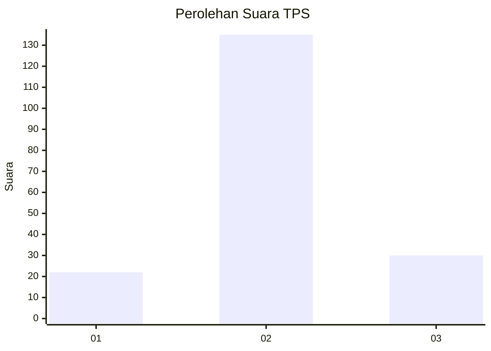
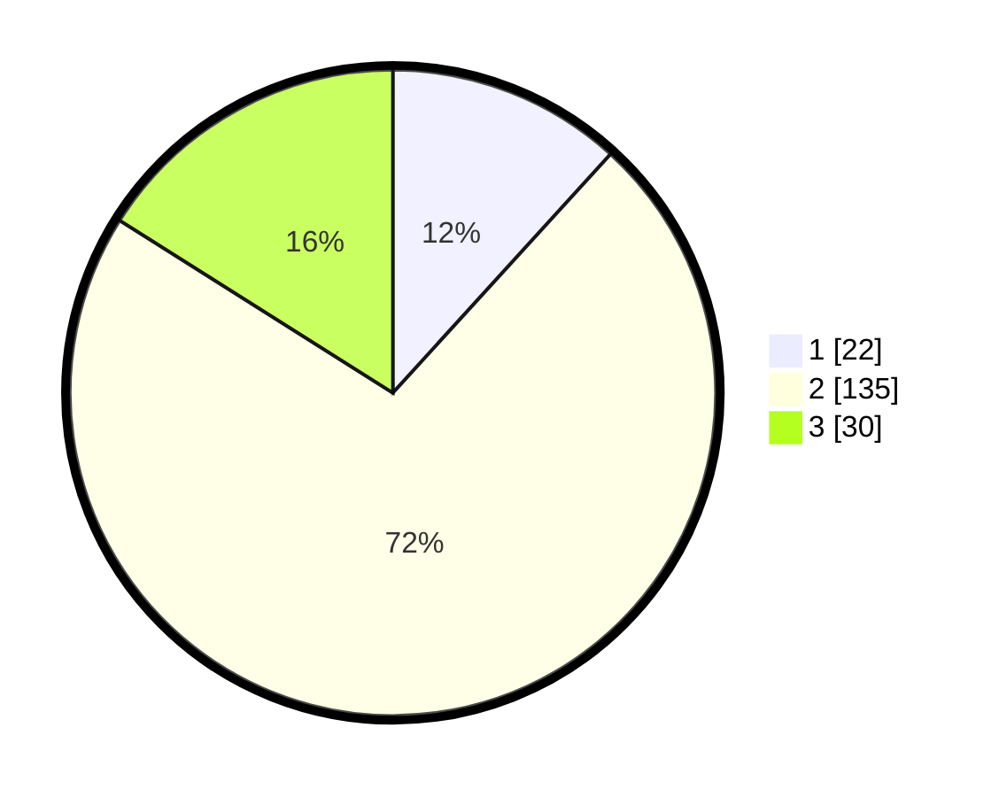

# Hasil

## Grafik

## Tabel

| No. | Nama Paslon    | Suara | Suara (raw) | Persentase |
|:--- |:-------------- | -----:| -----------:| ----------:|
| 1   | ANIES MUHAIMIN | 22    | [22][p-1]   | 11,76      |
| 2   | PRABOWO GIBRAN | 135   | [135][p-2]  | 72,19      |
| 3   | GANJAR MAHFUD  | 30    | [30][p-3]   | 16,04      |

[p-1]: https://github.com/gigit-pemilu/pemilu-2024-18-lampung/blob/main/pilpres/hitung-suara/sub/18-lampung/sub/05-tulang-bawang/sub/20-banjar-margo/sub/2001-bujuk-agung/sub/005-tps/sub/paslon-1.txt
[p-2]: https://github.com/gigit-pemilu/pemilu-2024-18-lampung/blob/main/pilpres/hitung-suara/sub/18-lampung/sub/05-tulang-bawang/sub/20-banjar-margo/sub/2001-bujuk-agung/sub/005-tps/sub/paslon-2.txt
[p-3]: https://github.com/gigit-pemilu/pemilu-2024-18-lampung/blob/main/pilpres/hitung-suara/sub/18-lampung/sub/05-tulang-bawang/sub/20-banjar-margo/sub/2001-bujuk-agung/sub/005-tps/sub/paslon-3.txt

## Foto C Plano

https://sirekap-obj-formc.kpu.go.id/1ac7/pemilu/ppwp/18/05/20/20/01/1805202001005-20240214-192650--6060f5e2-a5de-426b-872b-333b4930576a.jpg

https://sirekap-obj-formc.kpu.go.id/1ac7/pemilu/ppwp/18/05/20/20/01/1805202001005-20240214-192828--288a4307-e28a-4d55-9164-f9e7d55970fd.jpg

https://sirekap-obj-formc.kpu.go.id/1ac7/pemilu/ppwp/18/05/20/20/01/1805202001005-20240214-192929--f193d4c7-3d92-419e-b381-1fc9fa8343a2.jpg

## Metadata

| Key        | Value               |
| ---------- | ------------------- |
| Time Stamp | 2024-02-25 08:00:00 |

