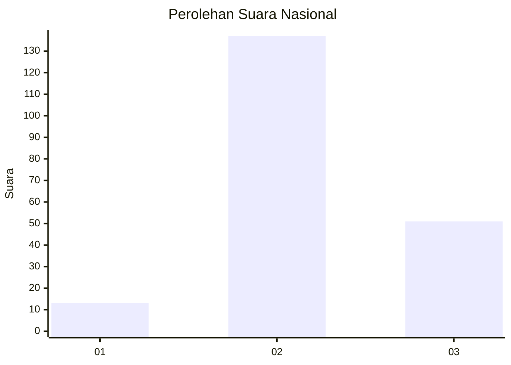
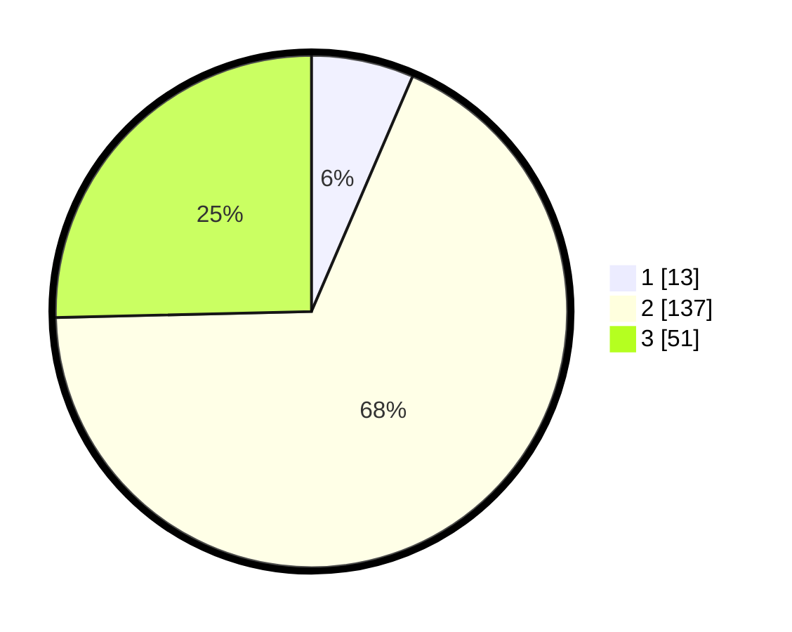

# Hasil

## Grafik

## Tabel

| No. | Nama Paslon    | Suara | Suara (raw) | Persentase |
|:--- |:-------------- | -----:| -----------:| ----------:|
| 1   | ANIES MUHAIMIN | 13    | [13][p-1]   | 6,47       |
| 2   | PRABOWO GIBRAN | 137   | [137][p-2]  | 68,16      |
| 3   | GANJAR MAHFUD  | 51    | [51][p-3]   | 25,37      |

[p-1]: https://github.com/gigit-pemilu/pemilu-2024/blob/main/pilpres/hitung-suara/sub/18-lampung/sub/05-tulang-bawang/sub/22-rawa-pitu/sub/2001-sumber-agung/sub/007-tps/sub/paslon-1.txt
[p-2]: https://github.com/gigit-pemilu/pemilu-2024/blob/main/pilpres/hitung-suara/sub/18-lampung/sub/05-tulang-bawang/sub/22-rawa-pitu/sub/2001-sumber-agung/sub/007-tps/sub/paslon-2.txt
[p-3]: https://github.com/gigit-pemilu/pemilu-2024/blob/main/pilpres/hitung-suara/sub/18-lampung/sub/05-tulang-bawang/sub/22-rawa-pitu/sub/2001-sumber-agung/sub/007-tps/sub/paslon-3.txt

## Foto C Plano

https://sirekap-obj-formc.kpu.go.id/c4a9/pemilu/ppwp/18/05/22/20/01/1805222001007-20240214-160157--d1488f75-ee0c-40d8-b82a-8979537c788c.jpg

https://sirekap-obj-formc.kpu.go.id/c4a9/pemilu/ppwp/18/05/22/20/01/1805222001007-20240214-155808--ac08198a-49b8-4e4a-a538-ca55a2dc7f39.jpg

https://sirekap-obj-formc.kpu.go.id/c4a9/pemilu/ppwp/18/05/22/20/01/1805222001007-20240214-155436--33535f04-a347-4076-b970-b5e446a4e763.jpg

## Metadata

| Key        | Value               |
| ---------- | ------------------- |
| Time Stamp | 2024-02-16 14:30:33 |

