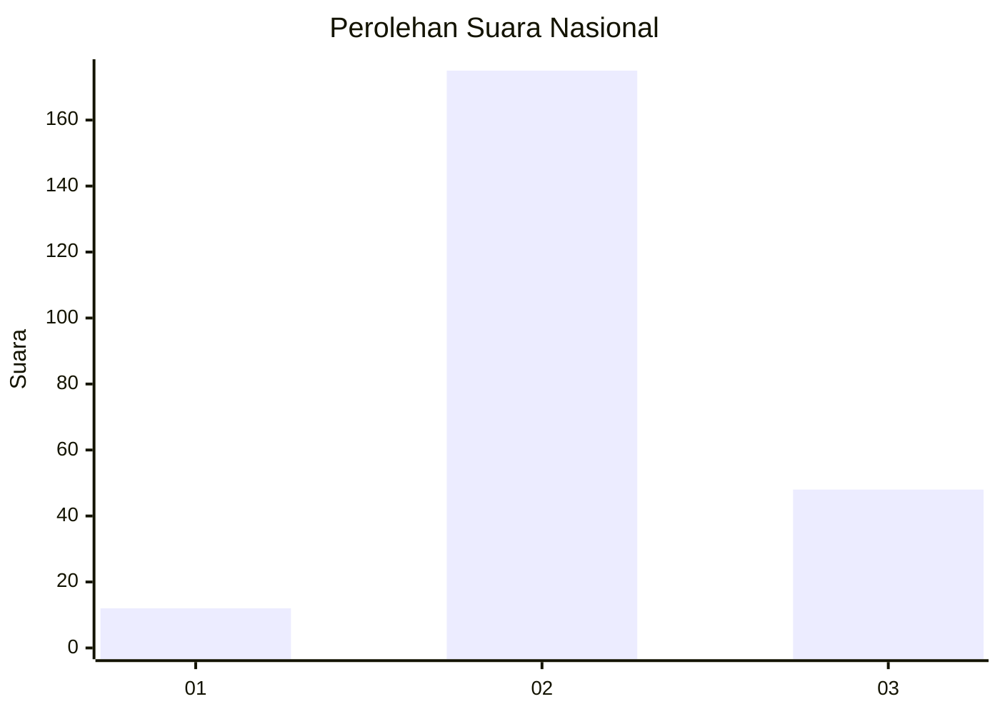

# Hasil

## Grafik

## Tabel

| No. | Nama Paslon    | Suara | Suara (raw) | Persentase |
|:--- |:-------------- | -----:| -----------:| ----------:|
| 1   | ANIES MUHAIMIN | 12    | [12][p-1]   | 5,11       |
| 2   | PRABOWO GIBRAN | 175   | [175][p-2]  | 74,47      |
| 3   | GANJAR MAHFUD  | 48    | [48][p-3]   | 20,43      |

[p-1]: https://github.com/gigit-pemilu/pemilu-2024/blob/main/pilpres/hitung-suara/sub/18-lampung/sub/05-tulang-bawang/sub/27-gedung-aji-baru/sub/2001-sidomukti/sub/005-tps/sub/paslon-1.txt
[p-2]: https://github.com/gigit-pemilu/pemilu-2024/blob/main/pilpres/hitung-suara/sub/18-lampung/sub/05-tulang-bawang/sub/27-gedung-aji-baru/sub/2001-sidomukti/sub/005-tps/sub/paslon-2.txt
[p-3]: https://github.com/gigit-pemilu/pemilu-2024/blob/main/pilpres/hitung-suara/sub/18-lampung/sub/05-tulang-bawang/sub/27-gedung-aji-baru/sub/2001-sidomukti/sub/005-tps/sub/paslon-3.txt

## Foto C Plano

https://sirekap-obj-formc.kpu.go.id/7aad/pemilu/ppwp/18/05/27/20/01/1805272001005-20240214-204825--7ef8f60c-e38b-4cf4-b8b5-8c717205bde7.jpg

https://sirekap-obj-formc.kpu.go.id/7aad/pemilu/ppwp/18/05/27/20/01/1805272001005-20240214-203841--4d94343a-eabe-45ae-b278-f966ec146cfa.jpg

https://sirekap-obj-formc.kpu.go.id/7aad/pemilu/ppwp/18/05/27/20/01/1805272001005-20240214-204845--38e1049a-5b3e-4ce9-88cc-1114a1556823.jpg

## Metadata

| Key        | Value               |
| ---------- | ------------------- |
| Time Stamp | 2024-02-15 15:00:29 |

