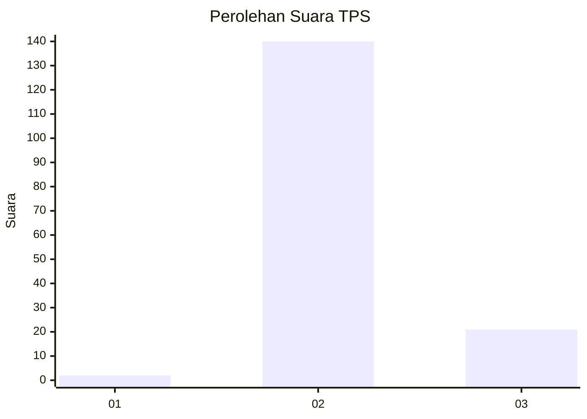
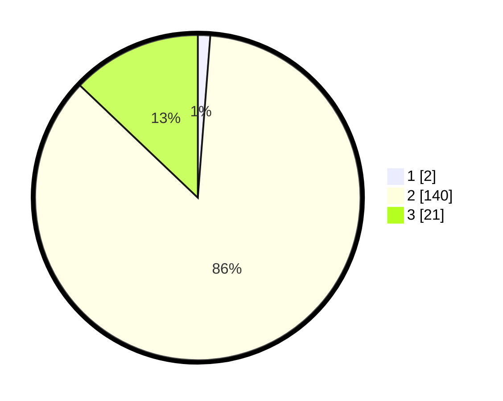

# Hasil

## Grafik

## Tabel

| No. | Nama Paslon    | Suara | Suara (raw) | Persentase |
|:--- |:-------------- | -----:| -----------:| ----------:|
| 1   | ANIES MUHAIMIN | 2     | [2][p-1]    | 1,23       |
| 2   | PRABOWO GIBRAN | 140   | [140][p-2]  | 85,89      |
| 3   | GANJAR MAHFUD  | 21    | [21][p-3]   | 12,88      |

[p-1]: https://github.com/gigit-pemilu/pemilu-2024-18-lampung/blob/main/pilpres/hitung-suara/sub/18-lampung/sub/05-tulang-bawang/sub/30-menggala-timur/sub/2001-lebuh-dalem/sub/005-tps/sub/paslon-1.txt
[p-2]: https://github.com/gigit-pemilu/pemilu-2024-18-lampung/blob/main/pilpres/hitung-suara/sub/18-lampung/sub/05-tulang-bawang/sub/30-menggala-timur/sub/2001-lebuh-dalem/sub/005-tps/sub/paslon-2.txt
[p-3]: https://github.com/gigit-pemilu/pemilu-2024-18-lampung/blob/main/pilpres/hitung-suara/sub/18-lampung/sub/05-tulang-bawang/sub/30-menggala-timur/sub/2001-lebuh-dalem/sub/005-tps/sub/paslon-3.txt

## Foto C Plano

https://sirekap-obj-formc.kpu.go.id/73b7/pemilu/ppwp/18/05/30/20/01/1805302001005-20240214-155726--281738b1-c0b4-40ab-b92e-5c26c899b990.jpg

https://sirekap-obj-formc.kpu.go.id/73b7/pemilu/ppwp/18/05/30/20/01/1805302001005-20240214-155243--b8617dce-44fa-4aec-943b-055268a597cd.jpg

https://sirekap-obj-formc.kpu.go.id/73b7/pemilu/ppwp/18/05/30/20/01/1805302001005-20240214-155432--0681790a-4a64-49e7-8a7d-ceac96af240b.jpg

## Metadata

| Key        | Value               |
| ---------- | ------------------- |
| Time Stamp | 2024-02-16 01:30:27 |

