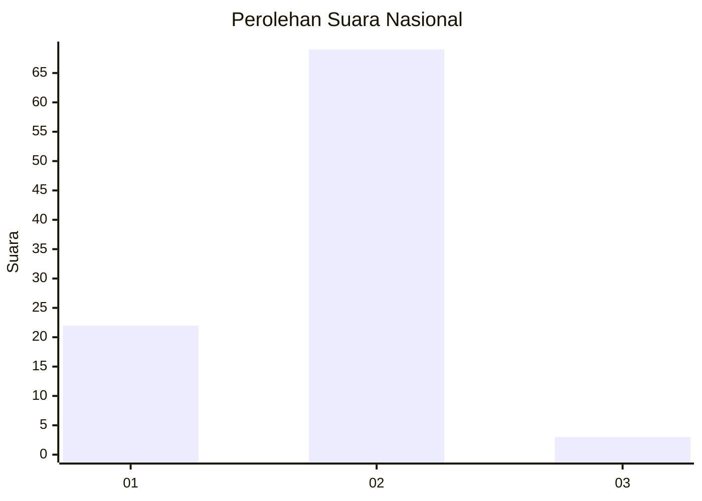
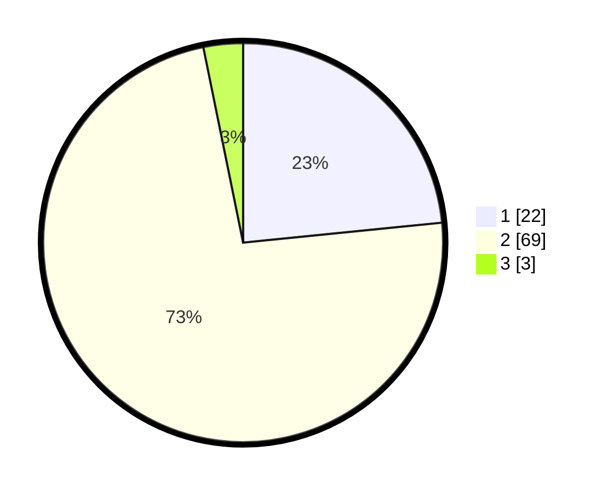

# Hasil

## Grafik

## Tabel

| No. | Nama Paslon    | Suara | Suara (raw) | Persentase |
|:--- |:-------------- | -----:| -----------:| ----------:|
| 1   | ANIES MUHAIMIN | 22    | [22][p-1]   | 23,40      |
| 2   | PRABOWO GIBRAN | 69    | [69][p-2]   | 73,40      |
| 3   | GANJAR MAHFUD  | 3     | [3][p-3]    | 3,19       |

[p-1]: https://github.com/gigit-pemilu/pemilu-2024/blob/main/pilpres/hitung-suara/sub/18-lampung/sub/06-tanggamus/sub/04-pulau-panggung/sub/2014-batu-bedil/sub/005-tps/sub/paslon-1.txt
[p-2]: https://github.com/gigit-pemilu/pemilu-2024/blob/main/pilpres/hitung-suara/sub/18-lampung/sub/06-tanggamus/sub/04-pulau-panggung/sub/2014-batu-bedil/sub/005-tps/sub/paslon-2.txt
[p-3]: https://github.com/gigit-pemilu/pemilu-2024/blob/main/pilpres/hitung-suara/sub/18-lampung/sub/06-tanggamus/sub/04-pulau-panggung/sub/2014-batu-bedil/sub/005-tps/sub/paslon-3.txt

## Foto C Plano

https://sirekap-obj-formc.kpu.go.id/374e/pemilu/ppwp/18/06/04/20/14/1806042014005-20240218-234912--2c0b7279-878a-41c4-ab06-f0eca05b373f.jpg

https://sirekap-obj-formc.kpu.go.id/374e/pemilu/ppwp/18/06/04/20/14/1806042014005-20240218-235059--ebe088c5-7b50-4760-bddd-9fdf5aa05f18.jpg

https://sirekap-obj-formc.kpu.go.id/374e/pemilu/ppwp/18/06/04/20/14/1806042014005-20240218-235213--c9bc5d75-8ed1-4a08-a3a5-19927ef7c750.jpg

## Metadata

| Key        | Value               |
| ---------- | ------------------- |
| Time Stamp | 2024-02-25 13:00:00 |

