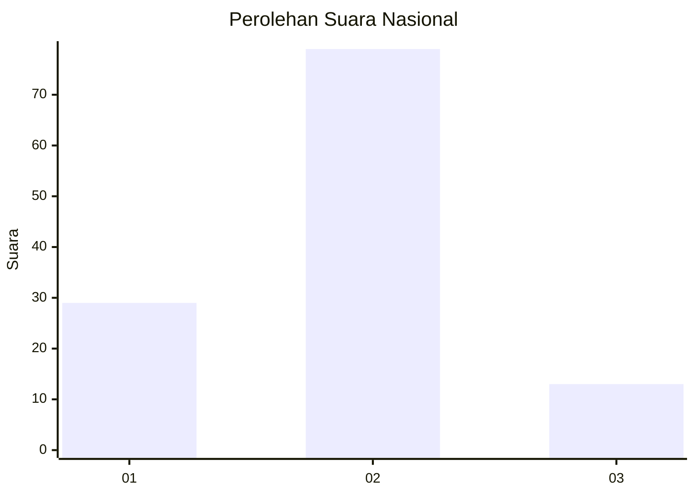

# Hasil

## Grafik

## Tabel

| No. | Nama Paslon    | Suara | Suara (raw) | Persentase |
|:--- |:-------------- | -----:| -----------:| ----------:|
| 1   | ANIES MUHAIMIN | 29    | [29][p-1]   | 23,97      |
| 2   | PRABOWO GIBRAN | 79    | [79][p-2]   | 65,29      |
| 3   | GANJAR MAHFUD  | 13    | [13][p-3]   | 10,74      |

[p-1]: https://github.com/gigit-pemilu/pemilu-2024/blob/main/pilpres/hitung-suara/sub/18-lampung/sub/06-tanggamus/sub/09-cukuh-balak/sub/2002-sawang-balak/sub/002-tps/sub/paslon-1.txt
[p-2]: https://github.com/gigit-pemilu/pemilu-2024/blob/main/pilpres/hitung-suara/sub/18-lampung/sub/06-tanggamus/sub/09-cukuh-balak/sub/2002-sawang-balak/sub/002-tps/sub/paslon-2.txt
[p-3]: https://github.com/gigit-pemilu/pemilu-2024/blob/main/pilpres/hitung-suara/sub/18-lampung/sub/06-tanggamus/sub/09-cukuh-balak/sub/2002-sawang-balak/sub/002-tps/sub/paslon-3.txt

## Foto C Plano

https://sirekap-obj-formc.kpu.go.id/a9b2/pemilu/ppwp/18/06/09/20/02/1806092002002-20240215-065920--96620223-508b-4777-89ef-4faf30fc9a2f.jpg

https://sirekap-obj-formc.kpu.go.id/a9b2/pemilu/ppwp/18/06/09/20/02/1806092002002-20240215-070122--cf3206f4-7bec-4446-be2c-2f5936b1acc1.jpg

https://sirekap-obj-formc.kpu.go.id/a9b2/pemilu/ppwp/18/06/09/20/02/1806092002002-20240215-070440--6f63d325-e2f5-427f-9860-f0100e288e69.jpg

## Metadata

| Key        | Value               |
| ---------- | ------------------- |
| Time Stamp | 2024-02-15 22:30:27 |

