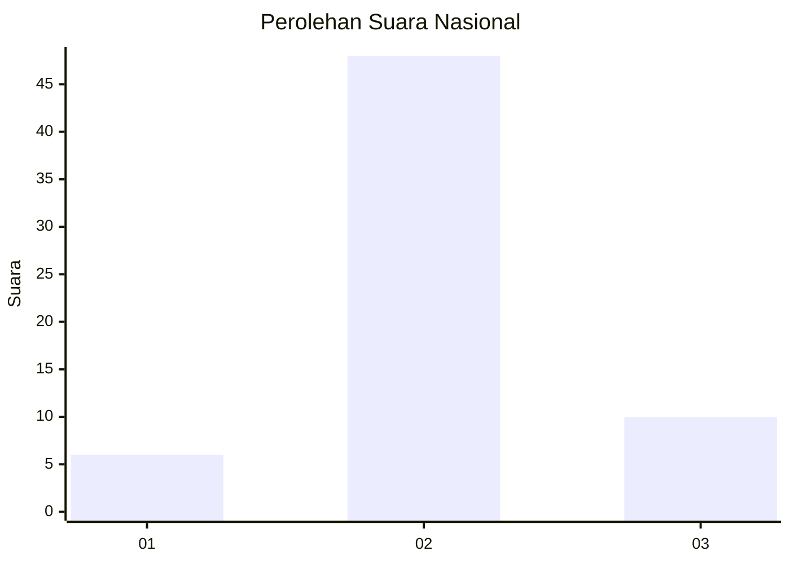

# Hasil

## Grafik

## Tabel

| No. | Nama Paslon    | Suara | Suara (raw) | Persentase |
|:--- |:-------------- | -----:| -----------:| ----------:|
| 1   | ANIES MUHAIMIN | 6     | [6][p-1]    | 9,38       |
| 2   | PRABOWO GIBRAN | 48    | [48][p-2]   | 75,00      |
| 3   | GANJAR MAHFUD  | 10    | [10][p-3]   | 15,63      |

[p-1]: https://github.com/gigit-pemilu/pemilu-2024/blob/main/pilpres/hitung-suara/sub/18-lampung/sub/06-tanggamus/sub/09-cukuh-balak/sub/2015-tanjung-betuah/sub/003-tps/sub/paslon-1.txt
[p-2]: https://github.com/gigit-pemilu/pemilu-2024/blob/main/pilpres/hitung-suara/sub/18-lampung/sub/06-tanggamus/sub/09-cukuh-balak/sub/2015-tanjung-betuah/sub/003-tps/sub/paslon-2.txt
[p-3]: https://github.com/gigit-pemilu/pemilu-2024/blob/main/pilpres/hitung-suara/sub/18-lampung/sub/06-tanggamus/sub/09-cukuh-balak/sub/2015-tanjung-betuah/sub/003-tps/sub/paslon-3.txt

## Foto C Plano

https://sirekap-obj-formc.kpu.go.id/79a3/pemilu/ppwp/18/06/09/20/15/1806092015003-20240214-141718--9b29598e-29e3-44d8-8ed7-663435f7c2e5.jpg

https://sirekap-obj-formc.kpu.go.id/79a3/pemilu/ppwp/18/06/09/20/15/1806092015003-20240214-141348--fe64571e-a92e-466d-8ded-3e213ec982e7.jpg

https://sirekap-obj-formc.kpu.go.id/79a3/pemilu/ppwp/18/06/09/20/15/1806092015003-20240214-141435--df6bcb1d-3aad-4116-aa8c-305e2f3986ce.jpg

## Metadata

| Key        | Value               |
| ---------- | ------------------- |
| Time Stamp | 2024-02-14 21:46:01 |

