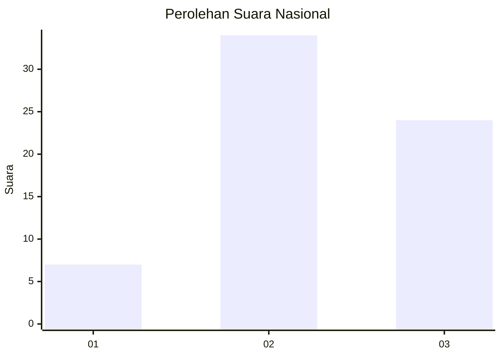
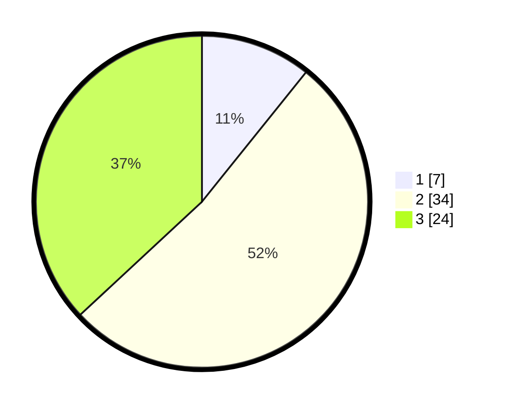

# Hasil

## Grafik

## Tabel

| No. | Nama Paslon    | Suara | Suara (raw) | Persentase |
|:--- |:-------------- | -----:| -----------:| ----------:|
| 1   | ANIES MUHAIMIN | 7     | [7][p-1]    | 10,77      |
| 2   | PRABOWO GIBRAN | 34    | [34][p-2]   | 52,31      |
| 3   | GANJAR MAHFUD  | 24    | [24][p-3]   | 36,92      |

[p-1]: https://github.com/gigit-pemilu/pemilu-2024/blob/main/pilpres/hitung-suara/sub/18-lampung/sub/06-tanggamus/sub/09-cukuh-balak/sub/2015-tanjung-betuah/sub/004-tps/sub/paslon-1.txt
[p-2]: https://github.com/gigit-pemilu/pemilu-2024/blob/main/pilpres/hitung-suara/sub/18-lampung/sub/06-tanggamus/sub/09-cukuh-balak/sub/2015-tanjung-betuah/sub/004-tps/sub/paslon-2.txt
[p-3]: https://github.com/gigit-pemilu/pemilu-2024/blob/main/pilpres/hitung-suara/sub/18-lampung/sub/06-tanggamus/sub/09-cukuh-balak/sub/2015-tanjung-betuah/sub/004-tps/sub/paslon-3.txt

## Foto C Plano

https://sirekap-obj-formc.kpu.go.id/99a9/pemilu/ppwp/18/06/09/20/15/1806092015004-20240215-095720--9c04356d-e177-4483-8520-7135c65897e2.jpg

https://sirekap-obj-formc.kpu.go.id/99a9/pemilu/ppwp/18/06/09/20/15/1806092015004-20240215-004356--3f343376-b51c-4379-8e44-8fff5ec3c74e.jpg

https://sirekap-obj-formc.kpu.go.id/99a9/pemilu/ppwp/18/06/09/20/15/1806092015004-20240215-100125--c57b7a00-5a84-4e86-9c61-4738926d2b60.jpg

## Metadata

| Key        | Value               |
| ---------- | ------------------- |
| Time Stamp | 2024-02-16 12:51:22 |

