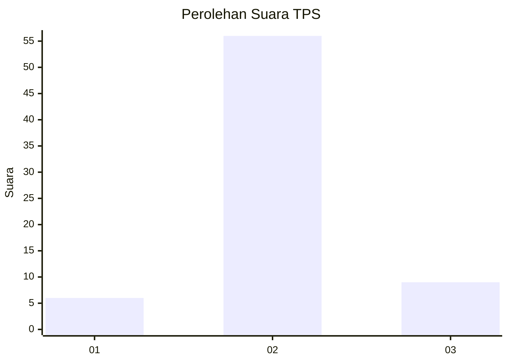
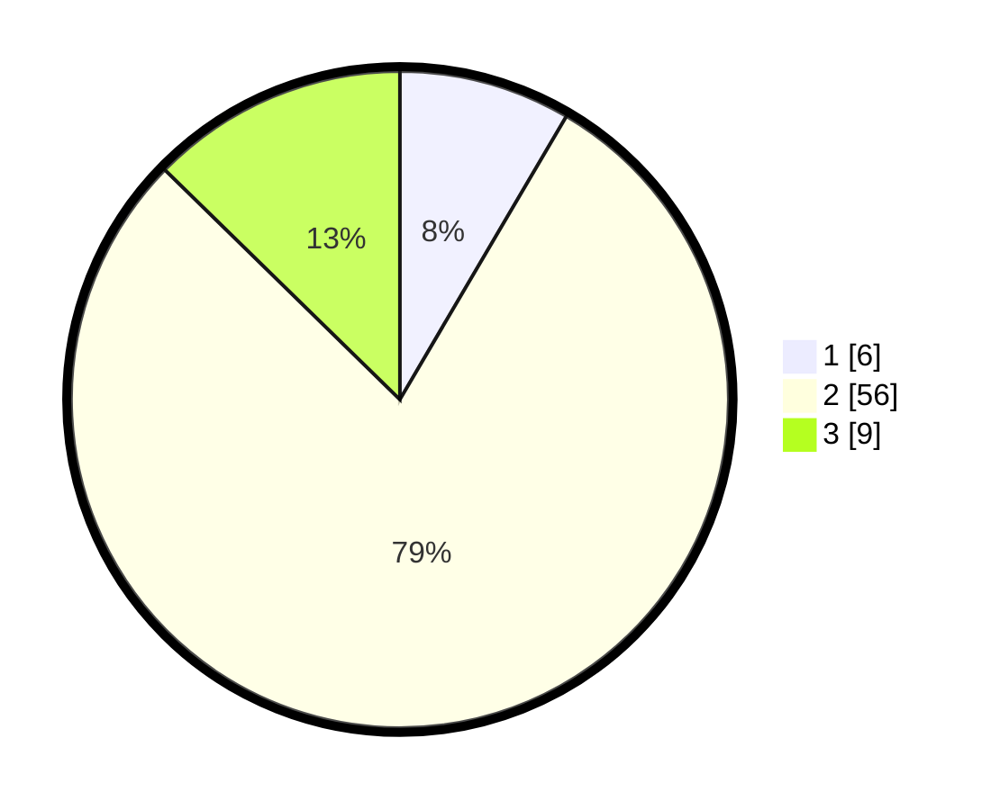

# Hasil

## Grafik

## Tabel

| No. | Nama Paslon    | Suara | Suara (raw) | Persentase |
|:--- |:-------------- | -----:| -----------:| ----------:|
| 1   | ANIES MUHAIMIN | 6     | [6][p-1]    | 8,45       |
| 2   | PRABOWO GIBRAN | 56    | [56][p-2]   | 78,87      |
| 3   | GANJAR MAHFUD  | 9     | [9][p-3]    | 12,68      |

[p-1]: https://github.com/gigit-pemilu/pemilu-2024-18-lampung/blob/main/pilpres/hitung-suara/sub/18-lampung/sub/06-tanggamus/sub/16-pematang-sawa/sub/2009-teluk-brak/sub/004-tps/sub/paslon-1.txt
[p-2]: https://github.com/gigit-pemilu/pemilu-2024-18-lampung/blob/main/pilpres/hitung-suara/sub/18-lampung/sub/06-tanggamus/sub/16-pematang-sawa/sub/2009-teluk-brak/sub/004-tps/sub/paslon-2.txt
[p-3]: https://github.com/gigit-pemilu/pemilu-2024-18-lampung/blob/main/pilpres/hitung-suara/sub/18-lampung/sub/06-tanggamus/sub/16-pematang-sawa/sub/2009-teluk-brak/sub/004-tps/sub/paslon-3.txt

## Foto C Plano

https://sirekap-obj-formc.kpu.go.id/e569/pemilu/ppwp/18/06/16/20/09/1806162009004-20240215-000442--70ae6e0b-0a13-4368-b8ac-2042342ddaa6.jpg

https://sirekap-obj-formc.kpu.go.id/e569/pemilu/ppwp/18/06/16/20/09/1806162009004-20240214-141802--38e9f3ed-34c0-4f40-86a7-c01b42f21220.jpg

https://sirekap-obj-formc.kpu.go.id/e569/pemilu/ppwp/18/06/16/20/09/1806162009004-20240214-141859--0d655ae6-a6cc-4e0a-88e4-9fa13b7f062f.jpg

## Metadata

| Key        | Value               |
| ---------- | ------------------- |
| Time Stamp | 2024-02-15 12:00:28 |

