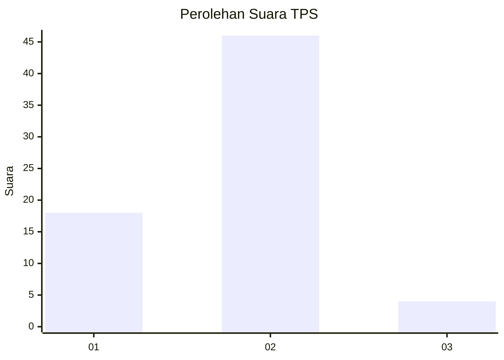
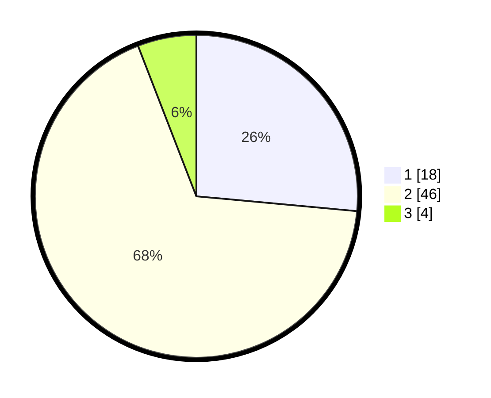

# Hasil

## Grafik

## Tabel

| No. | Nama Paslon    | Suara | Suara (raw) | Persentase |
|:--- |:-------------- | -----:| -----------:| ----------:|
| 1   | ANIES MUHAIMIN | 18    | [18][p-1]   | 26,47      |
| 2   | PRABOWO GIBRAN | 46    | [46][p-2]   | 67,65      |
| 3   | GANJAR MAHFUD  | 4     | [4][p-3]    | 5,88       |

[p-1]: https://github.com/gigit-pemilu/pemilu-2024-18-lampung/blob/main/pilpres/hitung-suara/sub/18-lampung/sub/06-tanggamus/sub/17-kelumbayan/sub/2001-negeri-kelumbayan/sub/002-tps/sub/paslon-1.txt
[p-2]: https://github.com/gigit-pemilu/pemilu-2024-18-lampung/blob/main/pilpres/hitung-suara/sub/18-lampung/sub/06-tanggamus/sub/17-kelumbayan/sub/2001-negeri-kelumbayan/sub/002-tps/sub/paslon-2.txt
[p-3]: https://github.com/gigit-pemilu/pemilu-2024-18-lampung/blob/main/pilpres/hitung-suara/sub/18-lampung/sub/06-tanggamus/sub/17-kelumbayan/sub/2001-negeri-kelumbayan/sub/002-tps/sub/paslon-3.txt

## Foto C Plano

https://sirekap-obj-formc.kpu.go.id/5db0/pemilu/ppwp/18/06/17/20/01/1806172001002-20240214-210927--319da157-7f64-433e-ac6f-5505ee3b3d6c.jpg

https://sirekap-obj-formc.kpu.go.id/5db0/pemilu/ppwp/18/06/17/20/01/1806172001002-20240215-065341--5781cadf-a664-428f-a1b8-447d46a29399.jpg

https://sirekap-obj-formc.kpu.go.id/5db0/pemilu/ppwp/18/06/17/20/01/1806172001002-20240214-215744--6c093a3b-1a31-46b9-9972-1c98627709f3.jpg

## Metadata

| Key        | Value               |
| ---------- | ------------------- |
| Time Stamp | 2024-02-15 22:00:27 |

## DATA PEMILIH TETAP

Jumlah pemilih dalam DPT: **81**.
 * L: **45**.
 * P: **36**.

## DATA PENGGUNA HAK PILIH

Jumlah pengguna hak pilih dalam DPT: **63**.
 * L: **33**.
 * P: **30**.

Jumlah pengguna hak pilih dalam DPTb: **0**.
 * L: **0**.
 * P: **0**.

Jumlah pengguna hak pilih dalam DPK: **6**.
 * L: **4**.
 * P: **2**.

Jumlah pengguna hak pilih: **69**.
 * L: **37**.
 * P: **32**.

## JUMLAH SUARA SAH DAN TIDAK SAH

JUMLAH SELURUH SUARA SAH: **68**.

JUMLAH SUARA TIDAK SAH: **1**.

JUMLAH SELURUH SUARA SAH DAN SUARA TIDAK SAH: **69**.

