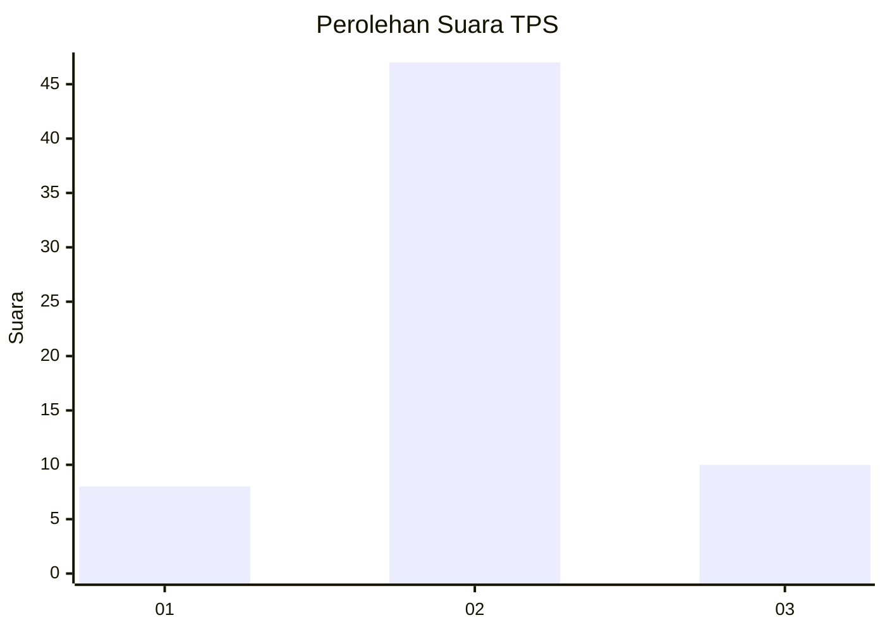
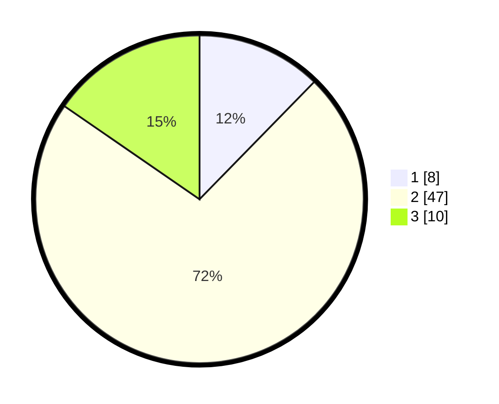

# Hasil

## Grafik

## Tabel

| No. | Nama Paslon    | Suara | Suara (raw) | Persentase |
|:--- |:-------------- | -----:| -----------:| ----------:|
| 1   | ANIES MUHAIMIN | 8     | [8][p-1]    | 12,31      |
| 2   | PRABOWO GIBRAN | 47    | [47][p-2]   | 72,31      |
| 3   | GANJAR MAHFUD  | 10    | [10][p-3]   | 15,38      |

[p-1]: https://github.com/gigit-pemilu/pemilu-2024-18-lampung/blob/main/pilpres/hitung-suara/sub/18-lampung/sub/06-tanggamus/sub/17-kelumbayan/sub/2001-negeri-kelumbayan/sub/005-tps/sub/paslon-1.txt
[p-2]: https://github.com/gigit-pemilu/pemilu-2024-18-lampung/blob/main/pilpres/hitung-suara/sub/18-lampung/sub/06-tanggamus/sub/17-kelumbayan/sub/2001-negeri-kelumbayan/sub/005-tps/sub/paslon-2.txt
[p-3]: https://github.com/gigit-pemilu/pemilu-2024-18-lampung/blob/main/pilpres/hitung-suara/sub/18-lampung/sub/06-tanggamus/sub/17-kelumbayan/sub/2001-negeri-kelumbayan/sub/005-tps/sub/paslon-3.txt

## Foto C Plano

https://sirekap-obj-formc.kpu.go.id/36b3/pemilu/ppwp/18/06/17/20/01/1806172001005-20240216-090933--2a145cf6-9ef8-4842-b489-7322abc7660c.jpg

https://sirekap-obj-formc.kpu.go.id/36b3/pemilu/ppwp/18/06/17/20/01/1806172001005-20240216-090936--2f21aa7b-83f9-4a9d-853c-a51ac279513b.jpg

https://sirekap-obj-formc.kpu.go.id/36b3/pemilu/ppwp/18/06/17/20/01/1806172001005-20240216-090935--f7d5bb8c-c607-48b9-bbb1-921ca0c181aa.jpg

## Metadata

| Key        | Value               |
| ---------- | ------------------- |
| Time Stamp | 2024-02-16 12:51:22 |

## DATA PEMILIH TETAP

Jumlah pemilih dalam DPT: **81**.
 * L: **49**.
 * P: **32**.

## DATA PENGGUNA HAK PILIH

Jumlah pengguna hak pilih dalam DPT: **65**.
 * L: **38**.
 * P: **27**.

Jumlah pengguna hak pilih dalam DPTb: **0**.
 * L: **0**.
 * P: **0**.

Jumlah pengguna hak pilih dalam DPK: **0**.
 * L: **0**.
 * P: **0**.

Jumlah pengguna hak pilih: **65**.
 * L: **38**.
 * P: **27**.

## JUMLAH SUARA SAH DAN TIDAK SAH

JUMLAH SELURUH SUARA SAH: **65**.

JUMLAH SUARA TIDAK SAH: **0**.

JUMLAH SELURUH SUARA SAH DAN SUARA TIDAK SAH: **65**.

