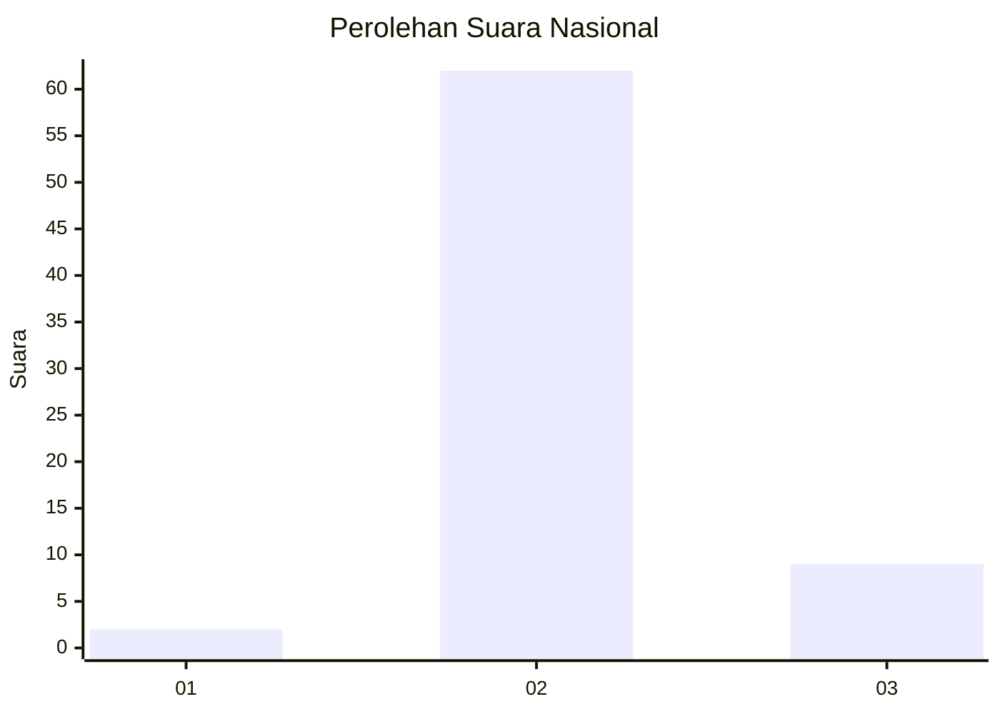
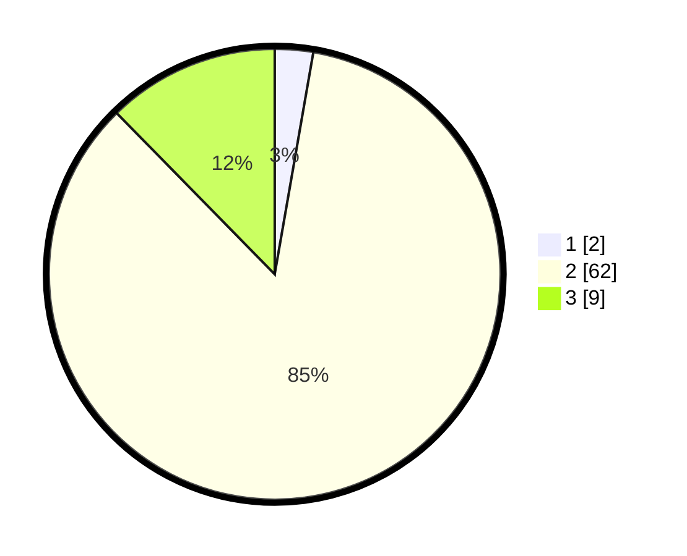

# Hasil

## Grafik

## Tabel

| No. | Nama Paslon    | Suara | Suara (raw) | Persentase |
|:--- |:-------------- | -----:| -----------:| ----------:|
| 1   | ANIES MUHAIMIN | 2     | [2][p-1]    | 2,74       |
| 2   | PRABOWO GIBRAN | 62    | [62][p-2]   | 84,93      |
| 3   | GANJAR MAHFUD  | 9     | [9][p-3]    | 12,33      |

[p-1]: https://github.com/gigit-pemilu/pemilu-2024/blob/main/pilpres/hitung-suara/sub/18-lampung/sub/06-tanggamus/sub/17-kelumbayan/sub/2006-penyandingan/sub/012-tps/sub/paslon-1.txt
[p-2]: https://github.com/gigit-pemilu/pemilu-2024/blob/main/pilpres/hitung-suara/sub/18-lampung/sub/06-tanggamus/sub/17-kelumbayan/sub/2006-penyandingan/sub/012-tps/sub/paslon-2.txt
[p-3]: https://github.com/gigit-pemilu/pemilu-2024/blob/main/pilpres/hitung-suara/sub/18-lampung/sub/06-tanggamus/sub/17-kelumbayan/sub/2006-penyandingan/sub/012-tps/sub/paslon-3.txt

## Foto C Plano

https://sirekap-obj-formc.kpu.go.id/c0ce/pemilu/ppwp/18/06/17/20/06/1806172006012-20240219-234148--19d5d73a-168e-4055-bf28-b68fa5f6e60f.jpg

https://sirekap-obj-formc.kpu.go.id/c0ce/pemilu/ppwp/18/06/17/20/06/1806172006012-20240219-232658--e185fbfe-5895-45ef-ac23-d3dd54ffba9a.jpg

https://sirekap-obj-formc.kpu.go.id/c0ce/pemilu/ppwp/18/06/17/20/06/1806172006012-20240219-233041--d881aab3-6bc8-46bc-a6e9-3f2cd68aacf1.jpg

## Metadata

| Key        | Value               |
| ---------- | ------------------- |
| Time Stamp | 2024-02-24 22:31:28 |

