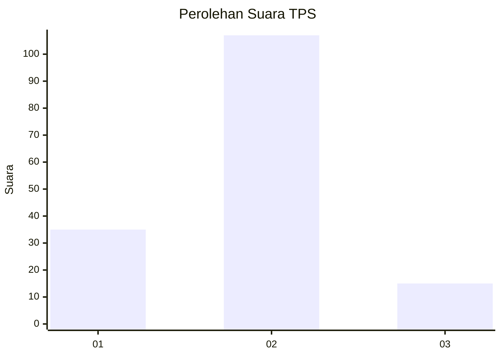

# Hasil

## Grafik

## Tabel

| No. | Nama Paslon    | Suara | Suara (raw) | Persentase |
|:--- |:-------------- | -----:| -----------:| ----------:|
| 1   | ANIES MUHAIMIN | 35    | [35][p-1]   | 22,29      |
| 2   | PRABOWO GIBRAN | 107   | [107][p-2]  | 68,15      |
| 3   | GANJAR MAHFUD  | 15    | [15][p-3]   | 9,55       |

[p-1]: https://github.com/gigit-pemilu/pemilu-2024-18-lampung/blob/main/pilpres/hitung-suara/sub/18-lampung/sub/06-tanggamus/sub/25-bandar-negeri-semuong/sub/2002-bandar-sukabumi/sub/001-tps/sub/paslon-1.txt
[p-2]: https://github.com/gigit-pemilu/pemilu-2024-18-lampung/blob/main/pilpres/hitung-suara/sub/18-lampung/sub/06-tanggamus/sub/25-bandar-negeri-semuong/sub/2002-bandar-sukabumi/sub/001-tps/sub/paslon-2.txt
[p-3]: https://github.com/gigit-pemilu/pemilu-2024-18-lampung/blob/main/pilpres/hitung-suara/sub/18-lampung/sub/06-tanggamus/sub/25-bandar-negeri-semuong/sub/2002-bandar-sukabumi/sub/001-tps/sub/paslon-3.txt

## Foto C Plano

https://sirekap-obj-formc.kpu.go.id/7eaa/pemilu/ppwp/18/06/25/20/02/1806252002001-20240214-211126--da3cd3ff-e3f4-49cc-9896-77b7641d28aa.jpg

https://sirekap-obj-formc.kpu.go.id/7eaa/pemilu/ppwp/18/06/25/20/02/1806252002001-20240214-211219--f34403c9-8518-4b2f-b4b2-c753e4864cd9.jpg

https://sirekap-obj-formc.kpu.go.id/7eaa/pemilu/ppwp/18/06/25/20/02/1806252002001-20240214-225644--6fc83e14-d669-4879-828a-6866de50a74e.jpg

## Metadata

| Key        | Value               |
| ---------- | ------------------- |
| Time Stamp | 2024-02-15 12:00:28 |

