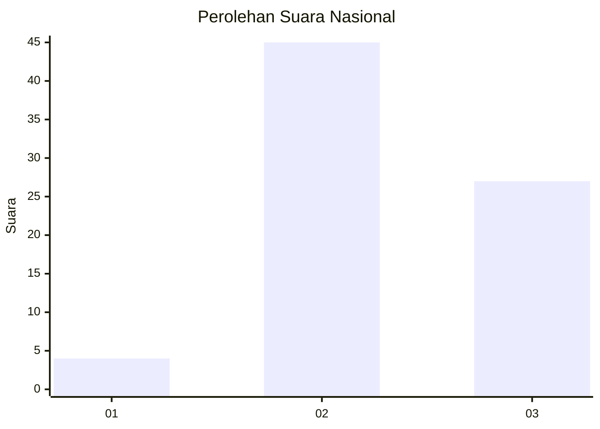
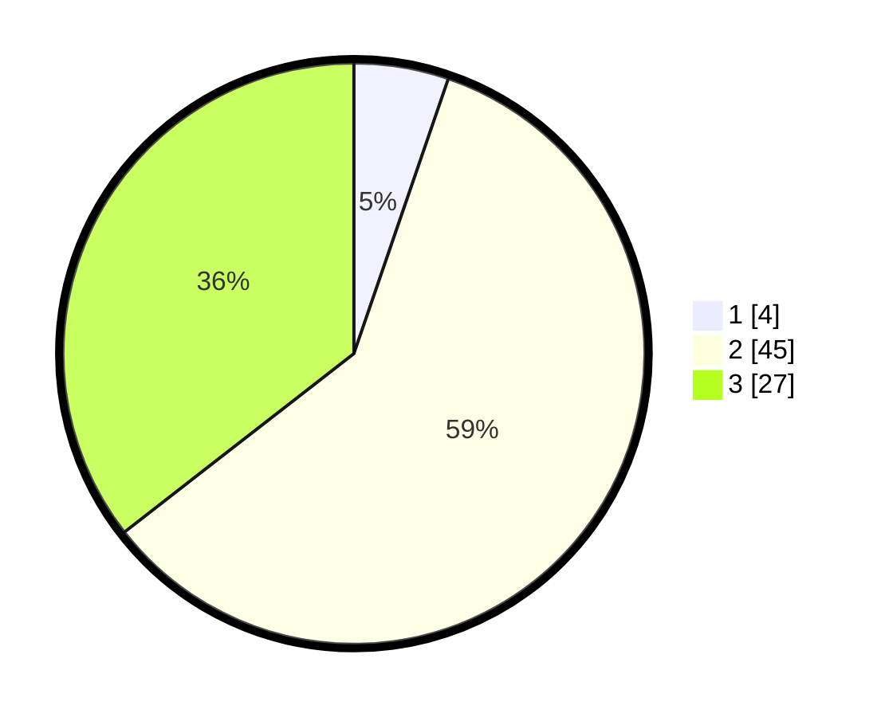

# Hasil

## Grafik

## Tabel

| No. | Nama Paslon    | Suara | Suara (raw) | Persentase |
|:--- |:-------------- | -----:| -----------:| ----------:|
| 1   | ANIES MUHAIMIN | 4     | [4][p-1]    | 5,26       |
| 2   | PRABOWO GIBRAN | 45    | [45][p-2]   | 59,21      |
| 3   | GANJAR MAHFUD  | 27    | [27][p-3]   | 35,53      |

[p-1]: https://github.com/gigit-pemilu/pemilu-2024/blob/main/pilpres/hitung-suara/sub/18-lampung/sub/06-tanggamus/sub/25-bandar-negeri-semuong/sub/2003-sanggi/sub/008-tps/sub/paslon-1.txt
[p-2]: https://github.com/gigit-pemilu/pemilu-2024/blob/main/pilpres/hitung-suara/sub/18-lampung/sub/06-tanggamus/sub/25-bandar-negeri-semuong/sub/2003-sanggi/sub/008-tps/sub/paslon-2.txt
[p-3]: https://github.com/gigit-pemilu/pemilu-2024/blob/main/pilpres/hitung-suara/sub/18-lampung/sub/06-tanggamus/sub/25-bandar-negeri-semuong/sub/2003-sanggi/sub/008-tps/sub/paslon-3.txt

## Foto C Plano

https://sirekap-obj-formc.kpu.go.id/f7bf/pemilu/ppwp/18/06/25/20/03/1806252003008-20240219-211534--e980a798-b1de-442c-b755-e6f1c189be44.jpg

https://sirekap-obj-formc.kpu.go.id/f7bf/pemilu/ppwp/18/06/25/20/03/1806252003008-20240219-211744--3e8ed0d7-b025-4289-9eac-e4a0e9a691ad.jpg

https://sirekap-obj-formc.kpu.go.id/f7bf/pemilu/ppwp/18/06/25/20/03/1806252003008-20240219-211844--b849e04e-7f99-401f-9f01-f8448e823743.jpg

## Metadata

| Key        | Value               |
| ---------- | ------------------- |
| Time Stamp | 2024-02-25 18:00:00 |

