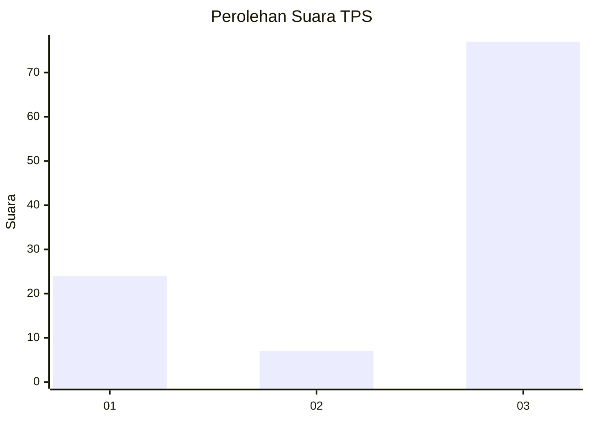
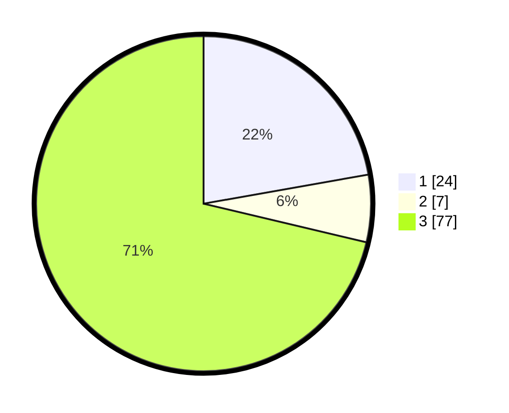

# Hasil

## Grafik

## Tabel

| No. | Nama Paslon    | Suara | Suara (raw) | Persentase |
|:--- |:-------------- | -----:| -----------:| ----------:|
| 1   | ANIES MUHAIMIN | 24    | [24][p-1]   | 22,22      |
| 2   | PRABOWO GIBRAN | 7     | [7][p-2]    | 6,48       |
| 3   | GANJAR MAHFUD  | 77    | [77][p-3]   | 71,30      |

[p-1]: https://github.com/gigit-pemilu/pemilu-2024-18-lampung/blob/main/pilpres/hitung-suara/sub/18-lampung/sub/06-tanggamus/sub/26-air-naningan/sub/2001-way-harong/sub/006-tps/sub/paslon-1.txt
[p-2]: https://github.com/gigit-pemilu/pemilu-2024-18-lampung/blob/main/pilpres/hitung-suara/sub/18-lampung/sub/06-tanggamus/sub/26-air-naningan/sub/2001-way-harong/sub/006-tps/sub/paslon-2.txt
[p-3]: https://github.com/gigit-pemilu/pemilu-2024-18-lampung/blob/main/pilpres/hitung-suara/sub/18-lampung/sub/06-tanggamus/sub/26-air-naningan/sub/2001-way-harong/sub/006-tps/sub/paslon-3.txt

## Foto C Plano

https://sirekap-obj-formc.kpu.go.id/59d6/pemilu/ppwp/18/06/26/20/01/1806262001006-20240223-210728--8f6d7bbb-259c-4326-9be6-9d2bdd9ad13a.jpg

https://sirekap-obj-formc.kpu.go.id/59d6/pemilu/ppwp/18/06/26/20/01/1806262001006-20240223-195918--e34dfc71-8fb3-49c8-ae29-05f428b20c65.jpg

https://sirekap-obj-formc.kpu.go.id/59d6/pemilu/ppwp/18/06/26/20/01/1806262001006-20240223-200045--d2be5e04-90ba-45bb-a766-ab64fb7be4c5.jpg

## Metadata

| Key        | Value               |
| ---------- | ------------------- |
| Time Stamp | 2024-02-24 22:31:28 |

