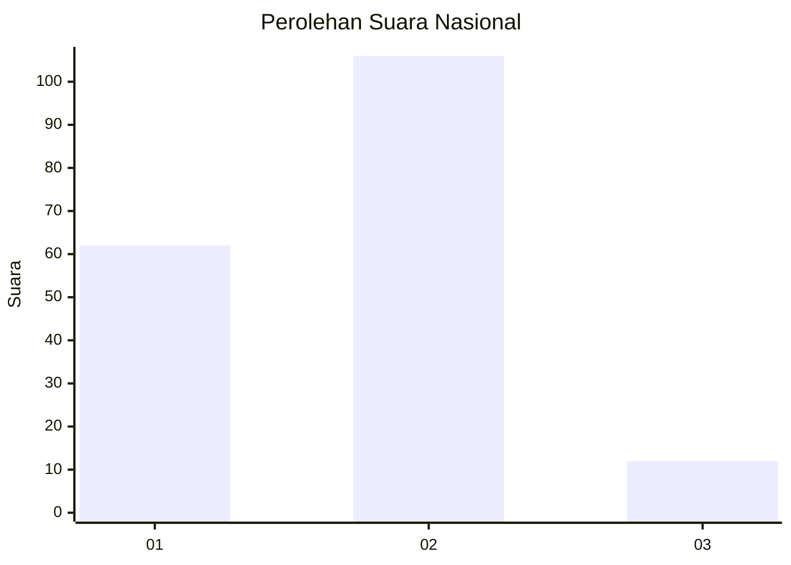
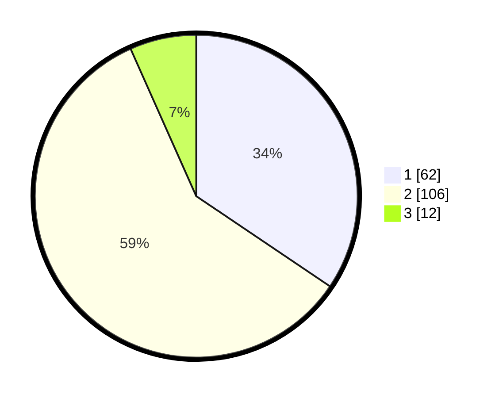

# Hasil

## Grafik

## Tabel

| No. | Nama Paslon    | Suara | Suara (raw) | Persentase |
|:--- |:-------------- | -----:| -----------:| ----------:|
| 1   | ANIES MUHAIMIN | 62    | [62][p-1]   | 34,44      |
| 2   | PRABOWO GIBRAN | 106   | [106][p-2]  | 58,89      |
| 3   | GANJAR MAHFUD  | 12    | [12][p-3]   | 6,67       |

[p-1]: https://github.com/gigit-pemilu/pemilu-2024/blob/main/pilpres/hitung-suara/sub/18-lampung/sub/06-tanggamus/sub/27-bulok/sub/2001-sukamara/sub/004-tps/sub/paslon-1.txt
[p-2]: https://github.com/gigit-pemilu/pemilu-2024/blob/main/pilpres/hitung-suara/sub/18-lampung/sub/06-tanggamus/sub/27-bulok/sub/2001-sukamara/sub/004-tps/sub/paslon-2.txt
[p-3]: https://github.com/gigit-pemilu/pemilu-2024/blob/main/pilpres/hitung-suara/sub/18-lampung/sub/06-tanggamus/sub/27-bulok/sub/2001-sukamara/sub/004-tps/sub/paslon-3.txt

## Foto C Plano

https://sirekap-obj-formc.kpu.go.id/839d/pemilu/ppwp/18/06/27/20/01/1806272001004-20240215-002735--edc93194-ddec-4bef-812c-50be4798538e.jpg

https://sirekap-obj-formc.kpu.go.id/839d/pemilu/ppwp/18/06/27/20/01/1806272001004-20240215-002824--2980372c-807d-4724-96c9-d7734895a545.jpg

https://sirekap-obj-formc.kpu.go.id/839d/pemilu/ppwp/18/06/27/20/01/1806272001004-20240215-024617--69c1f372-5bc7-43a3-b1b1-a1662e3417c8.jpg

## Metadata

| Key        | Value               |
| ---------- | ------------------- |
| Time Stamp | 2024-02-15 09:00:24 |

