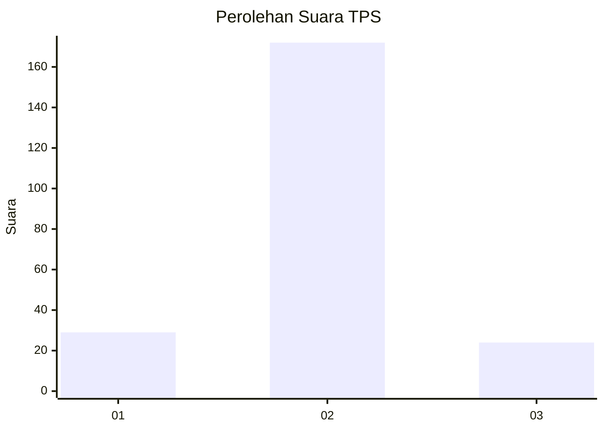
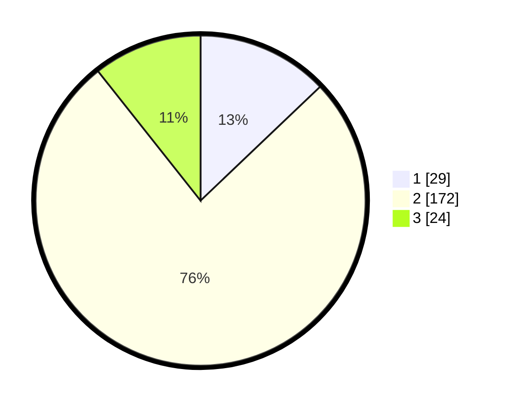

# Hasil

## Grafik

## Tabel

| No. | Nama Paslon    | Suara | Suara (raw) | Persentase |
|:--- |:-------------- | -----:| -----------:| ----------:|
| 1   | ANIES MUHAIMIN | 29    | [29][p-1]   | 12,89      |
| 2   | PRABOWO GIBRAN | 172   | [172][p-2]  | 76,44      |
| 3   | GANJAR MAHFUD  | 24    | [24][p-3]   | 10,67      |

[p-1]: https://github.com/gigit-pemilu/pemilu-2024-18-lampung/blob/main/pilpres/hitung-suara/sub/18-lampung/sub/06-tanggamus/sub/28-kelumbayan-barat/sub/2001-lengkukai/sub/006-tps/sub/paslon-1.txt
[p-2]: https://github.com/gigit-pemilu/pemilu-2024-18-lampung/blob/main/pilpres/hitung-suara/sub/18-lampung/sub/06-tanggamus/sub/28-kelumbayan-barat/sub/2001-lengkukai/sub/006-tps/sub/paslon-2.txt
[p-3]: https://github.com/gigit-pemilu/pemilu-2024-18-lampung/blob/main/pilpres/hitung-suara/sub/18-lampung/sub/06-tanggamus/sub/28-kelumbayan-barat/sub/2001-lengkukai/sub/006-tps/sub/paslon-3.txt

## Foto C Plano

https://sirekap-obj-formc.kpu.go.id/ee67/pemilu/ppwp/18/06/28/20/01/1806282001006-20240215-000611--fd03e009-e5c6-4e97-893d-16b8ab05ac8a.jpg

https://sirekap-obj-formc.kpu.go.id/ee67/pemilu/ppwp/18/06/28/20/01/1806282001006-20240215-101953--9ad405ab-5b41-448a-91c2-c25d19a42da2.jpg

https://sirekap-obj-formc.kpu.go.id/ee67/pemilu/ppwp/18/06/28/20/01/1806282001006-20240215-114348--5f0b4e36-04c1-423f-b5bf-f608c16e7ceb.jpg

## Metadata

| Key        | Value               |
| ---------- | ------------------- |
| Time Stamp | 2024-02-15 20:00:44 |

