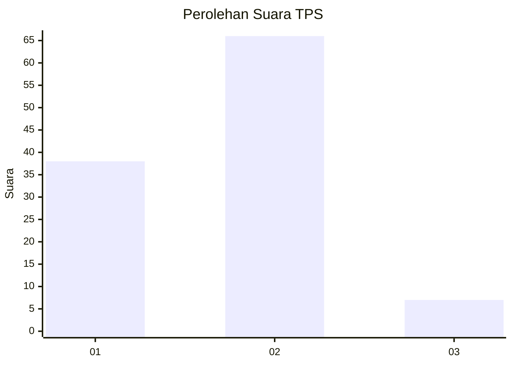
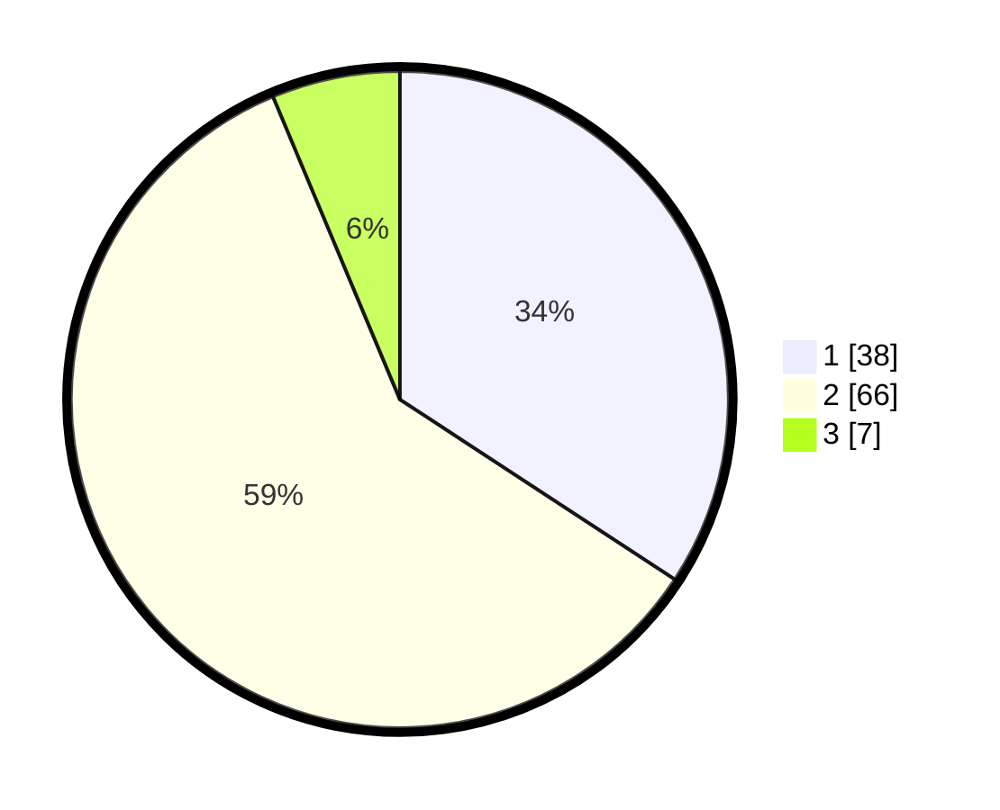

# Hasil

## Grafik

## Tabel

| No. | Nama Paslon    | Suara | Suara (raw) | Persentase |
|:--- |:-------------- | -----:| -----------:| ----------:|
| 1   | ANIES MUHAIMIN | 38    | [38][p-1]   | 34,23      |
| 2   | PRABOWO GIBRAN | 66    | [66][p-2]   | 59,46      |
| 3   | GANJAR MAHFUD  | 7     | [7][p-3]    | 6,31       |

[p-1]: https://github.com/gigit-pemilu/pemilu-2024-18-lampung/blob/main/pilpres/hitung-suara/sub/18-lampung/sub/07-lampung-timur/sub/01-sukadana/sub/2012-sukadana-ilir/sub/002-tps/sub/paslon-1.txt
[p-2]: https://github.com/gigit-pemilu/pemilu-2024-18-lampung/blob/main/pilpres/hitung-suara/sub/18-lampung/sub/07-lampung-timur/sub/01-sukadana/sub/2012-sukadana-ilir/sub/002-tps/sub/paslon-2.txt
[p-3]: https://github.com/gigit-pemilu/pemilu-2024-18-lampung/blob/main/pilpres/hitung-suara/sub/18-lampung/sub/07-lampung-timur/sub/01-sukadana/sub/2012-sukadana-ilir/sub/002-tps/sub/paslon-3.txt

## Foto C Plano

https://sirekap-obj-formc.kpu.go.id/4647/pemilu/ppwp/18/07/01/20/12/1807012012002-20240220-205540--d6499de1-f040-4c6f-ae59-ddf7a9147e8b.jpg

https://sirekap-obj-formc.kpu.go.id/4647/pemilu/ppwp/18/07/01/20/12/1807012012002-20240220-205904--a04ec224-977c-44ed-b3f9-c804f6f839f9.jpg

https://sirekap-obj-formc.kpu.go.id/4647/pemilu/ppwp/18/07/01/20/12/1807012012002-20240220-210241--6ba84be0-d2a7-4da9-93c6-c483991e2d5a.jpg

## Metadata

| Key        | Value               |
| ---------- | ------------------- |
| Time Stamp | 2024-02-20 22:00:00 |

## DATA PEMILIH TETAP

Jumlah pemilih dalam DPT: **0**.
 * L: **0**.
 * P: **0**.

## DATA PENGGUNA HAK PILIH

Jumlah pengguna hak pilih dalam DPT: **600**.
 * L: **563**.
 * P: **444**.

Jumlah pengguna hak pilih dalam DPTb: **700**.
 * L: **0**.
 * P: **100**.

Jumlah pengguna hak pilih dalam DPK: **100**.
 * L: **246**.
 * P: **721**.

Jumlah pengguna hak pilih: **442**.
 * L: **0**.
 * P: **5**.

## JUMLAH SUARA SAH DAN TIDAK SAH

JUMLAH SELURUH SUARA SAH: **211**.

JUMLAH SUARA TIDAK SAH: **0**.

JUMLAH SELURUH SUARA SAH DAN SUARA TIDAK SAH: **511**.

