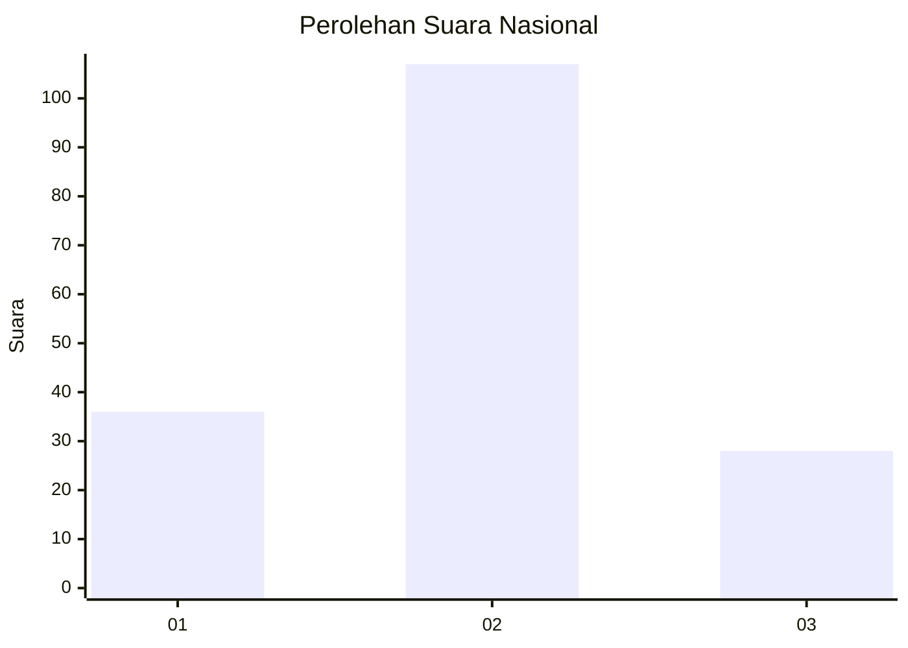

# Hasil

## Grafik

## Tabel

| No. | Nama Paslon    | Suara | Suara (raw) | Persentase |
|:--- |:-------------- | -----:| -----------:| ----------:|
| 1   | ANIES MUHAIMIN | 36    | [36][p-1]   | 21,05      |
| 2   | PRABOWO GIBRAN | 107   | [107][p-2]  | 62,57      |
| 3   | GANJAR MAHFUD  | 28    | [28][p-3]   | 16,37      |

[p-1]: https://github.com/gigit-pemilu/pemilu-2024/blob/main/pilpres/hitung-suara/sub/18-lampung/sub/07-lampung-timur/sub/02-labuhan-maringgai/sub/2001-labuhan-maringgai/sub/005-tps/sub/paslon-1.txt
[p-2]: https://github.com/gigit-pemilu/pemilu-2024/blob/main/pilpres/hitung-suara/sub/18-lampung/sub/07-lampung-timur/sub/02-labuhan-maringgai/sub/2001-labuhan-maringgai/sub/005-tps/sub/paslon-2.txt
[p-3]: https://github.com/gigit-pemilu/pemilu-2024/blob/main/pilpres/hitung-suara/sub/18-lampung/sub/07-lampung-timur/sub/02-labuhan-maringgai/sub/2001-labuhan-maringgai/sub/005-tps/sub/paslon-3.txt

## Foto C Plano

https://sirekap-obj-formc.kpu.go.id/5c69/pemilu/ppwp/18/07/02/20/01/1807022001005-20240215-010737--978462be-0172-47d1-84ee-c19a3bde99f1.jpg

https://sirekap-obj-formc.kpu.go.id/5c69/pemilu/ppwp/18/07/02/20/01/1807022001005-20240222-213923--31b6f6c9-d5dc-4238-a913-528f5a68ba07.jpg

https://sirekap-obj-formc.kpu.go.id/5c69/pemilu/ppwp/18/07/02/20/01/1807022001005-20240215-010550--f1c2fa7a-1750-4730-8f31-5c7df9224cef.jpg

## Metadata

| Key        | Value               |
| ---------- | ------------------- |
| Time Stamp | 2024-02-24 22:31:28 |

