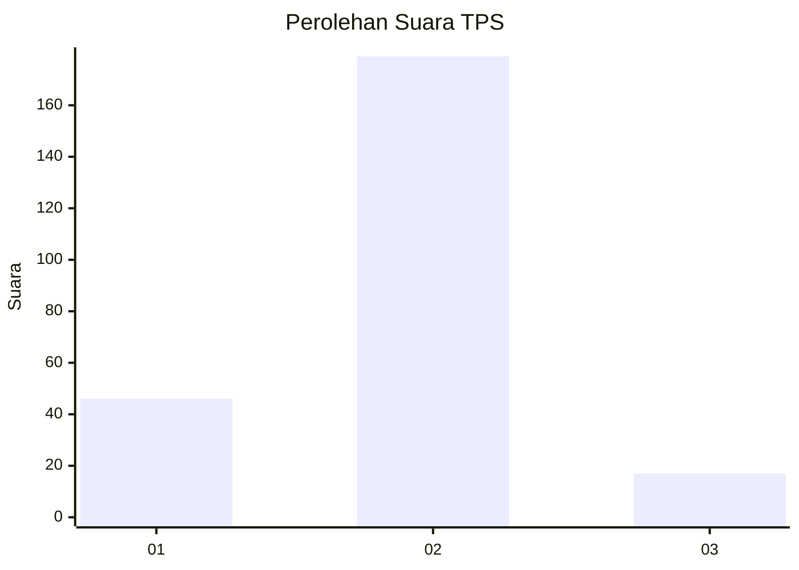
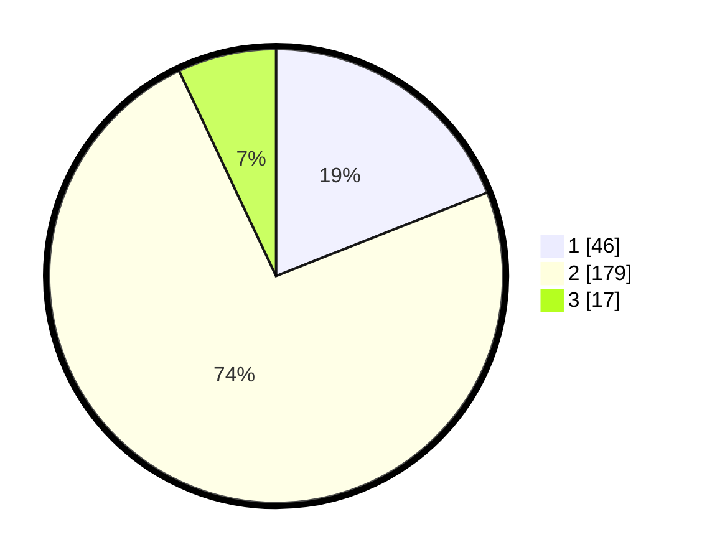

# Hasil

## Grafik

## Tabel

| No. | Nama Paslon    | Suara | Suara (raw) | Persentase |
|:--- |:-------------- | -----:| -----------:| ----------:|
| 1   | ANIES MUHAIMIN | 46    | [46][p-1]   | 19,01      |
| 2   | PRABOWO GIBRAN | 179   | [179][p-2]  | 73,97      |
| 3   | GANJAR MAHFUD  | 17    | [17][p-3]   | 7,02       |

[p-1]: https://github.com/gigit-pemilu/pemilu-2024-18-lampung/blob/main/pilpres/hitung-suara/sub/18-lampung/sub/07-lampung-timur/sub/04-pekalongan/sub/2001-pekalongan/sub/004-tps/sub/paslon-1.txt
[p-2]: https://github.com/gigit-pemilu/pemilu-2024-18-lampung/blob/main/pilpres/hitung-suara/sub/18-lampung/sub/07-lampung-timur/sub/04-pekalongan/sub/2001-pekalongan/sub/004-tps/sub/paslon-2.txt
[p-3]: https://github.com/gigit-pemilu/pemilu-2024-18-lampung/blob/main/pilpres/hitung-suara/sub/18-lampung/sub/07-lampung-timur/sub/04-pekalongan/sub/2001-pekalongan/sub/004-tps/sub/paslon-3.txt

## Foto C Plano

https://sirekap-obj-formc.kpu.go.id/0473/pemilu/ppwp/18/07/04/20/01/1807042001004-20240216-091757--6777b65f-108f-4ea9-be50-2258f4b42a6e.jpg

https://sirekap-obj-formc.kpu.go.id/0473/pemilu/ppwp/18/07/04/20/01/1807042001004-20240216-091827--9526b624-3e3e-46c9-b0ad-f38c2980a4ec.jpg

https://sirekap-obj-formc.kpu.go.id/0473/pemilu/ppwp/18/07/04/20/01/1807042001004-20240216-091849--78aab0b3-bc63-4fe1-972a-9ede30aefd99.jpg

## Metadata

| Key        | Value               |
| ---------- | ------------------- |
| Time Stamp | 2024-02-16 21:01:00 |

