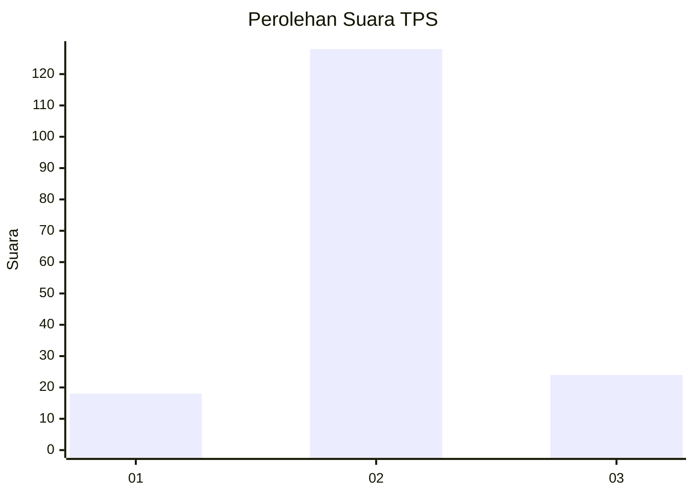
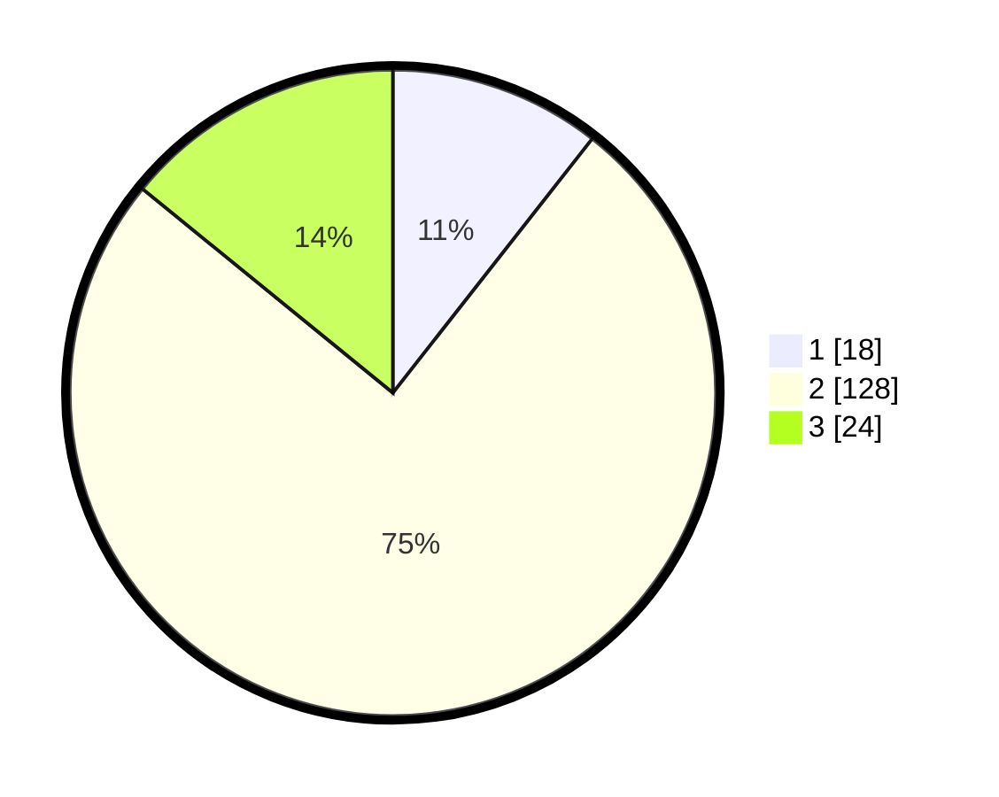

# Hasil

## Grafik

## Tabel

| No. | Nama Paslon    | Suara | Suara (raw) | Persentase |
|:--- |:-------------- | -----:| -----------:| ----------:|
| 1   | ANIES MUHAIMIN | 18    | [18][p-1]   | 10,59      |
| 2   | PRABOWO GIBRAN | 128   | [128][p-2]  | 75,29      |
| 3   | GANJAR MAHFUD  | 24    | [24][p-3]   | 14,12      |

[p-1]: https://github.com/gigit-pemilu/pemilu-2024-18-lampung/blob/main/pilpres/hitung-suara/sub/18-lampung/sub/07-lampung-timur/sub/05-sekampung/sub/2001-sumber-gede/sub/002-tps/sub/paslon-1.txt
[p-2]: https://github.com/gigit-pemilu/pemilu-2024-18-lampung/blob/main/pilpres/hitung-suara/sub/18-lampung/sub/07-lampung-timur/sub/05-sekampung/sub/2001-sumber-gede/sub/002-tps/sub/paslon-2.txt
[p-3]: https://github.com/gigit-pemilu/pemilu-2024-18-lampung/blob/main/pilpres/hitung-suara/sub/18-lampung/sub/07-lampung-timur/sub/05-sekampung/sub/2001-sumber-gede/sub/002-tps/sub/paslon-3.txt

## Foto C Plano

https://sirekap-obj-formc.kpu.go.id/fba4/pemilu/ppwp/18/07/05/20/01/1807052001002-20240216-203635--3a113ca6-50d0-4e2f-aef7-14fafb541a82.jpg

https://sirekap-obj-formc.kpu.go.id/fba4/pemilu/ppwp/18/07/05/20/01/1807052001002-20240216-205217--16747f6b-c53b-41c3-a39e-cf27df34037f.jpg

https://sirekap-obj-formc.kpu.go.id/fba4/pemilu/ppwp/18/07/05/20/01/1807052001002-20240214-190902--7dada587-f394-4c0b-84ce-82e83549a8dd.jpg

## Metadata

| Key        | Value               |
| ---------- | ------------------- |
| Time Stamp | 2024-02-16 23:45:47 |

