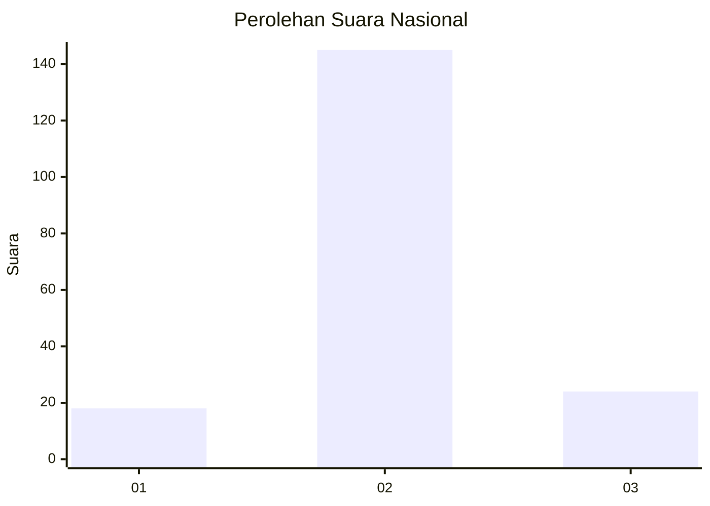
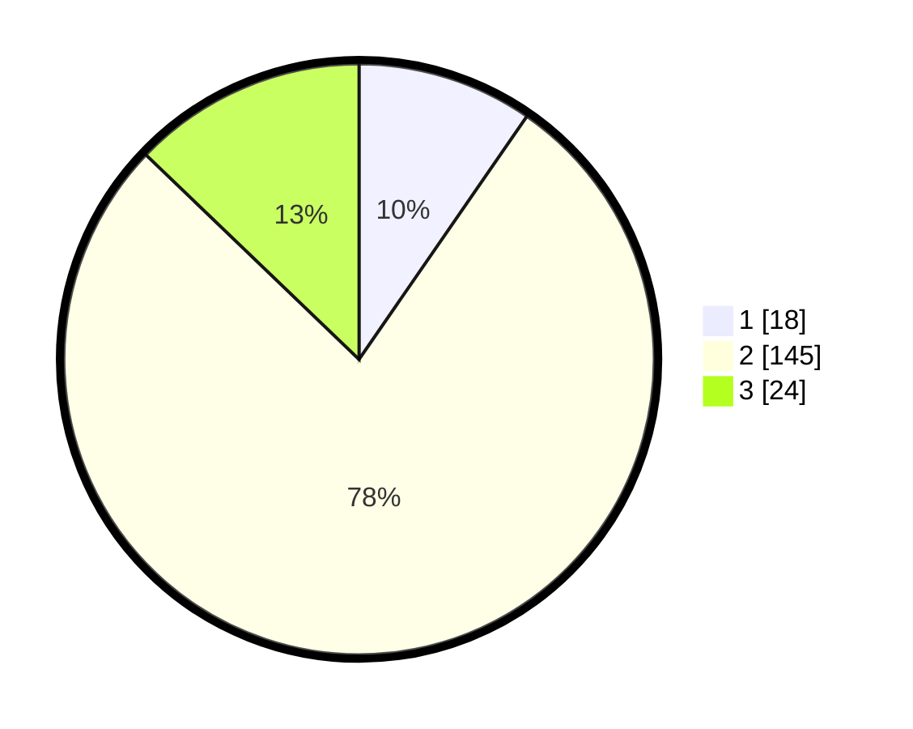

# Hasil

## Grafik

## Tabel

| No. | Nama Paslon    | Suara | Suara (raw) | Persentase |
|:--- |:-------------- | -----:| -----------:| ----------:|
| 1   | ANIES MUHAIMIN | 18    | [18][p-1]   | 9,63       |
| 2   | PRABOWO GIBRAN | 145   | [145][p-2]  | 77,54      |
| 3   | GANJAR MAHFUD  | 24    | [24][p-3]   | 12,83      |

[p-1]: https://github.com/gigit-pemilu/pemilu-2024/blob/main/pilpres/hitung-suara/sub/18-lampung/sub/07-lampung-timur/sub/05-sekampung/sub/2001-sumber-gede/sub/005-tps/sub/paslon-1.txt
[p-2]: https://github.com/gigit-pemilu/pemilu-2024/blob/main/pilpres/hitung-suara/sub/18-lampung/sub/07-lampung-timur/sub/05-sekampung/sub/2001-sumber-gede/sub/005-tps/sub/paslon-2.txt
[p-3]: https://github.com/gigit-pemilu/pemilu-2024/blob/main/pilpres/hitung-suara/sub/18-lampung/sub/07-lampung-timur/sub/05-sekampung/sub/2001-sumber-gede/sub/005-tps/sub/paslon-3.txt

## Foto C Plano

https://sirekap-obj-formc.kpu.go.id/ab01/pemilu/ppwp/18/07/05/20/01/1807052001005-20240217-080912--7c8def10-3288-40ba-923b-c1d72f12fb80.jpg

https://sirekap-obj-formc.kpu.go.id/ab01/pemilu/ppwp/18/07/05/20/01/1807052001005-20240217-080705--1d5c6717-f892-44b3-b788-fdbd6e6ce880.jpg

https://sirekap-obj-formc.kpu.go.id/ab01/pemilu/ppwp/18/07/05/20/01/1807052001005-20240222-120749--8762db3a-cf61-46d5-9f6c-1a0ecff57b2d.jpg

## Metadata

| Key        | Value               |
| ---------- | ------------------- |
| Time Stamp | 2024-02-22 13:00:00 |

